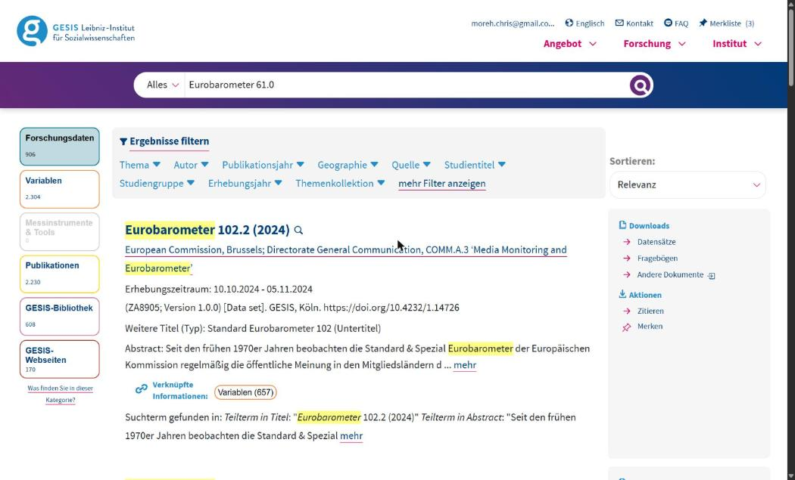
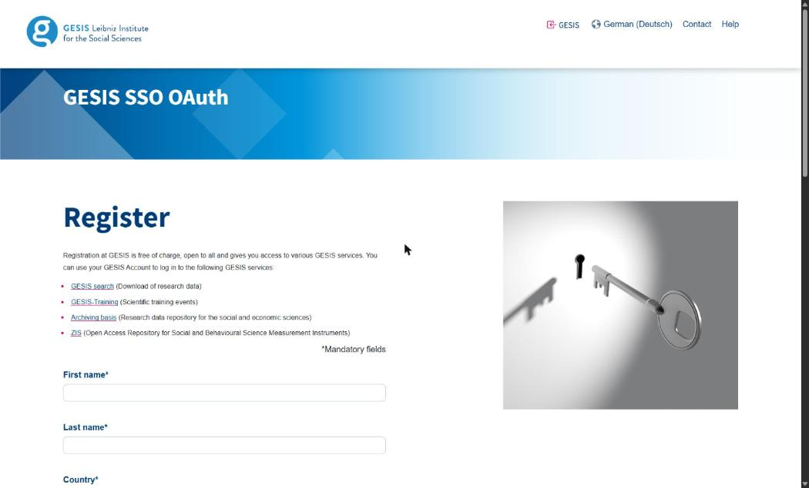
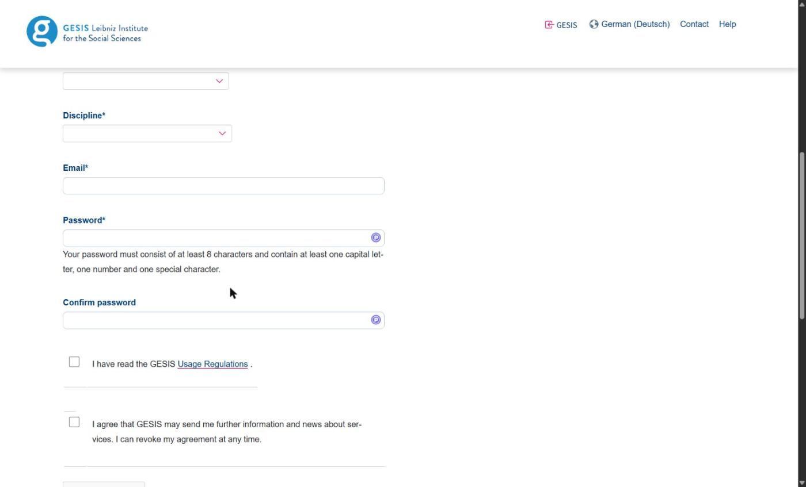
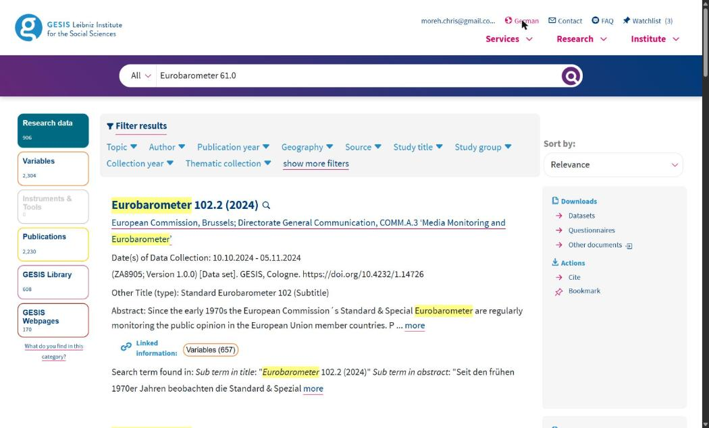
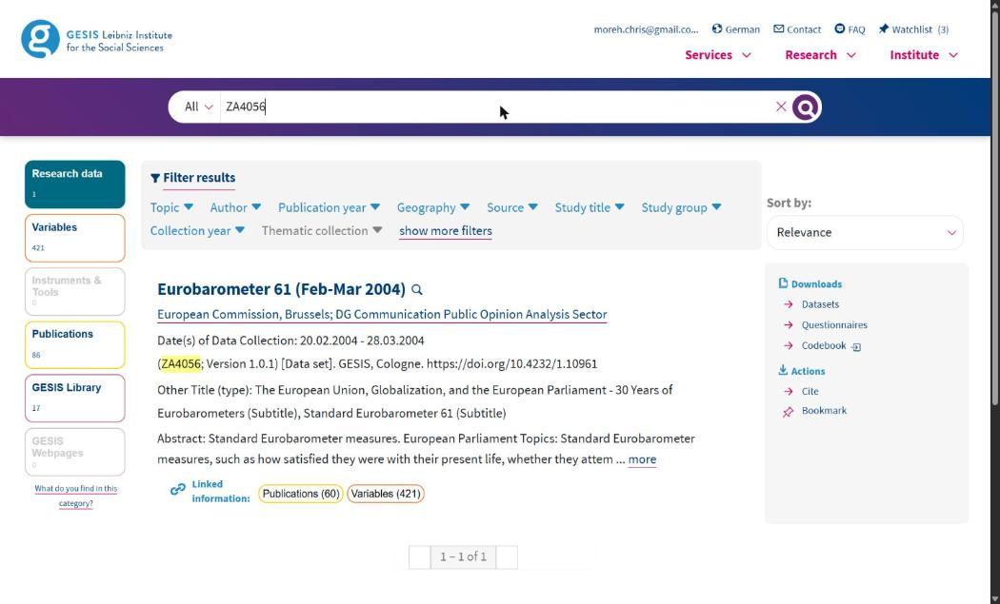
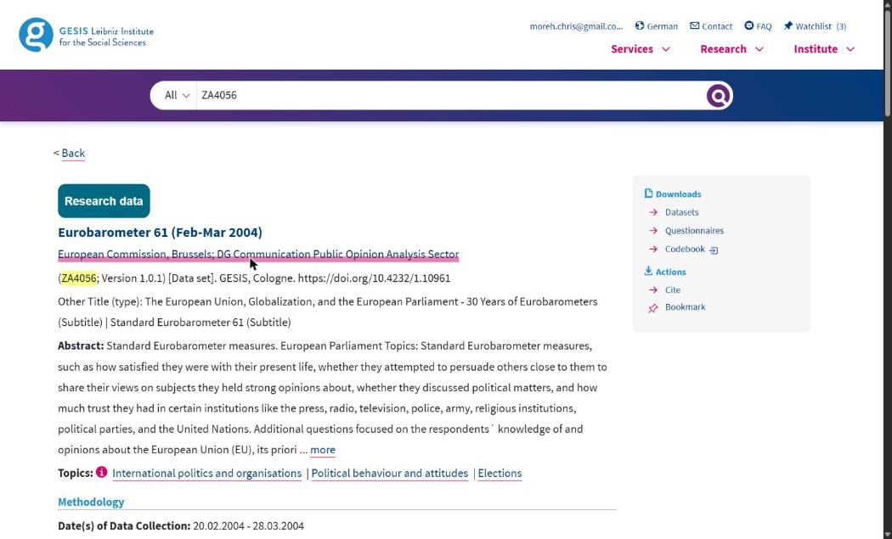
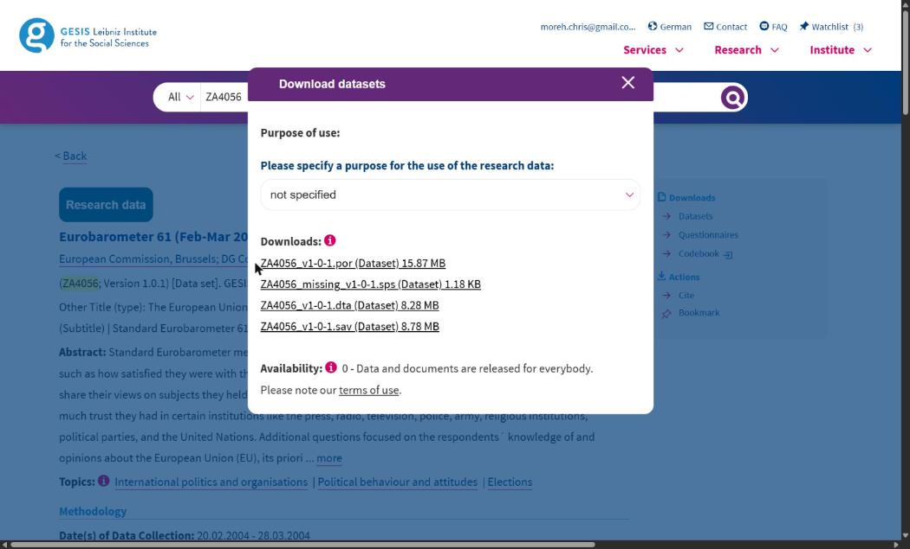
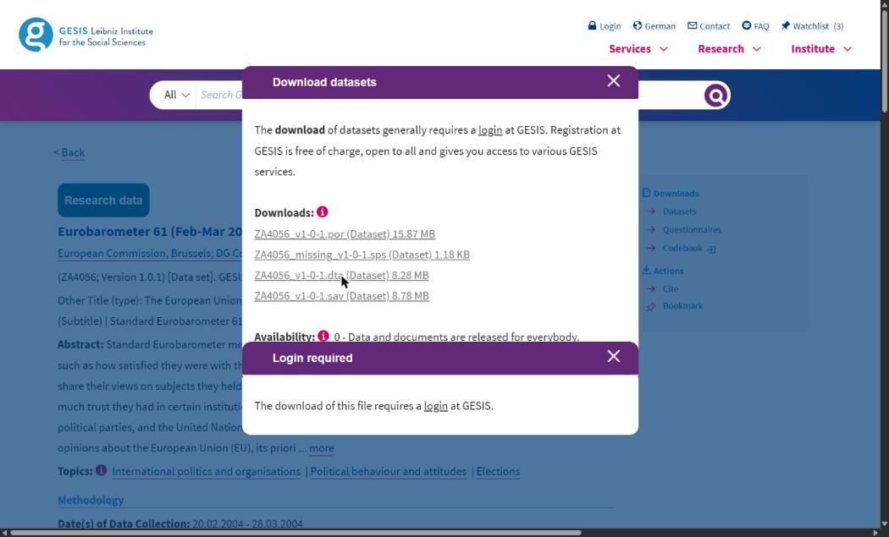
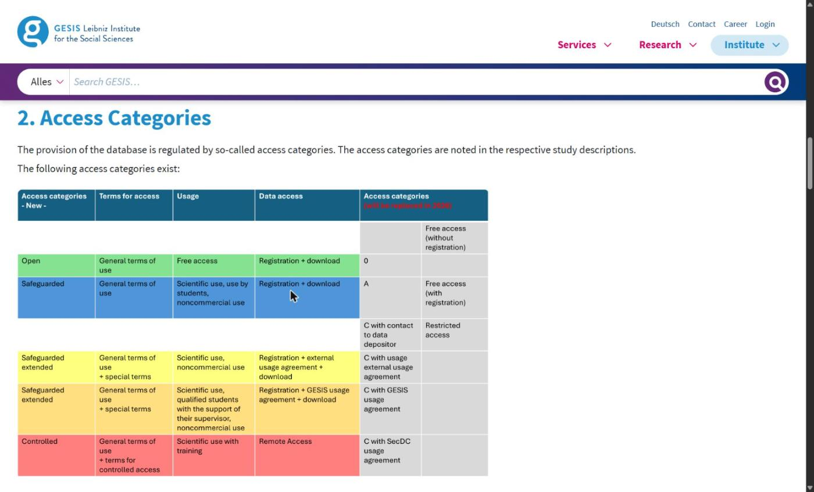

This module of the [companion curriculum](index.qmd) is about where the data that social scientists analyse actually live, and how a researcher gets hold of them. It has two halves. The first is a map: the survey programmes, archives, statistical offices and international organisations that hold most of the quantitative data used in sociology, political science and demography, with a focus on Europe and the United Kingdom, and with the access rule for each stated plainly, because the access rule is what decides whether you can start on Monday or in ten weeks. The second half drills into the sources behind this course, the Eurobarometer microdata at GESIS, the macro indicators at the World Bank and the country-year panel on the Open Science Framework, with every step from registration to a file on your disk. The [R module](intro-r.qmd#sec-fetching) has the companion subsection on the R packages that fetch from these sources directly, and the [repositories module](repositories.qmd) covers the other side of the exchange, where a finished piece of work is deposited so that others can find it.

Two things are outside the scope of this page. Qualitative data archives, though the UK Data Service and the Qualitative Data Repository named below hold them, are not discussed. And nothing here replaces the terms of use of a particular dataset, which change, and which you read before you download.

## 1. Three ways in {#sec-access}

Almost every dataset on this page is reached by one of three routes, and the vocabulary of the archives follows them.

**Open download.** The file is on a public page or behind a public API, under a licence that permits reuse with attribution, typically Creative Commons Attribution (CC BY) or an open government licence. World Bank indicators, Eurostat's aggregate tables, the Our World in Data compilations and most political-science datasets are of this kind. Nothing is asked of you except the citation.

**Registration and licence.** You create an account under your own name, agree to conditions (no redistribution, no attempt to identify anyone, citation of the source, sometimes non-commercial use), and download. This is the standard route for survey microdata, meaning files with one row per respondent: the European Social Survey, the Eurobarometer at GESIS, the UK Data Service's safeguarded collection, SHARE, IPUMS. The registration is free, immediate or nearly so, and the archive keeps a record of who took what.

**Application and secure access.** The data are too detailed to leave the archive: linked administrative records, fine geography, exact dates of birth, business microdata. You apply with a project description, your institution may have to be recognised as a research entity, you may have to complete a training course and become an accredited researcher, and you then work either on a scientific-use file sent under contract or inside a secure environment where nothing leaves without being checked. Eurostat's microdata, the UK Data Service's controlled collection through SecureLab, the Office for National Statistics' Secure Research Service, and the German Socio-Economic Panel's contract route are examples. Allow weeks or months.

Two distinctions run across all three. **Microdata against aggregates:** a respondent-level file needs the second or third route, while the country-year or region-year tables computed from it are usually open, which is exactly the shape of this course, whose panel is an open aggregate built from licensed microdata. And **catalogue against archive:** a catalogue such as the CESSDA Data Catalogue or re3data tells you that a dataset exists and where it is held, and the archive that holds it is where you register and download.

## 2. The map {#sec-map}

The tables name the source, what it holds, how it is reached and where to start. "Open" means the first route above, "registration" the second and "application" the third; the note says what the registration or application involves where that is not obvious.

### 2.1 Cross-national survey programmes {#sec-surveys}

| Source | What it holds | Access | Where to start |
|---|---|---|---|
| **European Social Survey (ESS)** | Attitudes, values and behaviour across Europe every two years since 2002; eleven rounds at the time of writing, plus the CRONOS online panels | Registration, free; the survey describes its data as "freely accessible data for academics, policymakers, civil society and the wider public" | [ESS Data Portal](https://ess.sikt.no/en/), which searches, builds a custom file and downloads |
| **Eurobarometer** | The European Commission's twice-yearly surveys since 1974, with the Standard, Special and Flash series; the source of this course's outcome variables | Registration with GESIS, free for academic use, one study per wave | [GESIS Eurobarometer Data Service](https://www.gesis.org/en/eurobarometer-data-service) and [search.gesis.org](https://search.gesis.org/) |
| **European Values Study (EVS) and World Values Survey (WVS)** | Values and beliefs in waves since 1981; the two are harmonised into a joint file for the 2017 wave | Registration, free; EVS is distributed by GESIS, WVS from its own site | [europeanvaluesstudy.eu](https://europeanvaluesstudy.eu/), [worldvaluessurvey.org](https://www.worldvaluessurvey.org/) |
| **International Social Survey Programme (ISSP)** | One themed module a year since 1985, repeated on a cycle (role of government, social inequality, religion, work) across some forty countries | Registration with GESIS, free | [issp.org](https://issp.org/), files via search.gesis.org |
| **SHARE** | The Survey of Health, Ageing and Retirement in Europe: a longitudinal panel of people over fifty, with linked administrative records for several countries | Registration, "free of charge for scientific use globally", under published conditions of use | [share-eric.eu](https://share-eric.eu/) |
| **Generations and Gender Programme (GGP)** | Longitudinal surveys on family, fertility and partnership | Registration | [ggp-i.org](https://www.ggp-i.org/) |
| **Comparative Study of Electoral Systems (CSES)** | Post-election surveys harmonised across countries, with system-level variables | Open | [cses.org](https://www.cses.org/) |
| **OECD PISA and PIAAC** | Student assessment (PISA) and adult skills (PIAAC) microdata, with contextual questionnaires | Open download of the public-use files | [PISA databases](https://www.oecd.org/en/data/datasets/pisa-2022-database.html), [PIAAC](https://www.oecd.org/en/about/programmes/piaac.html) |
| **The regional barometers** | Afrobarometer, Latinobarómetro and the Arab Barometer: repeated public-opinion surveys on their continents | Registration or open, by barometer | [afrobarometer.org](https://www.afrobarometer.org/), [latinobarometro.org](https://www.latinobarometro.org/), [arabbarometer.org](https://www.arabbarometer.org/) |
| **Pew Research Center** | US and global attitude surveys, released after an embargo | Registration, free; the `pewdata` R package downloads them | [pewresearch.org/datasets](https://www.pewresearch.org/datasets/) |
| **Eurofound surveys** | The European Working Conditions Survey and the European Quality of Life Survey | Registration with the UK Data Service, which distributes them | [eurofound.europa.eu/en/surveys](https://www.eurofound.europa.eu/en/surveys) |

### 2.2 Archives and catalogues {#sec-archives}

| Source | What it holds | Access | Where to start |
|---|---|---|---|
| **UK Data Service (UKDS)** | The national collection for the UK: the large government surveys, the household panels and cohorts, the census aggregates, ESRC-funded project data, and the international series it distributes. Its three tiers are named "Open" (download without registration), "Safeguarded" (registration and the End User Licence, sometimes a Special Licence with a use statement) and "Controlled" (SecureLab, for accredited researchers whose organisation signs an agreement) | By tier; registration is open to UK academic users through their institution and to others through a separate route | [ukdataservice.ac.uk](https://ukdataservice.ac.uk/), [types of data access](https://ukdataservice.ac.uk/help/access-policy/types-of-data-access/) |
| **GESIS Data Archive** | Germany's central social-science archive and the distributor of the Eurobarometer, EVS, ISSP, ALLBUS and the European Election Studies; each study carries an access category from free download to depositor permission, and a Secure Data Center for the sensitive files | Registration, free; category by study | [search.gesis.org](https://search.gesis.org/) |
| **CESSDA Data Catalogue** | The joint catalogue of the European social-science archives (the UK Data Service, GESIS, DANS, Sikt, the Finnish Social Science Data Archive and their peers), searchable in one place; downloads happen at the archive that holds the study | Catalogue open; access by archive | [datacatalogue.cessda.eu](https://datacatalogue.cessda.eu/) |
| **ICPSR** | The Inter-university Consortium for Political and Social Research at Michigan, the largest social-science archive in the United States; a part of the collection is public, most of it is for members, and restricted files are applied for | Institutional membership for most files; check whether your university is a member | [icpsr.umich.edu](https://www.icpsr.umich.edu/) |
| **Harvard Dataverse** | An open repository run on the Dataverse software, holding tens of thousands of datasets deposited by researchers and journals, including much replication material from political science | Open, with terms set per dataset; the `dataverse` R package downloads by DOI | [dataverse.harvard.edu](https://dataverse.harvard.edu/) |
| **re3data** | The registry of research data repositories, for finding out which repository holds a kind of data at all | Open | [re3data.org](https://www.re3data.org/) |

### 2.3 Household panels and cohorts {#sec-panels}

| Source | What it holds | Access | Where to start |
|---|---|---|---|
| **Understanding Society** (and the British Household Panel Survey before it) | The UK household longitudinal study, some forty thousand households followed yearly since 2009, with the BHPS back to 1991 | Safeguarded at the UK Data Service; the linked and geographic files need a Special Licence or SecureLab | [understandingsociety.ac.uk](https://www.understandingsociety.ac.uk/) |
| **English Longitudinal Study of Ageing (ELSA)** | People over fifty in England, followed every two years since 2002 | Safeguarded at the UK Data Service | [elsa-project.ac.uk](https://www.elsa-project.ac.uk/) |
| **The UK birth cohorts** | The 1946, 1958, 1970 and Millennium cohorts and their successors, coordinated by CLOSER | Safeguarded at the UK Data Service | [closer.ac.uk](https://www.closer.ac.uk/) |
| **German Socio-Economic Panel (SOEP)** | The German household panel since 1984, at the DIW Research Data Center | Application: a data distribution contract, free for scientific use | [DIW SOEP](https://www.diw.de/en/diw_01.c.678568.en/research_data_center_soep.html) |
| **LISS panel** | The Dutch online household panel run by Centerdata, with core modules and open calls for questions | Registration and approval | [lissdata.nl](https://www.lissdata.nl/) |

### 2.4 Official statistics and administrative data {#sec-official}

| Source | What it holds | Access | Where to start |
|---|---|---|---|
| **Eurostat, the database** | The aggregate statistics of the EU: unemployment, GDP, population, migration, living conditions, by country and region and year, behind a public API | Open | [ec.europa.eu/eurostat/data/database](https://ec.europa.eu/eurostat/data/database); the `eurostat` and `restatapi` R packages |
| **Eurostat, the microdata** | Fourteen collections of respondent-level files, among them the EU Labour Force Survey, EU-SILC (income and living conditions), the Household Budget Survey, the Adult Education Survey and the European Health Interview Survey | Application: the institution must be recognised as a research entity (about four weeks), then a research proposal (about eight to ten weeks); scientific-use files are sent, secure-use files are worked in the Safe Centre or at accredited access points, and the files are destroyed at the end of the project | [Eurostat microdata](https://ec.europa.eu/eurostat/web/microdata) |
| **Office for National Statistics (ONS)** | The UK's official statistics, open on the site and through an API; the detailed microdata through the Secure Research Service | Open for the published tables; accredited researcher status for the Secure Research Service | [ons.gov.uk](https://www.ons.gov.uk/); the `onsr` R package |
| **Nomis** | The ONS labour market and census statistics for small areas, with its own API | Open | [nomisweb.co.uk](https://www.nomisweb.co.uk/) |
| **ADR UK** | Administrative Data Research UK: linked government records for research, worked in secure settings by accredited researchers | Application and accreditation | [adruk.org](https://www.adruk.org/) |
| **HMRC Datalab** | Tax records for research, on HMRC premises or approved access | Application | [HMRC research](https://www.gov.uk/government/organisations/hm-revenue-customs/about/research) |
| **data.gov.uk and data.europa.eu** | The open-data portals of the UK government and of the EU institutions | Open | [data.gov.uk](https://www.data.gov.uk/), [data.europa.eu](https://data.europa.eu/) |
| **IPUMS International** | Harmonised census microdata: "104 countries – 656 censuses and surveys – over 1 billion person records", with the US and other IPUMS collections beside it | Registration, free, with approval of a stated purpose; the `ipumsr` R package fetches extracts | [international.ipums.org](https://international.ipums.org/) |
| **The Demographic and Health Surveys (DHS)** | Household surveys on health, fertility and nutrition in low- and middle-income countries since the 1980s | Registration with a stated project; the `rdhs` R package downloads | [dhsprogram.com/data](https://www.dhsprogram.com/data/) |

### 2.5 Indicators from the international organisations {#sec-indicators}

| Source | What it holds | Access | Where to start |
|---|---|---|---|
| **World Bank Open Data** | The World Development Indicators and the other Bank databases, by country and year, under CC BY 4.0; the source of this course's macro variables | Open; the `WDI` and `wbstats` R packages | [data.worldbank.org](https://data.worldbank.org/); the [Microdata Library](https://microdata.worldbank.org/) for the surveys behind them |
| **OECD Data Explorer** | The OECD's statistics on its members and partners, behind an SDMX API | Open; the `OECD` and `rsdmx` R packages | [data-explorer.oecd.org](https://data-explorer.oecd.org/) |
| **ILOSTAT** | Labour statistics, including the modelled unemployment estimates that the World Bank republishes | Open; the `Rilostat` R package | [ilostat.ilo.org](https://ilostat.ilo.org/) |
| **UN data** | The statistical databases of the UN agencies in one search | Open | [data.un.org](https://data.un.org/) |
| **World Inequality Database** | Income and wealth distributions by country | Open; the `wid` R package | [wid.world](https://www.wid.world/) |
| **Our World in Data** | Curated and documented compilations of the above, with the sources traced | Open | [ourworldindata.org](https://ourworldindata.org/) |

### 2.6 Political and institutional datasets {#sec-political}

| Source | What it holds | Access | Where to start |
|---|---|---|---|
| **Varieties of Democracy (V-Dem)** | Expert-coded measures of democracy for every country since 1789 | Open; the `vdemdata` package is on GitHub rather than CRAN | [v-dem.net](https://v-dem.net/) |
| **Manifesto Project** | Coded party election programmes since 1945 | Registration and an API key; the `manifestoR` R package | [manifesto-project.wzb.eu](https://manifesto-project.wzb.eu/) |
| **ParlGov** | Parties, elections and cabinets in the established democracies | Open | [parlgov.org](https://www.parlgov.org/) |
| **Chapel Hill Expert Survey (CHES)** | Expert placements of European parties on policy dimensions | Open | [chesdata.eu](https://www.chesdata.eu/) |
| **Quality of Government (QoG)** | Country-year compilations of governance indicators from many sources | Open | [Quality of Government Institute](https://www.gu.se/en/quality-government) |

::: {.callout-tip}
## Try it

Pick a question you have worked on, or would like to. Find a dataset that could answer it in two of the catalogues above, the CESSDA Data Catalogue and re3data, and write down for each: the archive that holds it, the access route, and the first step you would have to take on Monday morning. If the two catalogues disagree about where the data are, that is worth a sentence too.
:::

## 3. The data behind this course, step by step {#sec-course}

The course panel, `EUframes_cy.csv`, is one row per country and year: 27 member states over ten years, 270 rows, with six framing outcomes, the unemployment rate, GDP growth and a bailout indicator. It was built from three sources by three routes, and this section walks each of them. Nothing here has to be done to take the course, because the panel ships in the workspace; it is here so that you can rebuild the panel, extend it, or apply the same routes to a project of your own.

### 3.1 The Eurobarometer microdata, at GESIS {#sec-gesis}

The outcomes are built from sixteen Eurobarometer waves between 2004 and 2013, the waves that carried the question asking what the European Union means to the respondent personally, with its fourteen items. The files are distributed by **GESIS – Leibniz Institute for the Social Sciences**, the German social-science archive, which describes itself as "[the largest German infrastructure institute for the social sciences](https://www.gesis.org/en/institute)" and which runs the Eurobarometer Data Service for the European Commission. Its own description of the arrangement is short: "Eurobarometer data and documentation can be downloaded free of charge from the GESIS Data Catalog", and "the data are available to the scientific community for research and education" ([Eurobarometer Data Service](https://www.gesis.org/en/eurobarometer-data-service)). Everything below was walked through in a browser on 8 September 2026, and the file that came back from GESIS at the end was byte for byte the one the course panel was built from.

The sixteen studies are these. Every one is in the access category GESIS labels "0 – Data and documents are released for everybody", which means a free account and nothing more; the file names are the ones that arrive in your download folder, and the two marked as zipped arrive as `.zip` archives that the course's build script unpacks.

| Wave | Study | Version | DOI | Stata file |
|---|---|---|---|---|
| EB 61.0 | [ZA4056](https://search.gesis.org/research_data/ZA4056) | 1.0.1 | 10.4232/1.10961 | ZA4056_v1-0-1.dta |
| EB 62.0 | [ZA4229](https://search.gesis.org/research_data/ZA4229) | 1.1.0 | 10.4232/1.10962 | ZA4229_v1-1-0.dta |
| EB 63.4 | [ZA4411](https://search.gesis.org/research_data/ZA4411) | 1.1.0 | 10.4232/1.10968 | ZA4411_v1-1-0.dta |
| EB 64.2 | [ZA4414](https://search.gesis.org/research_data/ZA4414) | 1.1.0 | 10.4232/1.10970 | ZA4414_v1-1-0.dta |
| EB 65.2 | [ZA4506](https://search.gesis.org/research_data/ZA4506) | 1.0.1 | 10.4232/1.10974 | ZA4506_v1-0-1.dta, zipped |
| EB 67.2 | [ZA4530](https://search.gesis.org/research_data/ZA4530) | 2.1.0 | 10.4232/1.10984 | ZA4530_v2-1-0.dta |
| EB 69.2 | [ZA4744](https://search.gesis.org/research_data/ZA4744) | 5.0.0 | 10.4232/1.11755 | ZA4744_v5-0-0.dta, zipped |
| EB 70.1 | [ZA4819](https://search.gesis.org/research_data/ZA4819) | 3.0.2 | 10.4232/1.10989 | ZA4819_v3-0-2.dta |
| EB 72.4 | [ZA4994](https://search.gesis.org/research_data/ZA4994) | 3.0.0 | 10.4232/1.11141 | ZA4994_v3-0-0.dta |
| EB 73.4 | [ZA5234](https://search.gesis.org/research_data/ZA5234) | 2.0.1 | 10.4232/1.11479 | ZA5234_v2-0-1.dta |
| EB 74.2 | [ZA5449](https://search.gesis.org/research_data/ZA5449) | 2.2.0 | 10.4232/1.11626 | ZA5449_v2-2-0.dta |
| EB 75.3 | [ZA5481](https://search.gesis.org/research_data/ZA5481) | 2.0.1 | 10.4232/1.11852 | ZA5481_v2-0-1.dta |
| EB 76.3 | [ZA5567](https://search.gesis.org/research_data/ZA5567) | 2.0.1 | 10.4232/1.12007 | ZA5567_v2-0-1.dta |
| EB 77.3 | [ZA5612](https://search.gesis.org/research_data/ZA5612) | 2.0.0 | 10.4232/1.12050 | ZA5612_v2-0-0.dta |
| EB 78.1 | [ZA5685](https://search.gesis.org/research_data/ZA5685) | 2.0.0 | 10.4232/1.12061 | ZA5685_v2-0-0.dta |
| EB 79.3 | [ZA5689](https://search.gesis.org/research_data/ZA5689) | 2.0.0 | 10.4232/1.12718 | ZA5689_v2-0-0.dta |

: The sixteen studies, with the versions current on 8 September 2026. GESIS re-releases files under new version numbers; the build script checks what you downloaded against this list.

**Before you start: two settings in the browser.** GESIS serves its pages in German by default and marks them as English, so Chrome quietly translates them into an English that is close to the site's own and not the same, and the labels on your screen will not match the ones below. Turn translation off for the site (the translate icon in the address bar, then "Never translate this site") and click **English** in the page header. The sidebar then reads *Datasets / Questionnaires / Codebook* rather than *Datensätze / Fragebögen*.

{.border}

**1. Register once, before the course.** Open [search.gesis.org](https://search.gesis.org/), click *Login* and then "You are not yet registered?". The form asks for your name, country, discipline, email and a password of at least eight characters with a capital letter, a number and a special character; there is one kind of account and no institutional check, and the page says so: "Registration at GESIS is free of charge, open to all". Registration is a web form with a captcha, so it cannot be scripted, which is why it belongs in the week before the course rather than on the day. One trap: the checkbox that says "I have read the GESIS Usage Regulations" links to the data-protection notice rather than the terms of use, which are at [gesis.org/en/institute/data-usage-terms](https://www.gesis.org/en/institute/data-usage-terms) and are summarised below.

{.border}

{.border}

**2. Find each study by its number.** Type the study number, `ZA4056`, into the search box and press Enter: one hit. Do not search by wave name. "Eurobarometer 61.0" returns about nine hundred datasets with the 2023–2026 waves at the top and the one you want nowhere on the first page, and a `?q=` address pasted into the browser fills the box without running the search. The direct address `https://search.gesis.org/research_data/ZA4056` works too, and the table above links every study that way.

{.border}

{.border}

**3. Read the study page.** It carries the title, the version, the DOI, the fieldwork dates and the countries, and, in the right-hand panel, three download links: *Datasets*, *Questionnaires* and *Codebook*. The questionnaires and the codebook download without an account; they are the documents that say which variable holds which question in that wave, and the [data management module](data-management.qmd) uses them.

{.border}

**4. Download the Stata file.** Click *Datasets*. A dialog lists four files: an SPSS portable file, a syntax file defining missing values, the Stata file and the SPSS file. Take the Stata file only, the one ending in `.dta`; the course's script reads that format with its labels, and the others are not needed. Above the list is a **Purpose of use** dropdown, which you are stating in your own name: choose "in the course of my studies" if you are a student, and "for further education and qualification" otherwise; the lecturer's own option, "in a course as lecturer", is not for participants. Signed out, the same click produces only a "Login required" box. Signed in, the file arrives under exactly the name in the table, with no further prompt.

{.border}

{.border}

**5. Put all sixteen in one folder** outside the workspace, and run the build script described in the [data management module](data-management.qmd). It unpacks the two zipped studies, reads the sixteen files, checks each against the checksum of the file the course was built from, and writes one respondent-level file into a folder that the workspace never commits.

**The terms you accepted.** The terms of use, valid since 4 February 2026, are the document every download dialog links to, and four of their clauses shape how the course handles these files. Redistribution: "The provision of the database to third parties is not permitted", and third parties "include, but are not limited to, publishers, libraries, data archives, or research data repositories", so no respondent-level file goes into any repository, public or private. Identification: "The presentation or publication of individual cases, even if there is no direct reference to individuals, is not permitted", while "summary presentations of data, as is customary in scientific papers and lectures, are permitted", which is exactly the line between the microdata and the aggregates this course ships. Citation: the DOI and the version number of each file must appear in anything published from them. And a clause that a course taught with AI assistants has to take seriously: "The use of AI systems for processing the database provided to the user by GESIS is prohibited", with exceptions only on request. In practice that means the respondent file is never opened in a session that an AI assistant can read, never pasted into a chat, and never handed to an assistant that has access to your R session's objects; the aggregates the course ships carry no such restriction. The terms also ask for deletion of the files at the end of the project, and put a contractual penalty of €10,000 on a breach of the redistribution and de-anonymisation clauses.

{.border}

What may be shared is what this course shares: aggregates coarse enough that no respondent can be recovered, released under their own licence. The [data codebook](../data/EUframes_cy_codebook.md) states that division in its licence section, CC BY 4.0 for the derived country-year panel, GESIS terms for everything beneath it. The rebuild for this course started from these sixteen files and averaged the respondents "as interviewed", which is one of the choices the specification menu's Level 2 opens; the weights module explains the alternative.

### 3.2 The macro indicators, at the World Bank {#sec-worldbank}

The unemployment rate and GDP growth come from the World Bank's World Development Indicators, under the Bank's open licence (CC BY 4.0):

- `unemp`: unemployment as a percentage of the total labour force, the national estimate, indicator `SL.UEM.TOTL.NE.ZS`, which the Bank republishes from ILOSTAT;
- `growth`: annual GDP growth in percent, indicator `NY.GDP.MKTP.KD.ZG`.

There are two ways to get them. On the site, open [data.worldbank.org](https://data.worldbank.org/), search the indicator code, choose the countries and years and download a CSV. In R, the `WDI` package does the same in one call and returns a tidy country-year table:

```r
library(WDI)
macro <- WDI(
  country   = c("AT", "BE", "BG", "CY", "CZ", "DE", "DK", "EE", "ES", "FI", "FR", "GB",
                "GR", "HU", "IE", "IT", "LT", "LU", "LV", "MT", "NL", "PL", "PT", "RO",
                "SE", "SI", "SK"),
  indicator = c(unemp = "SL.UEM.TOTL.NE.ZS", growth = "NY.GDP.MKTP.KD.ZG"),
  start = 2004, end = 2013
)
```

The specification menu's Level 2 offers other published series for the same quantity, and the point of that axis is that they are not identical: the national estimate, the ILO modelled estimate that the Bank also carries (`SL.UEM.TOTL.ZS`), and Eurostat's own unemployment series, which comes from the EU Labour Force Survey and is fetched from the Eurostat database through its API. The measure module of the course shows how little the choice moves the results and how much the coverage attached to it does.

The third macro variable, `bailout`, is not downloaded at all. It is coded from the record of EU and IMF financial assistance programmes, country by country and year by year, and the codebook lists the programmes and years used. That is the ordinary way that a contextual variable enters a panel: a documented rule, applied by hand, with the source of each fact stated.

### 3.3 The panel itself, on the Open Science Framework {#sec-osf}

The finished panel is deposited on the Open Science Framework in the analyst's fork of the Multi100 record, node [`osf.io/6zqct`](https://osf.io/6zqct/), where `EUframes_cy.csv` sits in the main folder next to the submitted materials. The workspace's `R/get_data.R` fetches it with the `osfr` package, which talks to the OSF API and needs no login for a public node:

```r
node  <- osfr::osf_retrieve_node("6zqct")
files <- osfr::osf_ls_files(node)
osfr::osf_download(files[files$name == "EUframes_cy.csv", ], path = "data")
```

Two things about that route are worth knowing. The script treats it as an exercise rather than a dependency: if the network or the OSF is down, the committed copy in the workspace is used and the report renders regardless. And the OSF is changing. From 19 February 2027 every OSF project, this one included, becomes read-only, so the node will still answer the request above indefinitely, at the same address, but it will not receive new files. The maintained copy of the panel from then on is the [`replication-lab`](https://github.com/CodeMoreh/replication-lab) repository on GitHub, and the [repositories module](repositories.qmd#sec-osf) sets out what the change means for depositing your own work.

::: {.callout-tip}
## Try it

Run the `WDI` call above in your workspace and compare its `unemp` column with the one in `EUframes_cy.csv` for one country. They should agree to the decimal for most country-years and differ for a few, because the Bank revises series after the fact. Write down which years differ and by how much; that is the version question that every macro series carries, and it is why the codebook records the download date.
:::

## 4. Citing data {#sec-citing}

A dataset is cited like a publication, with the producer, the title, the version or wave, the distributor and the persistent identifier, and most archives print the citation they want on the study page. GESIS asks for the study number and the DOI of each wave; the UK Data Service and ICPSR give a citation with every download; the World Bank asks for the indicator and the access date. Two habits make the citation worth having. Record the date on which you downloaded a series, because the World Bank and Eurostat revise past years without renaming the file, and a reader who repeats your download a year later will get slightly different numbers. And keep the version identifier of a survey file, because the ESS, SHARE and the Eurobarometer all release corrected editions of the same round.

## Sources {#sec-sources}

The access rules above were read from the archives' own pages on 8 September 2026: the UK Data Service's [types of data access](https://ukdataservice.ac.uk/help/access-policy/types-of-data-access/), which names the Open, Safeguarded and Controlled tiers, the End User Licence, the Special Licence and SecureLab; [Eurostat's microdata pages](https://ec.europa.eu/eurostat/web/microdata), which describe research-entity recognition, the proposal step, scientific-use and secure-use files; the [SHARE data access page](https://share-eric.eu/data/data-access); the [IPUMS International](https://international.ipums.org/) front page, from which the coverage figures are quoted; and the [ESS Data Portal](https://ess.sikt.no/en/). The GESIS and ICPSR pages could not be read by the tools used to prepare this module, so their access descriptions rest on the archives' long-standing arrangements and should be checked against the current pages before relying on them. The course's own provenance is the [data codebook](../data/EUframes_cy_codebook.md) and the workspace script `R/get_data.R`.
