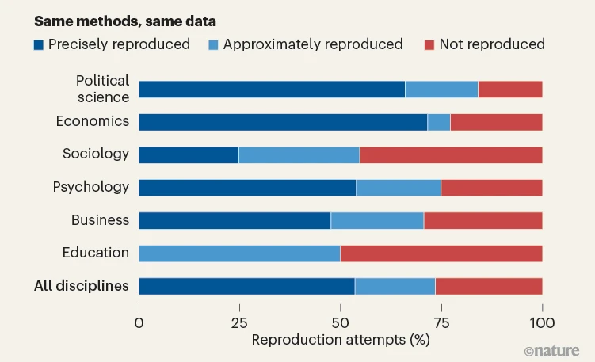
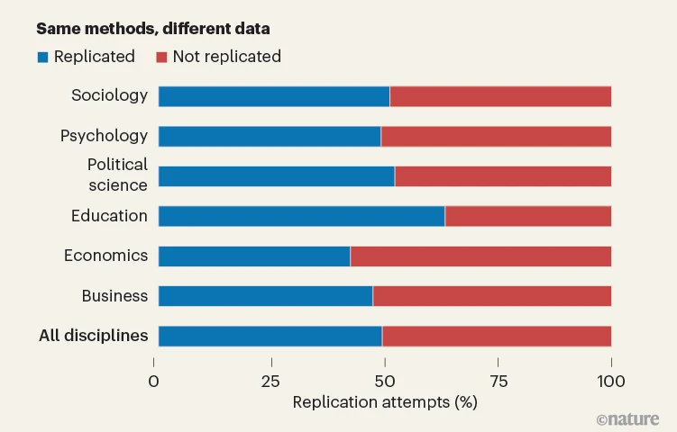
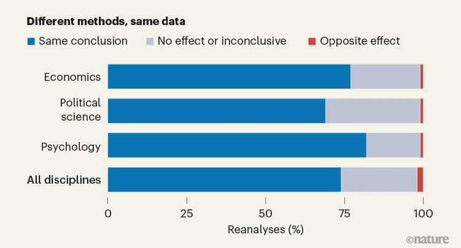

---
title: "Applied replication for data skills"
format: revealjs
---

```{r}
#| label: setup
#| include: false
# All figures on these slides are generated here from the workshop data files
# (../data/*.csv) or from small inline tribbles of published summary values –
# no images of the Nature papers' figures are used (copyright + everything must
# stay editable). Palette mirrors style/cgm-slides.scss.
suppressPackageStartupMessages({
  library(readr)
  library(dplyr)
  library(tidyr)
  library(ggplot2)
  library(dagitty)
  library(ggdag)
  library(patchwork)
})

ncl_blue <- "#0e3b6a"
orange   <- "#E69F00"
green    <- "#009E73"
d_red    <- "#a10000"
grey_mid <- "#848c94"

# A light slide-friendly ggplot theme: big type, no chart-junk.
theme_slide <- function(base_size = 17) {
  theme_minimal(base_size = base_size) +
    theme(
      panel.grid.minor = element_blank(),
      panel.grid.major.y = element_line(colour = "grey90"),
      plot.title = element_text(face = "bold", colour = ncl_blue),
      axis.title = element_text(colour = ncl_blue),
      legend.position = "none"
    )
}

# The four-cell repeatability matrix (Nosek et al. 2025). Defined once here so
# the full-colour slide and the 'robustness only' emphasis slide draw from a
# single source of truth – no copy-pasted plot code to drift apart. The data x
# analysis matrix is rendered as a tile grid (inline data, not a screenshot) so
# it stays fully editable; the term sits large in each cell with its one-line
# meaning beneath it.
repeatability_cells <- tibble::tribble(
  ~analysis,    ~data,       ~term,             ~def,                                  ~fill,
  "SAME METHODS",      "SAME DATA", "Reproducibility", "Testing the reliability of a prior finding\nwith the same data and same analysis\nstrategy by comparing the outcome of an\ninferential test as reported in a paper\nwith a re-calculation of that inferential\ntest from the original data.", "#0e3b6a",
  "DIFFERENT METHODS", "SAME DATA", "Robustness",  "Testing the reliability of a prior finding\nwith the same data and different analysis\nstrategy by conducting alternative\ntests on the original data.",  "#E69F00",
  "SAME METHODS",      "DIFFERENT DATA",  "Replicability",   "Testing the reliability of a prior finding\nwith new data expected to be theoretically\nequivalent by comparing the outcome of an\ninferential test as reported in a paper\nwith the equivalent inferential test as\ncalculated in the new dataset.",               "#009E73",
  "DIFFERENT METHODS", "DIFFERENT DATA", "Generalisibility", "Testing the reliability of a prior finding\nin a new dataset in a way that differs\nfrom the original study but is expected\nto produce similar results.",                 "#834848"
)

# Draw the matrix. `highlight = NULL` keeps all four cells in full colour; pass
# a term (e.g. "Robustness") to dim every OTHER cell to a light-grey box. Text
# stays white throughout, so dimmed cells read as light-grey background + white
# text while the highlighted cell keeps its own colour.
repeatability_matrix <- function(highlight = NULL) {
  grey_box <- "#b6bcc3"   # light grey for de-emphasised cells
  cells <- repeatability_cells |>
    dplyr::mutate(
      data = factor(data, levels = c("SAME DATA", "DIFFERENT DATA")),
      analysis = factor(analysis,
        levels = c("DIFFERENT METHODS", "SAME METHODS")),
      fill = if (is.null(highlight)) fill
             else dplyr::if_else(term == highlight, fill, grey_box)
    )
  ggplot(cells, aes(data, analysis)) +
    geom_tile(aes(fill = fill), colour = "white", linewidth = 4,
              width = 1, height = 1) +
    geom_text(aes(label = term), colour = "white",
              fontface = "bold", size = 9, nudge_y = 0.25) +
    geom_text(aes(label = def), colour = "white",
              size = 5, nudge_y = -0.1, lineheight = 0.95) +
    scale_fill_identity() +
    scale_x_discrete(position = "top") +
    labs(x = NULL, y = NULL) +
    theme_void(20) +
    # Row labels flipped to read vertically (bottom-to-top), matching the
    # rotated row-heads on the HTML image-grid version of this matrix.
    theme(panel.grid = element_blank(),
          axis.text = element_text(face = "bold", colour = ncl_blue),
          axis.text.x.top = element_text(size = 17),
          axis.text.y = element_text(size = 15, angle = 90, hjust = 0.5),
          plot.margin = ggplot2::margin(2, 8, 2, 2))
}

# Read the two data files the multiverse slides depend on. Relative paths
# resolve from slides/ at render time (verified with quarto render).
spec_grid <- readr::read_csv("../data/spec_grid.csv", show_col_types = FALSE)
analysts5 <- readr::read_csv("../data/analysts5.csv", show_col_types = FALSE)

# Shared multiverse base layer. Built ONCE so the two consecutive multiverse
# slides ("The class multiverse" and "Where your result lands") are the
# SAME chart with an overlay, not two charts. The second slide calls spec_base()
# and adds the analyst lines on top: identical dims, axes, theme, zero line,
# baseline marker and legend slot, so the reveal animates lines appearing on one
# unchanging panel. coord_cartesian() pins the y-range so the overlay cannot
# rescale the axis between slides.
sc_ranked <- spec_grid |>
  dplyr::arrange(r) |>
  dplyr::mutate(rank = dplyr::row_number())
sc_baseline <- dplyr::filter(sc_ranked, baseline)

spec_base <- function() {
  ggplot(sc_ranked, aes(rank, r)) +
    geom_hline(yintercept = 0, colour = grey_mid, linewidth = 0.4) +
    geom_point(aes(colour = sig), size = 0.7, alpha = 0.55) +
    geom_point(data = sc_baseline, colour = d_red, size = 4) +
    annotate("text", x = sc_baseline$rank, y = sc_baseline$r - 0.07,
             label = "constrained baseline\nt = −3.804",
             colour = d_red, fontface = "bold", size = 4, hjust = 0.15) +
    scale_colour_manual(values = c(`TRUE` = ncl_blue, `FALSE` = "#c7ccd2"),
                        labels = c(`TRUE` = "p < .05", `FALSE` = "n.s."),
                        name = NULL) +
    labs(x = "specification (ranked by partial r)", y = "partial r") +
    coord_cartesian(ylim = c(-0.72, 0.78)) +
    theme_slide(15) +
    theme(legend.position = "right", legend.title = element_blank())
}
```

## {#today .darkslide background-color="rgba(0,0,0,0)"}

::: {.todaymeta}
Workshop 1 · Open Research Conference · 10:15–12:45 · Room 1.06
:::

:::: {.todaybox}
::: {.nonincremental}
1. What survives when science repeats itself? – three *Nature* papers
2. Whose question is it anyway? – estimands and DAGs
3. You are analyst no. 6 – your own reanalysis, published before lunch
:::
::::

::: {.todaytake}
You leave with: your own public repo · a live web page · a row in the class multiverse
:::

::: {.todaymeta}
Work in pairs – one prepared laptop per pair
:::

::: notes
Welcome – good to have you here. This morning has three movements. First I'll show you what happened when *Nature* asked, three times over, whether social science holds up when you repeat it. Then we sharpen the question itself – estimands and causal graphs. And then you become analyst number six on a real published claim, and you'll publish your own reanalysis before lunch. You leave with your own public repository, a live web page, and a dot on the class's chart. One practical thing before we start: find a partner – ideally one prepared laptop per pair.
:::

# PART 1 – The three Rs {.darkslide background-color="rgba(0,0,0,0)"}

::: {.partlabel}
Talk I · 20 minutes
:::

::: notes
Part one, then. Three words that sound alike and are not – and the three *Nature* papers that put numbers on each of them. [18 minutes for this part – about 80 seconds a slide.]
:::

## "Replication" crises

:::: {.none}
::: {.fragment}
Another "replication" crisis – terminological confusion?
:::
::: {.fragment}
The term "reproducibility" has been used as a synonym for a number of different characteristics  – reproducibility, robustness, replicability, repeatability, credibility, and trustworthiness.
:::
[[Successfully rerun the same code on the same data?]{colour="#b22222"}]{.fragment}
[[Re-analyse the same data a different way?]{colour="#1C69A8"}]{.fragment}
[[Collect fresh data and analyse it in the same way?]{colour="#4D179A"}]{.fragment}
[[Using the same data and same analysis but asking a different question?]{colour="#3C6301"}]{.fragment}
[[Asking the same question but answering it with fresh data and a different analysis?]{colour="#3BB8DB"}]{.fragment}
::::

::: notes
Part of the problem is the word itself. For years 'replication' covered everything: rerunning someone's code, re-analysing their data a different way, collecting new data altogether. Those are three different operations, answering three different questions – but because we called them all 'replication', the crisis debates had people talking past each other for a decade. So before any numbers, we need vocabulary.
:::

## The data $\times$ analysis matrix

```{r}
#| label: matrix
#| fig-width: 12
#| fig-height: 7
repeatability_matrix()
```

::: {.src}
@AlipourfardEtAl2021SystematizingConfidenceOpen; @NosekEtAl2025BriefGlossaryTerms
:::

::: notes
Here is the whole framework on one slide, and if you take a single thing home today, make it this grid. The question stays the same throughout; what varies is the data and the analysis. Same data, same analysis – reproducibility: if I rerun your recipe, do I get your number? Same data but a different, justifiable analysis – robustness: does your finding survive my defensible choices? New data, same question – replicability. The fourth cell, new data and new analysis, is really generalisation, and we set it aside today. Sit with this for a moment – everything that follows this morning hangs off it.
:::

## Related concepts

::: {.scaled style="--fs: 0.9; --lh: 1.15"}
**Repeatability** is used when referring to reproducibility, robustness, and replicability as a constellation of concepts intended to assess whether answers to scientific questions are unchanged when different steps of the research process are repeated.

**Credibility** and **trustworthiness** refer to the confidence one can have in research findings. Because scientific knowledge claims are tentative, they are *not* synonymous with truth.

For example, credibility is advanced by addressing potential competing interests in the conducting and reporting of research, by taking existing knowledge into account, by using methods that have been validated, by controlling for biases in the research context, by pursuing precise and reliable evidence, and by calibrating the strength of the claims to the uncertainty of the evidence.
:::

::: {.src}
@NosekEtAl2025BriefGlossaryTerms
:::

## Three SCORE articles

::: {.matrix-grid}
<div class="corner"></div>
<div class="col-head">SAME data</div>
<div class="col-head">DIFFERENT data</div>

<div class="row-head">SAME methods</div>
<figure class="cell" style="--accent: #0e3b6a">

</figure>
<figure class="cell" style="--accent: #009E73">

</figure>

<div class="row-head">DIFFERENT methods</div>
<figure class="cell" style="--accent: #E69F00">

</figure>
<figure class="cell empty">

</figure>
:::

::: {.src}
@Sanchez-TojarEtAl2026HugeMetaresearchProject
:::

::: notes
Same four-cell map you have just learned – but now each box carries the actual disciplinary breakdown from its study. Three of the four corners have a SCORE paper behind them: reproduction top-left, replication top-right, reanalysis bottom-left. The fourth, generalisation, we set aside today. Notice the pattern jumps out by discipline rather than by concept: economics and political science sit at the top of reproduction, sociology lags; replication hovers around half almost everywhere; and reanalysis holds the original conclusion three times in four. Same data on the wall, three very different questions.
:::

<!-- ## Today's "replication"

```{r}
#| label: matrix-robustness
#| fig-width: 12
#| fig-height: 7
repeatability_matrix(highlight = "Robustness")
```

::: {.src}
@AlipourfardEtAl2021SystematizingConfidenceOpen; @NosekEtAl2025BriefGlossaryTerms
:::

::: notes
Same grid, one cell lit. Of the four, the one you are stepping into today is robustness: same data, a different but defensible analysis. Hold the other three in grey for now – we will meet each of them on this very paper before the morning is out – but this is the seat you are taking.
::: -->

## What is SCORE?

::: {.small}
- DARPA-funded programme to gauge the credibility of social-science claims
- **62 journals**, papers from **2009–2018**, stratified sample
- Each paper's central claim traced from abstract to the supporting statistic
- Thousands of researchers; three repetition studies built on the same frame
:::

::: notes
Where do these numbers come from? All three papers sit on one programme, SCORE – funded by DARPA, oddly enough, who wanted to know whether you could predict which findings hold up. The backbone is a stratified sample from sixty-two journals, papers published between 2009 and 2018, with each paper's central claim traced from the abstract down to the exact statistic that supports it. The three studies then took that same frame and each asked one of our three questions. So when the numbers land in a moment, they are about the same body of literature, asked three different things.
:::

## Reproducibility – Miske et al.

::: {.small}
- **600 papers** sampled (62 journals, 2009–2018)
- Ask the authors for data and code, then try to rerun the reported result
- How often can we even get to the starting line?
:::

::: {.src}
[@MiskeEtAl2026InvestigatingReproducibilitySocial].
:::

::: notes
First, reproducibility – the gentlest test of the three. The design in one breath: take six hundred papers, ask the authors for their data and code, and try to recompute the central reported result. Same data, same analysis: do you get the same number? Before we even ask how often that works, the first finding is about how rarely you can even start.
:::

## Most papers never reach the starting line

```{r}
#| label: miske-waterfall
#| fig-width: 8.5
#| fig-height: 3.6
# Waterfall from 600 sampled -> 143 assessable, inline data from the content
# bank (Miske et al. 2026). Illustrative staged counts, clearly labelled.
mw <- tibble::tribble(
  ~stage,                 ~n,
  "Sampled",              600,
  "Data available\n(24.0%)", 144,
  "Assessable",           143
)
mw <- mw |> dplyr::mutate(stage = factor(stage, levels = stage))
ggplot(mw, aes(stage, n, fill = stage)) +
  geom_col(width = 0.65) +
  geom_text(aes(label = n), vjust = -0.4, fontface = "bold",
            colour = ncl_blue, size = 6) +
  scale_fill_manual(values = c(ncl_blue, orange, green)) +
  ylim(0, 660) +
  labs(x = NULL, y = "papers") +
  theme_slide(16)
```

::: {.small}
- Of the **143 assessable**: **53.6%** reproduced precisely, **73.5%** approximately
- Counting the unassessable, only about **18%** reproduce
:::

::: notes
Read it left to right. Six hundred papers sampled. Data were available for twenty-four percent of them – for nearly three quarters there was neither data nor code. That leaves 143 papers you can actually assess. Of those, just over half reproduce precisely, and about three quarters at least approximately. Which sounds respectable – until you notice what happens if you count the papers nobody could check as failures: the overall rate falls to roughly eighteen percent. The barrier is not arithmetic. It is access.
:::

## Why some fields do better

::: {.small}
- Journals requiring data sharing: **87.5–100%** availability vs **16.0%** without
- Political science **54.1%** data availability vs education **2.9%**
- With data *and* code: **90.9%** approx-reproducible vs **38.1%** from rebuilt source
:::

::: {.claimcard}
"The most substantial barrier … was the unavailability of author data."

"Reproducibility success does not mean that the finding is correct."
:::

::: {.src}
[@MiskeEtAl2026InvestigatingReproducibilitySocial].
:::

::: notes
And access follows policy. Where journals mandate data sharing, availability sits between about ninety and one hundred percent; without a mandate, sixteen. Political science and economics built the habit early and are far ahead of the rest. The first quote is the paper's own conclusion – the biggest barrier was simply that the data were not there. The second quote deserves a beat of silence: "reproducibility success does not mean that the finding is correct." Reproducing a number tells you the computation was faithful. It does not tell you the claim about the world is true.
:::

## Robustness – Aczel et al. (Multi100)

::: {.small}
- **100 studies**, each re-analysed by **≥5 independent analysts**
- Same data; each analyst free to choose any *justifiable* analysis
- A peer panel judges whether each pipeline is appropriate
- This is the paper I was an analyst in
:::

::: {.src}
[@AczelEtAl2026InvestigatingAnalyticalRobustness].
:::

::: notes
The middle paper – the one I was in. One hundred studies, and for each one at least five analysts working independently: no teams, original authors barred, everyone handed the same data and the same claim. You were free to analyse it any way you could justify, and a peer panel later judged whether your pipeline was appropriate. Two things worth knowing about the design. The hundred studies had already passed a reproducibility check – so robustness was being measured on the reproducible subset, the best-case material. And we were not blinded: every analyst saw the full original article, published estimates and all, so if anything we were anchored towards the original answer.
:::

## Same data, five analysts, different answers

::: {.small}
- **34%** of reanalysis effect sizes within ±0.05 *d* of the original (57% within ±0.20)
- **74%** reached the same conclusion; 24% null/inconclusive; **2%** opposite
- Effect sizes shrank: original mean *d* **0.73** → reanalysis **0.49**
- Analyst-to-analyst variability typically **exceeds** sampling error
:::

::: {.src}
[@AczelEtAl2026InvestigatingAnalyticalRobustness].
:::

::: notes
So what do free, justifiable choices do to the same data? They move the answer – a lot. Only about a third of the reanalyses landed within five hundredths of a Cohen's d of the original, and in just five studies out of ninety-five did all the analysts land that close. Conclusions held up better than magnitudes: three quarters of reanalyses agreed with the original conclusion. But the effect sizes shrank, from a mean d of point seven three down to point four nine. And the finding I keep coming back to: the spread across analysts is typically larger than the statistical uncertainty inside any single analysis. The analyst, in other words, is a bigger source of noise than the sample. One more detail to hold for later: observational studies – which is what we work on today – came out less robust than experiments.
:::

## Replicability – Tyner et al.

::: {.small}
- **274 claims** from 164 papers, tested on **new data**
- Median statistical power **99.6%**; preregistered; original authors consulted
- The strictest test: does the effect reappear in a fresh sample?
:::

::: {.src}
[@TynerEtAl2026InvestigatingReplicabilitySocial].
:::

::: notes
The third paper is the strictest test: not the same data analysed differently, but genuinely new data. Two hundred and seventy-four claims, each replicated to a preregistered, peer-reviewed protocol, often with the original authors consulted, and with a median statistical power of ninety-nine point six percent. That last number matters: these studies were built so that a real effect would be very hard to miss. So whatever fails here is not failing for lack of trying.
:::

## Even success shrinks

```{r}
#| label: tyner-shrink
#| fig-width: 7.5
#| fig-height: 3.2
# Median r: original -> replication (Tyner et al. 2026), inline dumbbell.
sh <- tibble::tibble(
  stage = factor(c("Original", "Replication"),
                 levels = c("Original", "Replication")),
  r = c(0.25, 0.10)
)
ggplot(sh, aes(r, y = 1)) +
  geom_line(aes(group = 1), colour = grey_mid, linewidth = 2) +
  geom_point(aes(colour = stage), size = 8) +
  geom_text(aes(label = sprintf("%.2f", r)), vjust = -1.6,
            fontface = "bold", colour = ncl_blue, size = 6) +
  geom_text(aes(label = stage), vjust = 3.2, colour = ncl_blue, size = 5) +
  scale_colour_manual(values = c(ncl_blue, orange)) +
  scale_x_continuous(limits = c(0, 0.3)) +
  labs(x = "median effect size (r)", y = NULL) +
  theme_slide(16) +
  theme(axis.text.y = element_blank(),
        panel.grid.major.y = element_blank())
```

::: {.small}
- **55.1%** of claims replicated by significance; effect sizes roughly **halve**
- Thirteen success criteria give anywhere from **29%** to **75%**
:::

::: {.src}
[@TynerEtAl2026InvestigatingReplicabilitySocial].
:::

::: notes
And this is what comes back. The median effect size halves: point two five in the originals, point one zero in the replications. By the significance criterion, fifty-five percent of claims replicate. But notice that "did it replicate?" is not even one question – the team scored the same studies against thirteen reasonable success criteria and got answers ranging from twenty-nine to seventy-five percent. Two sentences from the paper are worth carrying around. "Strictly speaking, there is no such thing as exact replication." And: "The problem to solve is not unreplicability per se, it is overconfidence."
:::

## The take-away

:::: {.none}
Reproducible ≠ robust ≠ replicable.

::: {.fragment .fadeInUp}
Across SCORE the three are [**essentially uncorrelated**]{.highlight bg-colour="#ffe3b3"} – knowing one barely predicts the others.
:::

::: {.fragment .fadeInUp}
So there is no single number for 'trust'. You have to ask *which* repetition you mean.
:::
::::

::: notes
Now the bit that genuinely surprised me. You would hope these three properties travel together – that a reproducible finding is more likely to be robust, and a robust one more likely to replicate. Across SCORE, they do not. Measured on the same body of papers, the three indicators are essentially uncorrelated – knowing one tells you almost nothing about the others. So there is no single trust score for a finding. "Is it reliable?" is an incomplete question until you say which kind of repetition you mean. Hold that thought, because we are about to watch all three play out on one single paper.
:::

## Quick check: credibility in the wild {.questionslide transition="fade-in none-out"}

::: {.none}
You submit your paper and replication package. It goes out to reviewers.

- "Reviewer 1" wants to ensure that your results are [reproducible]{.fragment .bounceIn}, so she sources your R script to run the entire analysis. You're in luck – she hasn't yet updated her `dplyr`, so the code runs.
- "Reviewer 2" is very eager. He's unconvinced by your modelling choices, so he fits your data to another function to check if your findings are truly [robust]{.fragment .bounceIn}. You're in luck again – he recovers your point estimate to a reasonable precision, although the confidence intervals have widened.
- "Reviewer 3" takes a special interest because he's just working on a similar paper on data they published recently. Do your results [replicate]{.fragment .bounceIn} when your methods are applied to that state-of-the-art dataset?
:::

## Quick check: credibility in the wild {.questionslide transition="none-in fade-out"}

::: {.none}
You submit your paper and replication package. It goes out to reviewers. 

"Reviewer 2" just doesn't want to let go...

- He tried a few alternative analyses of your data, including a fancy new regression method that he just released as an R package. His method gives results that are generally aligned to yours, but for the method to work, it would require a larger dataset; would your results really [generalise]{.fragment .bounceIn} to this new dataset published by "Reviewer 3" that he just read about, if applying his new fancy method to it?
:::

# PART 2 – Our case {.darkslide background-color="rgba(0,0,0,0)"}

::: {.partlabel}
Talk II · 10 minutes
:::

::: notes
Part two – one paper. The one I worked on, and the one you are about to.
:::

## On the OSF

::: {.urlbox}
https://osf.io/6zqct
:::

## Teney (2016) in 60 seconds

::: {.small}
- 16 Eurobarometer waves, **2004–2013**; about **390,000** respondents in **27 countries**
- "What does the EU mean to you personally?" → four 0–1 framing scales
- cosmopolitan · utilitarian · communitarian · libertarian
- Three-level multilevel models (respondents in country-years in countries)
:::

::: {.src}
[@Teney2016DoesEUEconomic].
:::

::: notes
The paper is Céline Teney's, from 2016, in the *European Sociological Review*. Sixteen Eurobarometer waves, 2004 to 2013 – the crisis years – about three hundred and ninety thousand respondents across twenty-seven member states. The outcome comes from a nice survey item: "what does the EU mean to you personally?" Thirteen response options, which she organises into four framing scales; the cosmopolitan one – peace, democracy, freedom to move, cultural diversity – is the one we will target. The predictors are national unemployment and GDP growth, in three-level multilevel models. We will work on a country-year aggregate of the same data – two hundred and seventy rows – which behaves the same for our purposes and runs in milliseconds.
:::

## The claim card, as analysts received it

::: {.claimcard}
"… poor economic performances … decrease positive dimensions of EU framing"

<span class="src">Teney (2016: 619)</span>
:::

::: {.small}
- Anchor result – unemployment → cosmopolitan framing, Table 3 Model 1:
- **b = −0.00340 · [t = −4.03]{.highlight bg-colour="#ffe3b3"} · p < .001**
:::

::: notes
This is, word for word, the claim every Multi100 analyst was handed: "poor economic performances decrease positive dimensions of EU framing". And this is the anchor number behind it, from Table 3, Model 1 – the unemployment coefficient on cosmopolitan framing: minus point zero zero three four, t of minus four. Keep one wrinkle in mind for later. In the paper's own Model 2, with more controls in, that same coefficient drops by more than half and loses significance. The robustness question is already alive inside the original paper.
:::

## SCORE tried to reproduce it – twice

::: {.small}
- No public archive with the paper – **but the author supplied two Stata do-files on request**; the data stayed GESIS-restricted
- **Push-button reproduction** (with that author code) – **failed**:

::: {.claimcard .fragment}
"… file names that did not correspond with the names of the files available for download… 16 datasets are listed… the code references 18 files"
:::

- **Source-data reproduction** (rebuild from raw) – **"not reproduced"**: could not extract nor re-calculate the original effect size
:::

::: notes
So what happened when SCORE tried to reproduce this paper? Two attempts, two different failures. And let me be fair to the author here: there was no public archive with the paper, but she did supply her two Stata do-files when asked – what she could not share was the data, because GESIS terms do not allow it. Even with her code in hand, the push-button reproduction failed, and the report's wording is instructive – the file names in the code did not correspond to the files you could actually download; sixteen datasets listed, eighteen referenced. The second attempt rebuilt the data from source, and could not recover the published effect size at all. So this claim entered the robustness study already carrying two failed reproductions, of two different kinds.
:::

## The five-analyst reveal

```{r}
#| label: forest5
#| fig-width: 9
#| fig-height: 4
# Five Multi100 analysts of the SAME Teney claim, from ../data/analysts5.csv.
# Standardised partial r on one axis; C6HJR highlighted.
fa <- analysts5 |>
  dplyr::mutate(
    me  = analyst_id == "C6HJR",
    # tidy the tool string ("R (R Markdown)" etc.) for a clean label
    lab = paste0(analyst_id, "  ", tool),
    lab = factor(lab)
  ) |>
  dplyr::arrange(r) |>
  dplyr::mutate(lab = factor(lab, levels = lab))

ggplot(fa, aes(r, lab, colour = me)) +
  geom_vline(xintercept = 0, colour = grey_mid, linewidth = 0.4) +
  geom_point(size = 6) +
  geom_text(aes(label = sprintf("r = %.2f", r)),
            hjust = -0.25, size = 4.5, colour = ncl_blue) +
  scale_colour_manual(values = c(`FALSE` = ncl_blue, `TRUE` = orange)) +
  scale_x_continuous(limits = c(-0.55, 0.10)) +
  labs(x = "partial correlation r (same claim, five analysts)", y = NULL) +
  theme_slide(15)
```

::: {.small}
- All five negative – same direction · partial r from **−0.45 to −0.01** · one not significant
:::

::: {.src}
Multi100 Task-2 reanalyses of the Teney claim.
:::

::: notes
And then five of us re-analysed it, independently. Here is what came back. All five found a negative effect – on direction, unanimity. On size, look at the spread: from essentially zero – that one is not significant – up to a partial correlation of minus point four five. Two orders of magnitude apart, on the same data, for the same claim. The orange dot is me: R and Quarto, minus point two four. We did not even use the same software – two of the five worked in Stata, three in R, which quietly makes today's case for reproducible pipelines. Five competent people, one fixed question: analysis is a garden of forking paths.
:::

## One paper, all three Rs

```{r}
#| label: score-scoreboard
#| fig-width: 10.5
#| fig-height: 4.6
# The full SCORE dossier on Teney (2016) as a clean three-row scoreboard
# (sources: osf.io/h7432 components; see resources page). Inline values, one
# row per R, colour-coded by verdict. Stays fully editable.
sb <- tibble::tribble(
  ~ord, ~R,              ~verdict,         ~detail,                                              ~fill,
  3,    "Reproducible?", "FAILED ×2", "push-button + source-data, two different failures",  d_red,
  2,    "Robust?",       "MIXED",          "5 analysts, all negative; |r| 0.01–0.45 (×100)", orange,
  1,    "Replicable?",   "SIGN FLIPPED",   "new Eurobarometer, N = 352,114; b = +0.002, p = .046", d_red
)

ggplot(sb, aes(x = 1, y = ord)) +
  # role band
  geom_tile(aes(fill = fill), width = 0.9, height = 0.92,
            alpha = 0.14) +
  # left rule in the verdict colour
  geom_segment(aes(x = 0.553, xend = 0.553, y = ord - 0.46, yend = ord + 0.46,
                   colour = fill), linewidth = 6) +
  scale_fill_identity() +
  scale_colour_identity() +
  # the R name
  geom_text(aes(label = R), x = 0.60, hjust = 0, vjust = 0.5,
            fontface = "bold", colour = ncl_blue, size = 8) +
  # the verdict
  geom_text(aes(label = verdict, colour = fill), x = 0.60, y = sb$ord - 0.26,
            hjust = 0, vjust = 0.5, fontface = "bold", size = 6.2) +
  # the supporting detail
  geom_text(aes(label = detail), x = 1.02, hjust = 0, vjust = 0.5,
            colour = grey_mid, size = 4.6) +
  scale_x_continuous(limits = c(0.5, 1.9)) +
  scale_y_continuous(limits = c(0.4, 3.6)) +
  labs(x = NULL, y = NULL) +
  theme_void()
```

::: {.small}
- Reproduction failed (twice, differently) · robustness: same sign, sizes spanning two orders of magnitude · replication: **the sign flipped**
:::

::: {.src}
Full SCORE dossier on Teney (2016): osf.io/h7432. One paper, three Rs, three verdicts.
:::

::: notes
Put the whole dossier together – every artifact here is public, the link is on the slide. Reproduction: failed, twice, in two different ways. Robustness: mixed – five analysts, one sign, sizes spanning two orders of magnitude. And replication: a preregistered study took the same question to new Eurobarometer data, three hundred and fifty-two thousand observations – and the coefficient flipped sign. Positive, just significant, the wrong way round. So: one paper, three Rs, three different verdicts. That is the uncorrelated-indicators result from part one, embodied in a single case. Asking "is this paper reliable?" gets you nowhere; asking "reliable in which sense?" gets you all of this. And now it is your turn – you are the sixth analyst.
:::

## You are analyst no. 6 – two tracks

::: {.small}
- **Track A – browser lab** (zero install, webR in the page):
:::

::: {.urlbox}
codemoreh.github.io/applied-replication/exercise/browser-lab.html
:::

::: {.small}
- **Track B – template repo** (full Positron + git pipeline):
:::

::: {.urlbox}
github.com/CodeMoreh/replication-lab → "Use this template" → clone in Positron
:::

::: {.small}
- Work in **pairs** – at least one prepared laptop per pair
:::

::: notes
Here is how the next hour works. Two ways in, same destination. Track A is the browser lab: open that first address and R boots inside the page itself – nothing to install, works on any laptop, including the one you borrowed this morning. Track B is the full pipeline: take the template repository, click "Use this template", and clone your copy in Positron. In your pairs, make sure at least one of you has a working track – and if you are on Track B, keep the browser lab open in a tab as your spare. One more thing to note: everything you produce today ends up as a single click on a link that drops your result onto a live chart on the Multiverse page. That chart is our results board – we will watch it fill up and read it together at the end.
:::


# PART 3 – Estimands & DAGs {.darkslide background-color="rgba(0,0,0,0)"}

::: {.partlabel}
Concepts · 8-minute mini-lecture, then guided work
:::

::: notes
Right – everyone has something running. Eight minutes of ideas, and then you put them to work. The argument of this part, in one sentence: a lot of what we just called 'analysis variability' is really *question* variability – and if you fix the question precisely, the multiverse narrows.
:::

## The red-card study: 29 teams, one dataset

```{r}
#| label: redcard-strip
#| fig-width: 9
#| fig-height: 3.4
# Silberzahn et al. (2018): 29 teams, odds ratios 0.89-2.93, median 1.31.
# Illustrative dot strip rendered from the published summary stats (median +
# range) – CLEARLY a display sketch, not the raw 29 estimates.
set.seed(42)
rc <- tibble::tibble(
  team = 1:29,
  or = c(0.89, 2.93,
         qnorm(seq(0.05, 0.95, length.out = 27),
               mean = 1.31, sd = 0.45))
)
ggplot(rc, aes(or, y = 1)) +
  geom_vline(xintercept = 1, colour = grey_mid, linewidth = 0.4) +
  geom_jitter(height = 0.25, width = 0, size = 4, alpha = 0.7,
              colour = ncl_blue) +
  annotate("point", x = 1.31, y = 1, colour = d_red, size = 6) +
  annotate("text", x = 1.31, y = 1.45, label = "median 1.31",
           colour = d_red, fontface = "bold", size = 5) +
  scale_x_continuous(limits = c(0.7, 3.1)) +
  labs(x = "odds ratio: are dark-skinned players more often red-carded?",
       y = NULL) +
  theme_slide(15) +
  theme(axis.text.y = element_blank(),
        panel.grid.major.y = element_blank())
```

::: {.src}
[@SilberzahnEtAl2018ManyAnalystsOne]. Display sketch from published median (1.31) + range (0.89–2.93).
:::

::: notes
This is the study that started the whole many-analysts conversation. Twenty-nine teams, identical data, one question on paper: are dark-skinned footballers more likely to be red-carded than light-skinned ones? The odds ratios came back ranging from point eight nine – that is, below one – to nearly three. Median one point three one. About two thirds of the teams found a significant effect; a third did not. Same data, same question, twenty-nine answers. One caveat about the figure: the dots are a sketch drawn from the published median and range, not the teams' actual estimates – it is the spread that carries the message.
:::

## They were not answering the same question

::: {.none}
<br>
Auspurg & Brüderl re-read the 29 analyses and found **four** different estimands:

- descriptive association · discrimination *net of mediators* · variance-maximising · exploratory
- The dispersion was largely a **question**-multiverse, not an analysis-multiverse
:::

::: {.src}
[@AuspurgBruderl2021HasCredibilitySocial]
:::

::: notes
Why so scattered? Auspurg and Brüderl went back through all twenty-nine pipelines, and their diagnosis is the hinge of this morning: the teams were not answering one question. They found four. Some estimated the plain descriptive association. Some went after discrimination proper – the effect net of everything that legitimately explains red cards. Some built models tuned to explain variance. And some were frankly exploring. Of course the answers differed – they were answers to different questions. That reframes the crisis quite a bit: much of what looks like analytical instability is unstated disagreement about *what is being estimated*.
:::

## What is your estimand?

```{r}
#| label: lundberg-pipeline
#| fig-width: 9
#| fig-height: 3
# Lundberg et al. (2021) three steps as boxes-and-arrows (ggplot, editable).
steps <- tibble::tibble(
  x = c(1, 2, 3),
  lab = c("Theoretical\nestimand",
          "Empirical\nestimand",
          "Estimation\nstrategy"),
  sub = c("unit quantity +\ntarget population",
          "identification\nassumptions (DAG)",
          "where the R\ncode enters")
)
ggplot(steps, aes(x, 1)) +
  geom_tile(width = 0.8, height = 0.7, fill = ncl_blue) +
  geom_text(aes(label = lab), colour = "white", fontface = "bold",
            size = 5.2, vjust = -0.3) +
  geom_text(aes(label = sub), colour = "white", size = 3.6, vjust = 2.0) +
  annotate("segment", x = 1.42, xend = 1.58, y = 1, yend = 1,
           arrow = arrow(length = unit(0.18, "cm")), linewidth = 1) +
  annotate("segment", x = 2.42, xend = 2.58, y = 1, yend = 1,
           arrow = arrow(length = unit(0.18, "cm")), linewidth = 1) +
  scale_x_continuous(limits = c(0.5, 3.5)) +
  labs(x = NULL, y = NULL) +
  theme_void()
```

::: {.none}
- The theoretical estimand is stated **outside** any model – before R opens
:::

::: {.src}
[@LundbergEtAl2021WhatYourEstimand].
:::

::: notes
Which brings us to the most useful question in quantitative research: what is your estimand? Lundberg and colleagues split the answer into three steps. First, the theoretical estimand: a unit-specific quantity and a target population, stated in plain words, before any model exists. Second, the empirical estimand: what in the observable data corresponds to that quantity – and making that link forces your identification assumptions into the open, which is exactly where the causal graph lives. Only third comes estimation, where R finally opens. When they audited a full year of papers in a top sociology journal, the unit quantity was clearly stated in five out of thirty-two. Their demand is the one to remember: every quantitative study must be able to answer the question – what is your estimand?
:::

## DAG crash course: three roles {.smaller}

```{r}
#| label: mini-dags
#| fig-width: 9.5
#| fig-height: 3.6
# Three tiny DAGs: confounder / mediator / collider, built with ggdag.
mini <- function(spec, coords) {
  d <- dagitty::dagitty(spec)
  dagitty::coordinates(d) <- coords
  d
}
conf <- mini("dag { Z -> X  Z -> Y  X -> Y }",
  list(x = c(X = 0, Y = 2, Z = 1), y = c(X = 0, Y = 0, Z = 1)))
med  <- mini("dag { X -> M  M -> Y  X -> Y }",
  list(x = c(X = 0, Y = 2, M = 1), y = c(X = 0, Y = 0, M = 1)))
coll <- mini("dag { X -> C  Y -> C  X -> Y }",
  list(x = c(X = 0, Y = 2, C = 1), y = c(X = 0, Y = 0, C = -1)))

# Edges are coloured by role: the X -> Y causal effect (the estimand) is GREEN
# in every panel; the secondary structure carries an accent – RED where it
# biases the naive estimate (the confounder fork, the collider edges) and AMBER
# for the mediator's indirect path, which is part of the total effect rather
# than bias. The accent is passed per panel; green is constant so the eye learns
# 'green = the effect I want, coloured = the path I must reason about'.
gg <- function(d, ttl, cap, accent = d_red) {
  td <- ggdag::tidy_dagitty(d)
  td$data <- dplyr::mutate(td$data,
    edge_kind = dplyr::if_else(name == "X" & to == "Y", "causal", "other"))
  ggplot2::ggplot(td,
      ggplot2::aes(x = x, y = y, xend = xend, yend = yend)) +
    ggdag::geom_dag_edges(ggplot2::aes(edge_colour = edge_kind),
      arrow_directed = grid::arrow(length = grid::unit(7, "pt"),
                                   type = "closed")) +
    ggdag::geom_dag_point(size = 16, colour = "black") +
    ggdag::geom_dag_text(colour = "white", size = 4) +
    ggraph::scale_edge_colour_manual(
      values = c(causal = green, other = accent), guide = "none") +
    ggdag::theme_dag() +
    # Expand the panel so the nodes sit well inside it – otherwise the title
    # and caption crowd (and slightly cover) the top/bottom nodes.
    ggplot2::scale_x_continuous(expand = ggplot2::expansion(mult = 0.18)) +
    ggplot2::scale_y_continuous(expand = ggplot2::expansion(mult = 0.32)) +
    ggplot2::labs(title = ttl, caption = cap) +
    ggplot2::theme(
      plot.title = element_text(face = "bold", colour = ncl_blue,
                                hjust = 0.5, size = 16,
                                margin = margin(b = 10)),
      plot.caption = element_text(hjust = 0.5, size = 11,
                                  colour = grey_mid, lineheight = 1.05,
                                  margin = margin(t = 10)))
}
  patchwork::wrap_plots(
    gg(conf, "Confounder Z",
       "Common cause of X and Y.\nADJUST – or the estimate is biased.", d_red),
    gg(med,  "Mediator M",
       "Sits on the path X → Y.\nDON'T adjust for the total effect.", orange),
    gg(coll, "Collider C",
       "Caused by both X and Y.\nNEVER adjust – it opens a spurious path.", d_red),
    nrow = 1)
```

::: {.src}
X = exposure, Y = outcome. **Green** = the causal effect you want; **coloured** = the path you must reason about.
:::

::: notes
All the graph theory you need today, in three small pictures. In every panel the green arrow is the same thing – the effect you are actually after, X on Y. What changes is the coloured structure around it. A confounder is a common cause of your exposure and your outcome – that red fork is a back-door path, and if you leave it open you are biased, so you adjust to close it. A mediator sits on the causal path between them – the amber path is real, it is part of the total effect, so if the total effect is what you want you do not adjust for it, or you remove part of the very thing you are measuring. And a collider is caused by both sides – those edges are harmless until you condition on the collider, which opens a spurious path that was not there before. So the rulebook is short: adjust confounders, leave mediators alone for total effects, and never condition on a collider. That is the entire toolkit – the next four slides just give it a bit more depth before you use it.
:::

## One number, many stories {.smaller}

:::: {.columns}
::: {.column width="54%"}

```{r}
#| label: many-stories
#| fig-width: 5.2
#| fig-height: 4.3
# A single strong association. The same slope is consistent with several
# different causal structures – the number alone cannot tell you which one
# generated it (the 'causal quartet' point). Scatter is simulated for display.
set.seed(11)
n <- 130; x <- rnorm(n); y <- 0.6 * x + rnorm(n, 0, 0.85)
df <- tibble::tibble(x, y)
ggplot(df, aes(x, y)) +
  geom_point(colour = ncl_blue, alpha = 0.5, size = 2.3) +
  geom_smooth(method = "lm", se = FALSE, colour = d_red, linewidth = 1.2) +
  annotate("text", x = min(x), y = max(y), hjust = 0, vjust = 1,
           label = paste0("r = ", format(round(cor(x, y), 2), nsmall = 2)),
           colour = d_red, fontface = "bold", size = 6.5) +
  labs(x = "X", y = "Y") + theme_slide(16)
```

:::
::: {.column width="46%"}
::: {.small}
The same slope fits four different stories:

::: {.fragment}
- X really causes Y – the slope *is* the effect
:::
::: {.fragment}
- a common cause inflates it – **confounding**
:::
::: {.fragment}
- we are seeing a selected sample – **collider / selection**
:::
::: {.fragment}
- Y causes X (**reverse causation**), or it is **chance**
:::
::: {.fragment}
The data look identical in all four. Only an assumption about *how the data arose* tells them apart – that is what a DAG writes down.
:::
:::
:::
::::

::: {.src}
[@DAgostinoMcGowanEtAl2024CausalInferenceNot; @KeeleEtAl2020CausalInterpretationEstimated]. Scatter simulated for illustration.
:::

::: notes
Here is a strong correlation – r of about nought point six. Before you reach for a model, sit with an uncomfortable fact: this single number is consistent with at least four different stories. Maybe X really does cause Y, and the slope is the effect. Maybe a common cause is inflating it. Maybe we are quietly looking at a selected sample, and the association is an artefact of who got in. Maybe Y causes X, or it is simply chance. The data cannot choose between these – the scatter looks identical in every case. Only a claim about how the data were generated can. That claim is what a DAG writes down, and it is why we draw one before we fit anything.
:::

## Reading a DAG: open and closed paths {.smaller}

```{r}
#| label: backdoor-paths
#| fig-width: 9.5
#| fig-height: 3.7
# Same confounder graph, twice. LEFT: the back-door path X <- Z -> Y is open
# (red), so the naive X -> Y estimate is biased. RIGHT: adjusting for Z (boxed)
# blocks the back-door (greyed), leaving the green causal path clean. Reuses
# `conf` and `mini()` from the mini-dags chunk.
path_panel <- function(adjust_z = FALSE) {
  td <- ggdag::tidy_dagitty(conf)
  td$data <- dplyr::mutate(td$data,
    edge_kind = dplyr::if_else(name == "X" & to == "Y", "causal",
                       if (adjust_z) "blocked" else "backdoor"))
  p <- ggplot2::ggplot(td,
      ggplot2::aes(x = x, y = y, xend = xend, yend = yend)) +
    ggdag::geom_dag_edges(ggplot2::aes(edge_colour = edge_kind),
      arrow_directed = grid::arrow(length = grid::unit(7, "pt"),
                                   type = "closed")) +
    ggdag::geom_dag_point(size = 18, colour = "black") +
    ggdag::geom_dag_text(colour = "white", size = 4.4) +
    ggraph::scale_edge_colour_manual(
      values = c(causal = green, backdoor = d_red, blocked = grey_mid),
      guide = "none") +
    ggdag::theme_dag() +
    ggplot2::scale_x_continuous(expand = ggplot2::expansion(mult = 0.22)) +
    ggplot2::scale_y_continuous(expand = ggplot2::expansion(mult = 0.40)) +
    ggplot2::labs(title = if (adjust_z) "Adjust for Z → back-door closed"
                          else "Back-door path X ← Z → Y is open") +
    ggplot2::theme(plot.title = element_text(face = "bold", colour = ncl_blue,
                                hjust = 0.5, size = 15, margin = margin(b = 8)))
  if (adjust_z) {
    zc <- subset(td$data, name == "Z")[1, ]
    p <- p + ggplot2::annotate("point", x = zc$x, y = zc$y, shape = 0,
                               size = 14, stroke = 1.6, colour = ncl_blue)
  }
  p
}
patchwork::wrap_plots(path_panel(FALSE), path_panel(TRUE), nrow = 1)
```

::: {.small}
Association flows along **every open path** – not only the causal arrow. A fork or chain is open until you adjust the variable on it; a collider is the reverse – shut until you adjust it.

- **Back-door criterion**: close every path that enters X from behind, keep the causal X → Y path open
- That adjustment set – and only that set – earns a causal reading
:::

::: {.src}
[@HernanRobins2020CausalInferenceWhat; @Huntington-Klein2021EffectIntroductionResearch].
:::

::: notes
A DAG is read through its paths. Association does not only travel down the causal arrow – it flows along every open path between X and Y. So the job is to work out which paths are open and shut the ones you do not want. Two rules do all the work. A path through a fork or a chain is open, and you close it by adjusting the variable in the middle – that is the red back-door fork on the left. A path through a collider is the opposite: shut by default, and you open it by adjusting. The back-door criterion just packages this: close every path that sneaks into X from behind, leave the causal X-to-Y path alone. The set that does that – and only that set – is what you are allowed to read as causal.
:::

## Which effect do you even want? {.smaller}

:::: {.columns}
::: {.column width="55%"}

```{r}
#| label: total-direct
#| fig-width: 5.6
#| fig-height: 4.1
# Mediator graph with the two routes coloured: the DIRECT effect X -> Y (green)
# and the INDIRECT route X -> M -> Y (amber). Together they make the total
# effect; adjusting for M leaves only the direct one. Reuses `med`.
td <- ggdag::tidy_dagitty(med)
td$data <- dplyr::mutate(td$data,
  edge_kind = dplyr::if_else(name == "X" & to == "Y", "direct", "indirect"))
ggplot2::ggplot(td,
    ggplot2::aes(x = x, y = y, xend = xend, yend = yend)) +
  ggdag::geom_dag_edges(ggplot2::aes(edge_colour = edge_kind),
    arrow_directed = grid::arrow(length = grid::unit(8, "pt"), type = "closed")) +
  ggdag::geom_dag_point(size = 22, colour = "black") +
  ggdag::geom_dag_text(colour = "white", size = 5) +
  ggraph::scale_edge_colour_manual(values = c(direct = green, indirect = orange),
    guide = "none") +
  ggdag::theme_dag() +
  ggplot2::scale_x_continuous(expand = ggplot2::expansion(mult = 0.18)) +
  ggplot2::scale_y_continuous(expand = ggplot2::expansion(mult = 0.30)) +
  ggplot2::annotate("text", x = 0.5, y = 0.62, label = "indirect", colour = orange,
           fontface = "bold", size = 4.5, angle = 33) +
  ggplot2::annotate("text", x = 1, y = -0.14, label = "direct", colour = green,
           fontface = "bold", size = 4.5)
```

:::
::: {.column width="45%"}
::: {.small}
- **Total** = direct (green) + indirect (amber)
- Adjust for the mediator M → you estimate the **direct** effect only – a *different* estimand
- 'Control for everything' silently answers a question you never asked
- **Table 2 fallacy**: the other coefficients in your model are *not* all causal effects
:::
:::
::::

::: {.src}
[@KeeleEtAl2020CausalInterpretationEstimated; @DAgostinoMcGowanEtAl2024CausalInferenceNot].
:::

::: notes
Now the question the estimand discussion was circling. Suppose M sits between your exposure and outcome. The total effect is the green arrow plus the amber route through M. The direct effect is just the green arrow. These are different numbers and different questions – and which one you get depends entirely on whether you put M in the model. Drop a mediator in as just another 'control' and you have silently switched to the direct effect without telling anyone, including yourself. This is why 'control for everything' is bad advice. And it has a famous corollary – the Table 2 fallacy: when you print a regression table, usually only one coefficient has a clean causal reading. The control variables' coefficients are not little causal effects of their own.
:::

## Spurious by design: selection & feedback {.smaller}

```{r}
#| label: selection-panel
#| fig-width: 10
#| fig-height: 3.7
# LEFT: a collider S caused by A and B. Conditioning on (or sampling on) S –
# the red box – induces a spurious A–B association (dashed red). RIGHT: a
# two-wave cross-lagged panel. The claim U1 -> F2 is green; the reverse path
# F1 -> U2 is red; the autoregressive paths are grey. Two-way FE handles
# neither feedback nor time-varying confounding.
sel <- mini("dag { A -> S  B -> S }",
  list(x = c(A = 0, S = 1, B = 2), y = c(A = 0, S = 1, B = 0)))
tds <- ggdag::tidy_dagitty(sel)
tds$data <- dplyr::mutate(tds$data, edge_kind = "structural")
p_sel <- ggplot2::ggplot(tds,
    ggplot2::aes(x = x, y = y, xend = xend, yend = yend)) +
  ggdag::geom_dag_edges(ggplot2::aes(edge_colour = edge_kind),
    arrow_directed = grid::arrow(length = grid::unit(7, "pt"), type = "closed")) +
  ggdag::geom_dag_point(size = 18, colour = "black") +
  ggdag::geom_dag_text(colour = "white", size = 4.4) +
  ggraph::scale_edge_colour_manual(values = c(structural = grey_mid), guide = "none") +
  ggplot2::annotate("point", x = 1, y = 1, shape = 0, size = 14, stroke = 1.6,
                    colour = d_red) +
  ggplot2::annotate("curve", x = 0.12, y = -0.18, xend = 1.88, yend = -0.18,
    curvature = -0.25, colour = d_red, linetype = "dashed", linewidth = 0.9,
    arrow = grid::arrow(length = grid::unit(6, "pt"), ends = "both")) +
  ggdag::theme_dag() +
  ggplot2::scale_x_continuous(expand = ggplot2::expansion(mult = 0.22)) +
  ggplot2::scale_y_continuous(expand = ggplot2::expansion(mult = 0.45)) +
  ggplot2::labs(title = "Condition on collider S → spurious A–B link") +
  ggplot2::theme(plot.title = element_text(face = "bold", colour = ncl_blue,
                              hjust = 0.5, size = 14, margin = margin(b = 8)))

clp <- mini("dag { U1 -> U2  F1 -> F2  U1 -> F2  F1 -> U2 }",
  list(x = c(U1 = 0, F1 = 0, U2 = 2, F2 = 2),
       y = c(U1 = 1, F1 = 0, U2 = 1, F2 = 0)))
tdc <- ggdag::tidy_dagitty(clp)
tdc$data <- dplyr::mutate(tdc$data, edge_kind = dplyr::case_when(
  name == "U1" & to == "F2" ~ "claim",
  name == "F1" & to == "U2" ~ "reverse",
  TRUE ~ "auto"))
p_clp <- ggplot2::ggplot(tdc,
    ggplot2::aes(x = x, y = y, xend = xend, yend = yend)) +
  ggdag::geom_dag_edges(ggplot2::aes(edge_colour = edge_kind),
    arrow_directed = grid::arrow(length = grid::unit(7, "pt"), type = "closed")) +
  ggdag::geom_dag_point(size = 20, colour = "black") +
  ggdag::geom_dag_text(colour = "white", size = 3.6) +
  ggraph::scale_edge_colour_manual(
    values = c(claim = green, reverse = d_red, auto = grey_mid), guide = "none") +
  ggdag::theme_dag() +
  ggplot2::scale_x_continuous(expand = ggplot2::expansion(mult = 0.18)) +
  ggplot2::scale_y_continuous(expand = ggplot2::expansion(mult = 0.30)) +
  ggplot2::labs(title = "Panel feedback: U now → F later, but also F → U") +
  ggplot2::theme(plot.title = element_text(face = "bold", colour = ncl_blue,
                              hjust = 0.5, size = 14, margin = margin(b = 8)))
patchwork::wrap_plots(p_sel, p_clp, nrow = 1)
```

::: {.small}
- **Selection / collider bias** – conditioning, or merely *sampling*, on a common effect manufactures an association that was never there (much of the early COVID risk-factor literature)
- **Reverse causation & feedback** – in a panel, today's outcome can move tomorrow's exposure; two-way fixed effects absorb stable country traits and common-year shocks, **not** time-varying feedback (U = unemployment, F = framing)
:::

::: {.src}
[@GriffithEtAl2020ColliderBiasUndermines; @ColeEtAl2010IllustratingBiasDue; @LeszczenskyWolbring2022HowDealReverse].
:::

::: notes
Two last ways a relationship can be spurious, both of which live in our case. The first is selection, or collider bias. If you condition on – or merely sample on – something that both your variables cause, you manufacture a correlation out of nothing. A lot of the early COVID risk-factor findings were exactly this: conclusions drawn from people who had been tested, which is a selected group. The second is reverse causation and feedback. Our data are a panel, and in a panel today's outcome can feed tomorrow's exposure. Two-way fixed effects – which is the model we are about to draw – soak up stable differences between countries and shocks common to a year. They do not, on their own, fix a time-varying confounder or a feedback loop. Keep that in mind when we build the graph for our own paper.
:::

## A&B's resolution: fix the estimand first

```{r}
#| label: redcard-contrast
#| fig-width: 9
#| fig-height: 3.6
# Dispersion contrast: the 29-team crowd (SD 0.45) vs Auspurg & Brüderl's
# 486-model multiverse with the estimand fixed (median 1.28, SD 0.06).
# Both are display sketches from the published median + SD, clearly labelled.
set.seed(7)
contrast <- dplyr::bind_rows(
  tibble::tibble(grp = "29 teams\n(SD 0.45)",
                 or = rnorm(29, 1.31, 0.45)),
  tibble::tibble(grp = "486 models,\nestimand fixed (SD 0.06)",
                 or = rnorm(200, 1.28, 0.06))
)
ggplot(contrast, aes(or, grp, colour = grp)) +
  geom_vline(xintercept = 1, colour = grey_mid, linewidth = 0.4) +
  geom_jitter(height = 0.22, width = 0, size = 2.5, alpha = 0.55) +
  scale_colour_manual(values = c(d_red, ncl_blue)) +
  scale_x_continuous(limits = c(0.5, 3.1)) +
  labs(x = "odds ratio", y = NULL) +
  theme_slide(15)
```

::: {.small}
- Fix the question → derive the model space → run **all 486** justifiable models → **SD 0.45 → 0.06**
:::

::: {.src}
[@AuspurgBruderl2021HasCredibilitySocial]. Display sketches from published medians + SDs (illustrative spread).
:::

::: notes
And here is the optimistic half of the red-card story. Auspurg and Brüderl fixed one estimand – discrimination, properly defined – used a causal graph to derive every model specification consistent with it, four hundred and eighty-six of them, and ran the lot. Look what happens to the spread: standard deviation point four five in the crowd, point zero six with the question fixed. Same caveat as before – these strips are sketches from the published summary figures. The recipe we take from them is the workshop's recipe: a precise question, assumptions drawn out explicitly, then a whole multiverse rather than one path, then sensitivity analysis. Their conclusion, roughly: it is research without a clear question that has the credibility problem.
:::

## *Revenons à nos moutons*

::: {.claimcard}
"The expected change in [unit quantity] among [target population] for a 1-percentage-point difference in unemployment, holding [assumptions] fixed."
:::

::: {.small}
- Unit quantity – a *person's* cosmopolitan framing, or a *country-year* mean?
- Target population – which countries, which years?
- You write this sentence in your report **before** you fit anything
:::

::: notes
Now apply it to our paper. This is the first thing you write in Task C – the sentence on the slide, with the brackets filled in. The genuinely open choice is the unit. Is your estimand about a *person's* framing, the way Teney's multilevel models are? Or about a *country-year average*, the way our panel is? Neither is wrong – they are different questions, with different confounding stories, and the coefficient means something different in each. Write the sentence before you fit anything. It will discipline every choice you make afterwards.
:::

## The Teney DAG, half built

:::: {.columns}
::: {.column width="60%"}

```{r}
#| label: teney-dag
#| fig-width: 10.5
#| fig-height: 5.8
# ggdag rendering of the Task-C starter DAG. This reproduces the EXACT graph in
# _template/R/dag_starter.R: the causal path of interest and the two confounder
# pairs (country, year) are drawn SOLID; the three arguable nodes (growth,
# bailout, politicisation) are present but UNCONNECTED – the edges participants
# decide whether to add in Task C. That is what makes it 'half built'. Nodes are
# coloured by ROLE (exposure orange, outcome navy, candidates light grey),
# labels sit inside the nodes in white/dark, edges are thick and gently curved.
dag <- dagitty::dagitty('dag {
  unemployment   [exposure]
  framing        [outcome]
  country
  year
  growth
  bailout
  politicisation

  unemployment -> framing
  country -> unemployment
  country -> framing
  year -> unemployment
  year -> framing
}')

# 'growth' nudged down off the year -> unemployment crossing arrow; the other
# floating candidates kept clear of the committed edges.
dagitty::coordinates(dag) <- list(
  x = c(unemployment = 0, framing = 3, country = 1, year = 2,
        growth = 0.9, bailout = 1.5, politicisation = 3),
  y = c(unemployment = 0, framing = 0, country = 1.4, year = 1.4,
        growth = -1.0, bailout = -1.2, politicisation = -0.95))

# Role lookup → drives node fill and label colour; short display labels keep
# the longer names from overflowing the nodes (the underlying graph keeps the
# full names, matching dag_starter.R).
roles <- tibble::tibble(
  name = c("unemployment", "framing", "country", "year",
           "growth", "bailout", "politicisation"),
  role = c("exposure", "outcome", "adjusted", "adjusted",
           "candidate", "candidate", "candidate"),
  disp = c("unemp.", "framing", "country", "year",
           "growth", "bailout", "politic."))
role_fill <- c(exposure = orange, outcome = ncl_blue,
               adjusted = "#c7ccd2", candidate = "#dde2e7")
# White labels read on the dark exposure/outcome fills; navy on the light greys.
role_lab  <- c(exposure = "#FFFFFF", outcome = "#FFFFFF",
               adjusted = ncl_blue, candidate = "#5d666e")

dag_tidy <- dag |>
  ggdag::tidy_dagitty() |>
  dplyr::left_join(roles, by = "name") |>
  dplyr::mutate(role = factor(role,
    levels = c("exposure", "outcome", "adjusted", "candidate")))

ggplot2::ggplot(dag_tidy,
    ggplot2::aes(x = x, y = y, xend = xend, yend = yend)) +
  ggdag::geom_dag_edges_arc(curvature = 0.18, edge_colour = grey_mid,
                            edge_width = 1.1,
                            arrow_directed = grid::arrow(
                              length = grid::unit(9, "pt"), type = "closed")) +
  ggdag::geom_dag_point(ggplot2::aes(fill = role), shape = 21,
                        size = 32, stroke = 0, colour = "white") +
  ggdag::geom_dag_text(ggplot2::aes(label = disp, colour = role),
                       size = 5.2, fontface = "bold") +
  ggplot2::scale_fill_manual(values = role_fill, guide = "none") +
  ggplot2::scale_colour_manual(values = role_lab, guide = "none") +
  ggdag::theme_dag() +
  ggplot2::expand_limits(x = c(-0.7, 3.7), y = c(-1.9, 2.1)) +
  ggplot2::theme(plot.margin = ggplot2::margin(14, 14, 14, 14))
```

::: {.dagcode}
live version: dagitty.net/dags.html → Model code → paste this → drag nodes, add edges, watch the adjustment sets update
:::

```default
dag {
unemployment [exposure]
framing [outcome]
country -> unemployment ; country -> framing
year -> unemployment ; year -> framing
unemployment -> framing
}
```
:::

::: {.column width="40%"}
::: {.small}
- Drawn: the path + two confounder pairs (**country, year → two-way FE**)
- Floating, unwired: growth (confounder?) · bailout (mediator?) · politicisation (mediator?)
- You add the edges you believe, then run `adjustmentSets()`
:::
:::
::::

::: notes
And here is the graph you will finish yourselves. The solid part is what we are committing to: unemployment to framing is the path of interest, and country and year are the two confounder pairs – stable national traits on one side, EU-wide shocks in a given year on the other. Ask dagitty for the adjustment set on this graph and it answers: country and year. Which is precisely what a two-way fixed-effects model absorbs – the graph and the baseline model are the same claim, written in two languages. The three pale nodes are yours to wire up, and they are genuine decisions. Is GDP growth a time-varying confounder that fixed effects cannot reach – a slump that raises unemployment and sours sentiment in the same year? Is the bailout a mediator, in which case you leave it alone if you want the total effect? Multi100 told us to disregard politicisation – was that defensible? If you want to play with this live, paste the model code from the slide into dagitty.net and drag things around; the adjustment sets update as you edit. Whatever you decide here becomes your model in the next task – that is the point.
:::

## Add a control, watch the result move {.smaller}

```{r}
#| label: ctrl-grid
#| include: false
# Precompute the unemployment t-statistic from the constrained two-way FE model
# (mcosmo ~ unemp + country + year) on the CORRECTED panel, for every on/off
# combination of the two time-varying candidate controls that actually exist in
# the panel: growth and bailout. Politicisation is not in the aggregate data, so
# it cannot be toggled – that absence is itself part of the Multi100 lesson. The
# base cell (neither control) reproduces the recorded t = -3.804. The grid is
# handed to OJS via ojs_define() so the toggles below recompute nothing live.
ten <- readr::read_csv("../data/teney_panel.csv", show_col_types = FALSE)
ten$country <- factor(ten$country); ten$year <- factor(ten$year)
ctrl_t <- function(growth, bailout) {
  extra <- c(if (growth) "growth", if (bailout) "bailout")
  rhs <- paste(c("unemp", extra, "country", "year"), collapse = " + ")
  m <- lm(stats::as.formula(paste("mcosmo ~", rhs)), data = ten)
  unname(summary(m)$coefficients["unemp", "t value"])
}
tgrid <- tidyr::expand_grid(growth = c(FALSE, TRUE), bailout = c(FALSE, TRUE)) |>
  dplyr::mutate(code = as.integer(growth) + 2L * as.integer(bailout),
                t = mapply(ctrl_t, growth, bailout))
ojs_define(tgrid = tgrid)
```

:::: {.columns}
::: {.column width="40%"}

```{ojs}
//| echo: false
viewof addGrowth = Inputs.toggle({label: "+ GDP growth", value: false})
```

```{ojs}
//| echo: false
viewof addBailout = Inputs.toggle({label: "+ bailout", value: false})
```

::: {.small}
Constrained model `mcosmo ~ unemp` + country + year fixed effects. *Politicisation* is not in the aggregate panel, so the third candidate cannot be tested here.
:::

:::
::: {.column width="60%"}

```{ojs}
//| echo: false
grid = transpose(tgrid)
code = (addGrowth ? 1 : 0) + (addBailout ? 2 : 0)
current = grid.find(d => d.code === code)
sig = Math.abs(current.t) >= 1.96
```

```{ojs}
//| echo: false
html`<div style="font-size:2.7em;font-weight:700;line-height:1.05;color:${sig ? '#0e3b6a' : '#a10000'}">t = ${current.t.toFixed(3)}</div>
<div style="font-size:1.05em;color:#848c94;margin:.15em 0 .7em">${sig ? 'still significant  (|t| ≥ 1.96)' : 'no longer significant  (|t| < 1.96)'}</div>`
```

```{ojs}
//| echo: false
html`<table style="border-collapse:collapse;font-size:.82em">
<thead><tr style="color:#0e3b6a;font-weight:700;border-bottom:2px solid #0e3b6a">
<th style="padding:3px 14px;text-align:left">growth</th>
<th style="padding:3px 14px;text-align:left">bailout</th>
<th style="padding:3px 14px;text-align:right">t</th></tr></thead>
<tbody>${grid.map(d => html`<tr style="background:${d.code === code ? '#eaf0f6' : 'transparent'};font-weight:${d.code === code ? 700 : 400}">
<td style="padding:3px 14px">${d.growth ? '✓' : '·'}</td>
<td style="padding:3px 14px">${d.bailout ? '✓' : '·'}</td>
<td style="padding:3px 14px;text-align:right;color:${Math.abs(d.t) >= 1.96 ? '#0e3b6a' : '#a10000'}">${d.t.toFixed(3)}</td></tr>`)}</tbody></table>`
```

:::
::::

::: {.src}
Recomputed from `data/teney_panel.csv`; base cell = the recorded Multi100 value for analyst C6HJR.
:::

::: notes
Before we open dagitty, one quick demonstration of why those three pale nodes matter. This is our exact constrained model – cosmopolitan framing on unemployment, with country and year fixed effects – and the only thing changing is which candidate control I switch on. With neither, you get minus three point eight, comfortably significant; that is the recorded number. Add GDP growth and it barely moves. But add the bailout indicator and the t-statistic falls to about minus one point nine – it crosses the line, and the result is no longer significant at five percent. One defensible control, and the finding flips. Notice politicisation is not even on the menu – it is not in the aggregate panel, so that Multi100 instruction could not be tested anyway. This is the multiverse in miniature, and in twenty minutes every one of you will be adding your own dot to it.
:::

## {.iframe-slide background-iframe="https://www.dagitty.net/dags.html" background-interactive="true"}


# PART 4 – The multiverse {.darkslide background-color="rgba(0,0,0,0)"}

::: {.partlabel}
Debrief · 12 minutes
:::

::: notes
Welcome back. We will get to what the room found in a moment – but first, a story. It happened to all of you about an hour ago, and you may not have noticed.
:::

## You just lived a reproducibility story

:::: {.none}
You fetched `rep_data.csv` from the fork and fitted the constrained model.

::: {.fragment}
You got **t = −3.853**.
:::

::: {.fragment}
The result recorded for analyst C6HJR in Multi100 is **t = −3.804**.
:::

::: {.fragment}
Same model. Same data, supposedly. Two different numbers. Why?
:::
::::

::: notes
Earlier this morning, every one of you pulled my submitted dataset from the fork and fitted exactly the constrained model – the same one I submitted to Multi100. You got t equals minus three point eight five three. [advance] The number on record for me, in the Multi100 dataset, is minus three point eight zero four. [advance] Same model. Supposedly the same data. Two different numbers. [pause] Why? Take a guess – this is reproducibility, same data and same analysis, coming up short by a hair. And the answer is more interesting than embarrassing.
:::

## The discovery – and the correction {.smaller}

::: {.small}
- The prep script read **EB 70.1** (ZA4819) **twice**, never **EB 72.4** (ZA4994) – the 2009 rows are relabelled **2008** data
- **The analyst spotted this during the project and fixed it** – the recorded −3.804 came from the corrected pipeline:
:::

::: {.claimcard}
"APRIL 2025 – Mistake in dataset here; the dataset associated with 'eb724' should be 'ZA4994_v3-0-0.dta'" <span class="src">– analyst's own annotation</span>
:::

::: {.small}
- The official component kept only the earlier folder; the correction is published in the fork: **osf.io/6zqct → `moreh_rep_vAPR2025/`**
:::

::: notes
Here is why. My original data-preparation script read the autumn 2008 Eurobarometer file twice, and never read the 2009 file – so what is labelled 2009 in that dataset is actually 2008 again. I caught it during the project; the annotation on the slide is from the script itself, dated April 2025 – "mistake in dataset here". The corrected pipeline is what produced the recorded minus three point eight zero four. What slipped was the archive: the official Multi100 folder kept only the earlier, uncorrected version. The correction now lives, documented where it happened, in the fork you all pulled from this morning. Corrections like this are normal science – the question is only whether the trail stays visible.
:::

## This is reproducibility *working*

:::: {.none}
The workshop panel, rebuilt from the raw GESIS files, recovers **t = −3.804** exactly.

::: {.fragment}
Every step was checkable because the materials were **open** – the as-submitted data, the corrected script, the rebuild.
:::

::: {.fragment}
Reproducibility working, not failing. Keep the whole trail public.
:::
::::

::: notes
And the ending is the good part. The workshop dataset you used for the menu – rebuilt independently, from the raw files – recovers minus three point eight zero four exactly. So we know precisely which dataset produced the recorded value, and we know the rest of the pipeline matches to machine precision. Notice what made all of that possible: every step was checkable only because the materials were open. You fetched the submitted data and got one number; you could read the annotation, see the correction, rebuild, and get the other. None of this is a gotcha – not about Teney, not about me. It is what open materials are *for*. The discipline is keeping the whole trail public. So – with that in mind – where did your own results land?
:::

## The class multiverse

```{r}
#| label: spec-curve
#| fig-width: 9.5
#| fig-height: 4.3
# The pre-computed specification curve over the full menu (1,680 specs). Each
# point is one specification; the constrained baseline (t = -3.804) is red.
# Built via spec_base() (setup chunk) so the NEXT slide reuses this exact panel.
spec_base()
```

::: {.small}
- **1,680** specifications · **68.7%** claim-consistent direction · **63.9%** significant · partial r from **−0.59 to +0.70**
:::

::: {.src}
Pre-computed over the specification menu (data/spec_grid.csv). Class results stream onto the Multiverse page, live.
:::

::: notes
This is the space your results live in. I took the whole specification menu – every outcome, every exposure form, with and without growth, every estimator, every sample window, weighted and not – and ran all of it. One thousand six hundred and eighty models, each one a dot, ranked by partial correlation. Blue means significant, grey means not. About two thirds point the way the claim says; about two thirds are significant; the red dot is the baseline we all reproduced. Notice you can buy almost any answer you like in here – if you are willing to pick the path after seeing the results. Right – where did the room land? Call them out: did anyone flip the sign? Lose significance? Which choice moved your estimate most?
:::

## Where your result lands

```{r}
#| label: spec-overlay
#| fig-width: 9.5
#| fig-height: 4.3
# EXACT same base layer as the previous slide (spec_base()), with the five
# Multi100 analysts overlaid as dashed horizontal lines at their partial r;
# C6HJR in orange, the other four in neutral grey. The base cloud keeps its
# blue/grey significance colouring (constant across both slides), so the analyst
# lines are drawn as fixed-colour layers rather than via the colour aesthetic,
# which would clash with the cloud's scale. Result: moving here looks like the
# lines fading onto the same unchanging chart. labs(title = NULL) keeps the panel
# from shifting down; the slide's own heading names the chart.
an       <- dplyr::mutate(analysts5, me = analyst_id == "C6HJR")
an_other <- dplyr::filter(an, !me)
an_me    <- dplyr::filter(an, me)

spec_base() +
  geom_hline(data = an_other, aes(yintercept = r),
             colour = grey_mid, linewidth = 0.7, linetype = "22") +
  geom_hline(data = an_me, aes(yintercept = r),
             colour = orange, linewidth = 1.0, linetype = "22") +
  geom_text(data = an_other, aes(x = 30, y = r, label = analyst_id),
            colour = grey_mid, size = 3.4, vjust = -0.4, hjust = 0) +
  geom_text(data = an_me, aes(x = 30, y = r, label = analyst_id),
            colour = orange, fontface = "bold", size = 3.6, vjust = -0.4, hjust = 0) +
  labs(title = NULL)
```

::: {.resultline}
Your orange dot lands here → live on the **Multiverse** page as the room submits
:::

::: {.src}
`report_result()` gives you a one-click submission link; results stream onto the [Multiverse]() page.
:::

::: notes
Same curve, with the five Multi100 analysts laid across it as dashed lines – me in orange. What I like about this picture: the five published reanalyses are themselves just draws from this same space. Nobody was wrong; we were standing in different places in the garden. Right now this chart shows only the starting position – the five analysts on the empty menu. As you submit, your own results appear as orange dots, live, on the Multiverse page. report_result gives you a one-click link that already has your numbers in it, including the partial correlation computed exactly the way Multi100 computed it. That little conversion is what lets a Stata pooled model and an R fixed-effects model sit on the same axis – yours included.
:::

## What we learned

::: {.claimcard}
"the common single-path analyses in social and behavioural research should not be simply assumed to be robust to alternative analyses" [@AczelEtAl2026InvestigatingAnalyticalRobustness]
:::

::: {.claimcard}
A blueprint: precise question → causal reasoning (DAG) → multiverse → sensitivity analysis [@AuspurgBruderl2021HasCredibilitySocial]
:::

::: {.small}
- Same-conclusion robustness and same-*number* robustness are different bars
- Justifiability is the criterion – choose with reasons, show the spread
:::

::: notes
Two sentences to take away. From the Multi100 paper: single-path analyses should not simply be assumed robust. And they add something worth hearing about preregistration – it protects you against choosing opportunistically, but it gives your preselected path no special status among the alternatives. That is why we ran a curve today, not a model. From Auspurg and Brüderl, the constructive recipe we followed: precise question, explicit assumptions, multiverse, sensitivity. And keep the two robustness standards apart in your own writing: same *conclusion* – seventy-four percent in Multi100 – and same *number* – thirty-four. When you claim robustness, say which one you mean.
:::

## A single analytical path is a choice

::: {.none .fs-140}
- There is no privileged single analytical path – only justifiable ones, explored openly.
- You made one justifiable choice today – transparently, with a reason, inside a multiverse.
- This is a skill. 
- And that was the workshop.
:::

::: {.urlbox}
codemoreh.github.io/applied-replication
:::
::: {.none}
Fork anything. Everything is open.
:::

::: notes
If the morning had one sentence, it is this one. There is no privileged single analytical path – only justifiable ones, explored openly. And notice that you have already done the right thing once: you made one defensible choice, you wrote down your reason before running it, and you placed your answer inside the space of alternatives rather than pretending it was the only one. That is the transferable habit. Everything else today was tooling in its service.
:::

## Take home & resources

::: {.small}
- **Yours now**: a public reproducible repo (Track B) or a saved browser script (Track A); a result on the class curve
- **Read**: the three *Nature* 2026 papers [@MiskeEtAl2026InvestigatingReproducibilitySocial; @AczelEtAl2026InvestigatingAnalyticalRobustness; @TynerEtAl2026InvestigatingReplicabilitySocial] · the glossary [@NosekEtAl2025BriefGlossaryTerms] · @AuspurgBruderl2021HasCredibilitySocial · @LundbergEtAl2021WhatYourEstimand · @Teney2016DoesEUEconomic
- **Explore**: the Multi100 data · OSF preregistration templates · `fixest` & `dagitty` docs
- **At Newcastle**: the RSE team · Library open-research pages · `data.ncl.ac.uk` · ReproducibiliTea
:::

::: {.urlbox}
codemoreh.github.io/applied-replication
:::
::: {.none}
Fork anything. Everything is open.
:::
::: notes
What you take with you: a public repository, or your browser script if you worked in Track A; a published page; and a dot on that curve. The website on screen has everything else – the readings, the data, the template, and the full SCORE dossier on the paper if you want to dig further. I will not read the list out, but the Newcastle pointers are worth a look while you are here: the RSE team run excellent training, the library's open-research people are genuinely helpful, data.ncl is where your own datasets can live – and if this morning's conversation is one you want to keep having, ReproducibiliTea meets monthly.
:::

## References {.scrollable .smaller visibility="uncounted"}

::: {#refs}
:::


## Thank you – and your feedback

<!-- VEVOX: replace with session link / QR for the feedback poll -->

::: {.pollbox}
Feedback poll<br>
<span style="font-size:0.7em">(Vevox session QR / short URL)</span>
:::


::: notes
That is the workshop. The feedback form is on screen – two minutes of your time, and it genuinely shapes how I run this next time. While you fill it in: everything you have touched today is open and forkable – the slides, the data, the template, even the scripts with my own mistake annotated in them. If you do one thing this week, state an estimand for a piece of your own work, out loud, in one sentence. Thank you very much – and enjoy the rest of the conference.
:::