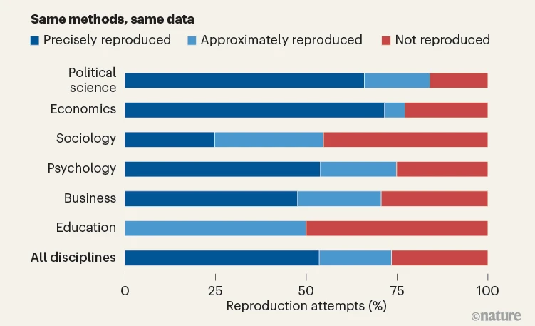
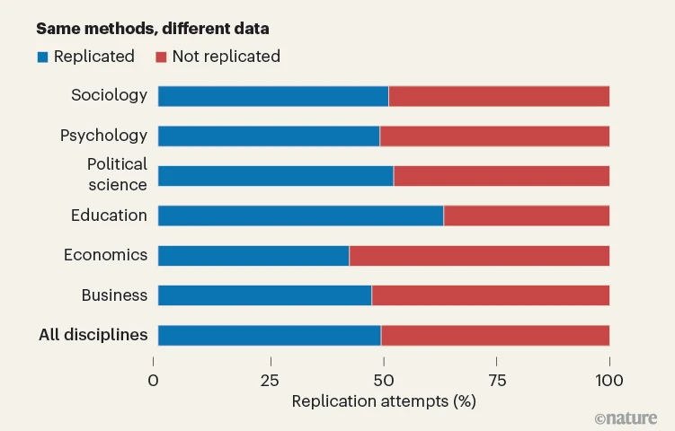
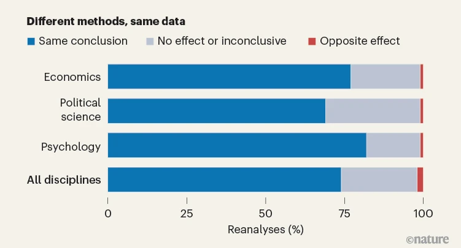
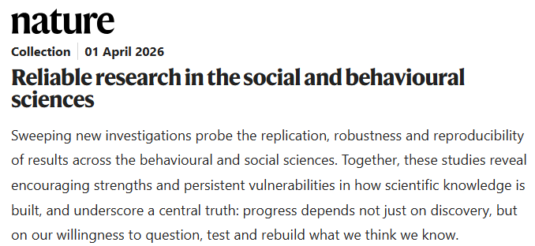
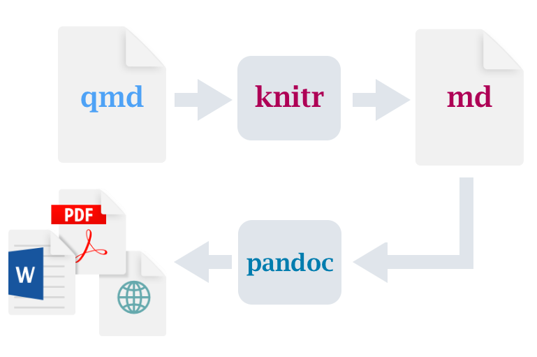
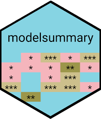
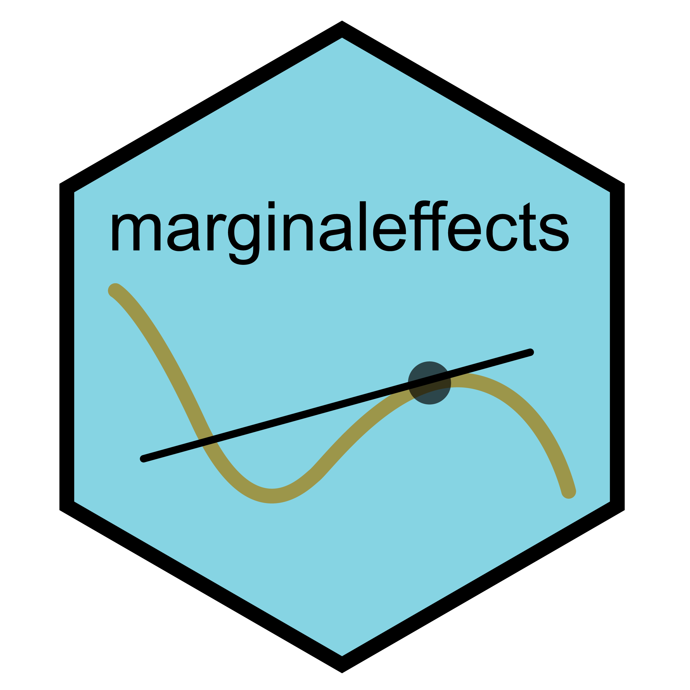

---
title: "Applied replication for data skills"
format: revealjs
---

```{r}
#| label: setup
#| include: false
# All figures on these slides are generated here from the workshop data files
# (../data/*.csv) or from small inline tribbles of published summary values –
# no images of the Nature papers' figures are used (copyright + everything must
# stay editable). Palette mirrors style/cgm-slides.scss.
suppressPackageStartupMessages({
  library(readr)
  library(dplyr)
  library(tidyr)
  library(purrr)
  library(ggplot2)
  library(dagitty)
  library(ggdag)
  library(patchwork)
})

ncl_blue <- "#0e3b6a"
orange   <- "#E69F00"
green    <- "#009E73"
d_red    <- "#a10000"
grey_mid <- "#848c94"

# A light slide-friendly ggplot theme: big type, no chart-junk.
theme_slide <- function(base_size = 17) {
  theme_minimal(base_size = base_size) +
    theme(
      panel.grid.minor = element_blank(),
      panel.grid.major.y = element_line(colour = "grey90"),
      plot.title = element_text(face = "bold", colour = ncl_blue),
      axis.title = element_text(colour = ncl_blue),
      legend.position = "none"
    )
}

# The four-cell repeatability matrix (Nosek et al. 2025). Defined once here so
# the full-colour slide and the 'robustness only' emphasis slide draw from a
# single source of truth – no copy-pasted plot code to drift apart. The data x
# analysis matrix is rendered as a tile grid (inline data, not a screenshot) so
# it stays fully editable; the term sits large in each cell with its one-line
# meaning beneath it.
repeatability_cells <- tibble::tribble(
  ~analysis,    ~data,       ~term,             ~def,                                  ~fill,
  "SAME METHODS",      "SAME DATA", "Reproducibility", "Testing the reliability of a prior finding\nwith the same data and same analysis\nstrategy by comparing the outcome of an\ninferential test as reported in a paper\nwith a re-calculation of that inferential\ntest from the original data.", "#0e3b6a",
  "DIFFERENT METHODS", "SAME DATA", "Robustness",  "Testing the reliability of a prior finding\nwith the same data and different analysis\nstrategy by conducting alternative\ntests on the original data.",  "#E69F00",
  "SAME METHODS",      "DIFFERENT DATA",  "Replicability",   "Testing the reliability of a prior finding\nwith new data expected to be theoretically\nequivalent by comparing the outcome of an\ninferential test as reported in a paper\nwith the equivalent inferential test as\ncalculated in the new dataset.",               "#009E73",
  "DIFFERENT METHODS", "DIFFERENT DATA", "Generalisability", "Testing the reliability of a prior finding\nin a new dataset in a way that differs\nfrom the original study but is expected\nto produce similar results.",                 "#834848"
)

# Draw the matrix. `highlight = NULL` keeps all four cells in full colour; pass
# a term (e.g. "Robustness") to dim every OTHER cell to a light-grey box. Text
# stays white throughout, so dimmed cells read as light-grey background + white
# text while the highlighted cell keeps its own colour.
repeatability_matrix <- function(highlight = NULL) {
  grey_box <- "#b6bcc3"   # light grey for de-emphasised cells
  cells <- repeatability_cells |>
    dplyr::mutate(
      data = factor(data, levels = c("SAME DATA", "DIFFERENT DATA")),
      analysis = factor(analysis,
        levels = c("DIFFERENT METHODS", "SAME METHODS")),
      fill = if (is.null(highlight)) fill
             else dplyr::if_else(term == highlight, fill, grey_box)
    )
  ggplot(cells, aes(data, analysis)) +
    geom_tile(aes(fill = fill), colour = "white", linewidth = 4,
              width = 1, height = 1) +
    geom_text(aes(label = term), colour = "white",
              fontface = "bold", size = 9, nudge_y = 0.25) +
    geom_text(aes(label = def), colour = "white",
              size = 5, nudge_y = -0.1, lineheight = 0.95) +
    scale_fill_identity() +
    scale_x_discrete(position = "top") +
    labs(x = NULL, y = NULL) +
    theme_void(20) +
    # Row labels flipped to read vertically (bottom-to-top), matching the
    # rotated row-heads on the HTML image-grid version of this matrix.
    theme(panel.grid = element_blank(),
          axis.text = element_text(face = "bold", colour = ncl_blue),
          axis.text.x.top = element_text(size = 17),
          axis.text.y = element_text(size = 15, angle = 90, hjust = 0.5),
          plot.margin = ggplot2::margin(2, 8, 2, 2))
}

# Read the two data files the multiverse slides depend on. Relative paths
# resolve from slides/ at render time (verified with quarto render).
# r_ca is the claim-aligned partial r – the day's convention: negative framings
# (mcomm, mlib, mneg) reverse-coded, so 'supports the claim' = negative sign
# for every outcome. All Part 4 curve/placement slides work on this scale;
# the class chart and the lab's percentile cell use the same one.
spec_grid <- readr::read_csv("../data/spec_grid.csv", show_col_types = FALSE) |>
  dplyr::mutate(r_ca = ifelse(positive_outcome, r, -r))
analysts5 <- readr::read_csv("../data/analysts5.csv", show_col_types = FALSE)

# The 29 teams of Silberzahn et al. (2018), published values, read here because
# two slides in different parts draw them: the full forest in Part 1 and the
# one-row reminder strip in Part 2. Codebook: data/silberzahn29_codebook.md.
silberzahn29 <- readr::read_csv("../data/silberzahn29.csv", show_col_types = FALSE) |>
  dplyr::mutate(distribution = factor(distribution,
                  levels = c("Linear", "Logistic", "Poisson", "Other")))

# Teams described their own methods and capitalised them 29 different ways;
# the published table title-cases them, and the forest slide follows suit.
tidy_approach <- function(x) {
  stringr::str_replace_all(stringr::str_to_title(x),
                           "\\b(And|A|For|With|Using|The|Of)\\b", tolower)
}

# Shared multiverse base layer. Built ONCE so the two consecutive multiverse
# slides ("The class multiverse" and "Where your result lands") are the
# SAME chart with an overlay, not two charts. The second slide calls spec_base()
# and adds the analyst lines on top: identical dims, axes, theme, zero line,
# baseline marker and legend slot, so the reveal animates lines appearing on one
# unchanging panel. coord_cartesian() pins the y-range so the overlay cannot
# rescale the axis between slides.
sc_ranked <- spec_grid |>
  dplyr::arrange(r_ca) |>
  dplyr::mutate(rank = dplyr::row_number())
sc_baseline <- dplyr::filter(sc_ranked, baseline)

spec_base <- function() {
  ggplot(sc_ranked, aes(rank, r_ca)) +
    geom_hline(yintercept = 0, colour = grey_mid, linewidth = 0.4) +
    geom_point(aes(colour = sig), size = 0.7, alpha = 0.55) +
    geom_point(data = sc_baseline, colour = d_red, size = 4) +
    annotate("text", x = sc_baseline$rank, y = sc_baseline$r_ca - 0.07,
             label = "constrained baseline\nt = −3.804",
             colour = d_red, fontface = "bold", size = 4, hjust = 0.15) +
    scale_colour_manual(values = c(`TRUE` = ncl_blue, `FALSE` = "#c7ccd2"),
                        labels = c(`TRUE` = "p < .05", `FALSE` = "n.s."),
                        name = NULL) +
    labs(x = "specification (ranked by claim-aligned partial r)",
         y = "claim-aligned partial r") +
    coord_cartesian(ylim = c(-0.75, 0.32)) +
    theme_slide(15) +
    theme(legend.position = "right", legend.title = element_blank())
}

# Fork-importance decomposition over the committed grid
# (data/fork_importance.csv: share of specification variance in partial r per
# menu axis, main-effects eta-squared). Read once; the Part 4 slide charts it.
fork_imp <- readr::read_csv("../data/fork_importance.csv", show_col_types = FALSE)

# Analyst placement inside the 840-spec grid: the share of the grid more
# negative than each analyst's recorded partial r, on the claim-aligned scale
# (the analysts' own values are cosmopolitan-outcome results, so alignment
# leaves them untouched). The person/aggregate split is the published
# classification of the five Multi100 pipelines (KEVF1 and PRL47 fitted
# person-level models; the other three worked on aggregates).
an_level <- tibble::tribble(
  ~analyst_id, ~level,
  "KEVF1", "person-level",
  "PRL47", "person-level",
  "KQXUE", "aggregated",
  "018OL", "aggregated",
  "C6HJR", "aggregated"
)
an_placed <- analysts5 |>
  dplyr::left_join(an_level, by = "analyst_id") |>
  dplyr::mutate(pct_more_negative = purrr::map_dbl(r, \(x) mean(spec_grid$r_ca < x)) * 100) |>
  dplyr::arrange(pct_more_negative)

# Wrong-sign specifications in the cosmopolitan-only universe: the claim
# predicts a negative unemployment coefficient on mcosmo, so a positive
# estimate is a sign flip. Cross-tabbed by estimator and sample on the
# Part 4 patterned-flips slide.
flips_mcosmo <- spec_grid |>
  dplyr::filter(outcome == "mcosmo") |>
  dplyr::mutate(wrong_sign = estimate > 0)
```

## {#today .darkslide background-color="rgba(0,0,0,0)"}

::: {.todaymeta}
A full-day workshop · four parts
:::

:::: {.todaybox}
::: {.nonincremental}
1. Why any of this, and with what tools – science, its crisis, and the toolchain
2. The question underneath – one paper, five analysts, and what they were each asking
3. What you can actually do – reproduce a published result, then work the menu
4. Reading the multiverse – and choosing the one path you will defend
:::
::::

::: {.todaytake}
You leave with: a reproduced result · an estimand and a DAG of your own · a preregistered analysis · your dot on a live class multiverse
:::

::: {.todaymeta}
Work along in Positron (Route 1) or in the browser lab (Route 2) – solo or in pairs
:::

::: notes
Welcome – good to have you here. A full day, in four parts of ninety minutes. The first part is the ground floor: what we are doing when we do social science, why people say it is in crisis, what open research proposes to do about that, and – because none of it happens without software – the tools. The second part goes inside one published paper that I re-analysed myself, and asks the harder question of why five analysts of the same claim came back with five different answers. The third part is the coding-heavy one: you reproduce my submitted result, then work through the menu of choices you could have made instead. And the fourth reads what the room built, and asks how you settle on the one analysis you would actually publish.
:::

## Two kinds of aim {.smaller}

:::: {.columns}
::: {.column width="50%"}
::: {.small}
**What I want you to understand**

- What reproducibility, robustness and replicability each mean, and why they come apart
- Why analysts disagree – and how much of that is disagreement about the *question*
- What a causal graph buys you when you cannot make a causal claim
- What a multiverse shows, and what it cannot show
- What preregistration settles, and what it leaves open
:::
:::
::: {.column width="50%"}
::: {.small}
**What I want you to be able to do**

- Get an analysis running from someone else's materials
- Write an estimand in one sentence, and a DAG that matches it
- Reproduce a published result to the third decimal
- Vary a specification deliberately and read what changed
- Declare an analysis before you run it, and report where it sits among the alternatives
:::
:::
::::

::: notes
Two columns, because the day has two kinds of aim and they are not the same thing. On the left is what I want you to understand – conceptual work, and most of it is not about code at all. On the right is what I want you to be able to do by six o'clock, and every one of those is something you will have done at least once today with your own hands. If you only take the left-hand column home you will have had an interesting day and changed nothing about your practice. If you only take the right-hand column you will have learned some R. The point is the pairing: the concepts tell you which of the things you can now do is worth doing.
:::

## What you do not need today

::: {.none}
- No git, and no GitHub account
- No OSF account – we will read OSF, not log into it
- No installs on Route 2: the browser is the whole toolchain
- Nothing to sign up for; nothing leaves your machine except the results you choose to submit
:::

::: {.fragment}
**Do this now:** Route 1 – open your workspace folder in Positron. Route 2 – open the browser lab tab and leave it loading; the engine warms while we talk.
:::

::: notes
Before anything else, the reassurance slide. You do not need git today, or a GitHub account, or an OSF account – we will look at OSF from the outside, like readers. If you did not install anything, that is fine: the browser lab runs R inside the page itself, and there is a task at the end of this part where we get everybody set up properly. One thing to do right now, while I talk: Route 1 people, open the workspace folder in Positron; Route 2 people, open the browser-lab tab now and just leave it – the engine loads in the background, so it will be ready long before you need it. If you are on the call with one screen, the cheatsheet has a tip: put the meeting on your phone or a second window and keep the lab full-screen.
:::

# PART 1 – Why any of this, and with what tools {.darkslide background-color="rgba(0,0,0,0)"}

::: {.partlabel}
Part 1 · 90 minutes
:::

::: notes
Part one, then. We start further back than you might expect, with what science is for and why anyone thinks it is in trouble. Then what open research proposes as the remedy, and how well that holds up. Then the evidence: three enormous studies published together this year that put numbers on how often social-science findings survive being repeated. Then a first look at the one of those studies I was inside. And we finish on the tools, because every part of this – the sharing, the checking, the repeating – is something software either makes easy or makes impossible.
:::

## What are we doing when we do social science?

:::: {.none}
::: {.fragment}
Making **claims about the world** that could turn out to be wrong – and saying how we would know.
:::

::: {.fragment}
A claim is not private. It is offered to others so they can **check it, use it, argue with it, build on it**.
:::

::: {.fragment}
That handover is the whole enterprise. Everything today is about whether it works.
:::
::::

::: notes
Start with the obvious question that nobody asks out loud. What are we actually doing? We are making claims about the world – claims that could turn out to be wrong, and that come with some statement of how we would find out. And crucially, a claim is not a private possession. You publish it so that other people can check it, use it, argue with it, and build on top of it. That handover is not an administrative afterthought; it is the entire enterprise. A finding nobody else can examine is not a contribution, it is an assertion. So when we ask today whether social science is in trouble, the question is really quite specific: does the handover work? Can someone else pick your finding up and do anything with it?
:::

## Three arguments that made people nervous {.smaller}

::: {.small}
- **The theory, 2005.** With small studies, small true effects, flexible designs and many teams chasing the same question, most published findings in a field can be false with nobody breaking any rules [@Ioannidis2005WhyMostPublished]
- **The demonstration, 2011.** Give researchers only the flexibility they legitimately have – which cases to drop, which covariates to keep, when to stop collecting – and a **false-positive rate of 5% becomes over 60%** [@SimmonsEtAl2011FalsePositivePsychology]
- **The subtlety, 2014.** You do not need many tests. In a **garden of forking paths**, a single test *chosen after looking at the data* already has the wrong p-value [@GelmanLoken2014StatisticalCrisisScience]
:::

::: notes
Three arguments, in order of how uncomfortable they are. Ioannidis in 2005 made the theoretical case: put together small studies, small true effects, flexible designs and lots of teams chasing the same question, and you can show that most published findings in a field will be false without anybody breaking a single rule. Then Simmons, Nelson and Simonsohn demonstrated it in practice – give researchers only the flexibility they legitimately have, and you can push a five per cent false-positive rate above sixty. They proved it by 'showing', with real participants and real statistics, that listening to a Beatles song makes you younger. And Gelman and Loken added the subtlety that I find hardest to shake: you do not have to run many tests for this to bite. If the one test you ran was chosen after you looked at the data, its p-value is already wrong.
:::

## And then people counted {.smaller}

::: {.small}
- **100 psychology experiments**, replicated with high power and the original materials: **97%** of the originals were significant, **36%** of the replications were, and effect sizes roughly **halved** [@OpenScienceCollaboration2015EstimatingReproducibilityPsychological]
- **161 researchers, 73 teams, one hypothesis** on immigration and support for social policy: **1,253** models, and no convergence on either sign or significance [@BreznauEtAl2022ObservingManyResearchers]
:::

::: {.fragment .small}
Different fields, different designs, one uncomfortable conclusion: **the finding depends on the finder.**
:::

::: notes
And then people stopped arguing and counted. The Open Science Collaboration took a hundred psychology experiments and replicated them properly – high power, original materials, the original authors consulted where possible. Ninety-seven per cent of the original studies had reported a significant result. Thirty-six per cent of the replications did, and the effect sizes came back at about half the original size. That is the study that made 'replication crisis' a phrase outside methodology seminars. The second one is closest to home, because it is ours: seventy-three teams of sociologists and political scientists, one hypothesis about immigration and support for social policy, more than twelve hundred models between them, and no agreement on the sign, let alone the significance. Different fields, different designs, and the same uncomfortable conclusion. The finding depends on the finder.
:::

## It is not mostly fraud {.smaller}

::: {.small}
The mechanism is **ordinary and structural**:

- Journals reward novel, clean, significant results – so that is what gets written up
- Every analysis contains dozens of small defensible choices, and the analyst makes them while looking at the data
- Nobody publishes the twelve specifications that did not work; the reader sees one
- Data and code are usually not available, so nobody can check any of it
:::

::: {.fragment .small}
Ask researchers anonymously, with an incentive to answer truthfully, and a **majority admit** to at least one of these practices – not fraud, the ordinary kind [@JohnEtAl2012MeasuringPrevalenceQuestionable]
:::

::: {.fragment .small}
None of these steps requires a dishonest person. That is exactly why the problem is hard: you cannot fix it by hiring better people.
:::

::: notes
Now the important qualification, and I want to be emphatic about it. This is not mostly a story about fraud. Fraud exists and it is spectacular when it surfaces, but it is rare and it is not what these numbers are measuring. The mechanism is ordinary and it is structural. Journals want novel, clean, significant results, so that is what gets submitted. Every analysis contains dozens of small, individually defensible choices, and the analyst makes them while looking at the data, because how else would you make them. Nobody writes up the twelve specifications that did not work, so the reader sees one path through a garden with hundreds. And in most cases neither the data nor the code are available, so nobody can check any of it. John, Loewenstein and Prelec went and asked researchers directly, anonymously, with a mechanism designed to make truthful answers worth giving – and a majority admitted to at least one of these practices. Not one of those steps requires a bad actor. Which is exactly why the problem is hard: you cannot solve it by hiring better people. [pause] So suppose you did hire the best people you could find, gave them all the same data and the same question, and watched. Somebody did exactly that.
:::

## Twenty-nine teams, one question {.smaller}

::: {.small}
**The question.** Are football referees more likely to give red cards to dark-skinned players than to light-skinned ones?

**The data.** One dataset, sent to everyone: 2,053 players in the top divisions of England, Germany, France and Spain, the 3,147 referees they played under, and **146,028 player–referee pairs**. Skin tone rated from profile photographs by two coders who did not know the research question.

**The design.** Twenty-nine teams analysed it independently. They reviewed each other's approaches *before* anyone had seen a result, revised, and only then compared answers.
:::

::: {.fragment .small}
This is the first many-analysts study. Every one since is a variation on it – including the one you are inside today.
:::

::: {.src}
@SilberzahnEtAl2018ManyAnalystsOne
:::

::: notes
So let me show you the study that started all of this, because everything after it, including our own day, is a variation on its design. Silberzahn and colleagues, twenty eighteen. The question is deliberately concrete: are football referees more likely to give red cards to dark-skinned players than to light-skinned ones? The data went to everyone identically – two thousand and fifty-three players in the top divisions of England, Germany, France and Spain, the three thousand referees they had played under, and a hundred and forty-six thousand player-referee pairs, with skin tone rated from profile photographs by two coders who were not told the research question. And then the part that makes it a study rather than a survey: twenty-nine teams analysed it independently, reviewed each other's approaches before anybody had seen a single result, revised, and only then compared answers. Nobody could tune their method to get a number they liked, because nobody knew what number anyone was getting.
:::

## All twenty-nine, side by side

```{r}
#| label: silberzahn-forest
#| fig-width: 9.6
#| fig-height: 5.0
# The paper's Figure 3, rebuilt from the authors' published values rather than
# reproduced as an image: every team, every interval, grouped by the response
# distribution it assumed. Colour is ours - the original is monochrome - and
# marks whether the interval excludes 1. Teams 21 and 27 have intervals running
# to 11.5 and 78.7; the published figure truncates both and asterisks them, and
# so does this.
CLIP <- 3.2
szf <- silberzahn29 |>
  mutate(hi_draw = pmin(or_hi, CLIP),
         lab = paste0(team, ". ", tidy_approach(approach))) |>
  arrange(distribution, or) |>
  mutate(lab = factor(lab, levels = rev(lab)))

ggplot(szf, aes(or, lab, colour = significant)) +
  geom_vline(xintercept = 1, linetype = "longdash", colour = grey_mid) +
  geom_errorbarh(aes(xmin = or_lo, xmax = hi_draw), height = 0, linewidth = 0.55) +
  geom_point(size = 2.4) +
  geom_text(data = filter(szf, or_hi > CLIP), aes(x = CLIP + 0.04, label = "*"),
            size = 5, vjust = 0.75, show.legend = FALSE) +
  scale_colour_manual(values = c(`TRUE` = ncl_blue, `FALSE` = d_red),
                      breaks = c("TRUE", "FALSE"), name = NULL,
                      labels = c("interval excludes 1", "interval includes 1")) +
  scale_x_continuous(breaks = c(0.5, 1, 1.5, 2, 2.5, 3),
                     expand = expansion(mult = c(0.01, 0.03))) +
  coord_cartesian(xlim = c(0.42, CLIP + 0.1)) +
  facet_grid(distribution ~ ., scales = "free_y", space = "free_y", switch = "y") +
  labs(x = "odds ratio", y = NULL,
       caption = paste("Above 1: dark-skinned players red-carded more often.",
                       "* interval runs past the edge (teams 21 and 27).")) +
  theme_slide(11) +
  theme(plot.caption = element_text(hjust = 1, colour = "grey45", size = 9,
                                    margin = margin(t = 4)),
        legend.position = "top", legend.justification = "right",
        legend.margin = margin(0, 0, -6, 0),
        legend.text = element_text(size = 10, colour = "grey25"),
        panel.grid.major.y = element_blank(),
        panel.grid.major.x = element_line(colour = "grey92"),
        strip.placement = "outside",
        strip.text.y.left = element_text(angle = 0, face = "bold",
                                         colour = ncl_blue, hjust = 1),
        axis.text.y = element_text(colour = "grey25", hjust = 0, size = 8.5),
        panel.spacing.y = unit(0.45, "lines"))
```

::: {.src}
@SilberzahnEtAl2018ManyAnalystsOne, Figure 3, rebuilt from the published values at osf.io/gvm2z.
:::

::: notes
And here is what came back. Read it as a list of twenty-nine analyses of one dataset. The odds ratios run from nought point eight nine to two point nine three – the low end says dark-skinned players were red-carded slightly *less* often – and the median is one point three one. Twenty of the twenty-nine intervals exclude one; nine do not. So about two thirds found an effect and a third did not, on identical data. [pause] Now look at the left column, because that is where the day's real subject is. The teams are grouped by the response distribution they assumed – linear, logistic, Poisson, and two that fit none of the three. That is not a detail of implementation. It is a decision each team made, defensibly, before touching the data, and it is the same kind of decision you will be making after lunch. Hold on to that grouping; we come back to it twice.
:::

## 'Replication' crises

:::: {.none}
::: {.fragment}
Another 'replication' crisis – terminological confusion?
:::
::: {.fragment}
The term 'reproducibility' has been used as a synonym for a number of different characteristics – reproducibility, robustness, replicability, repeatability, credibility, and trustworthiness.
:::
[[Successfully rerun the same code on the same data?]{colour="#b22222"}]{.fragment}
[[Re-analyse the same data a different way?]{colour="#1C69A8"}]{.fragment}
[[Collect fresh data and analyse it in the same way?]{colour="#4D179A"}]{.fragment}
[[Using the same data and same analysis but asking a different question?]{colour="#3C6301"}]{.fragment}
[[Asking the same question but answering it with fresh data and a different analysis?]{colour="#3BB8DB"}]{.fragment}
::::

::: notes
So: twenty-nine competent teams, one dataset, and no agreement. Now notice what I have carefully not said yet – what *kind* of failure that is. And that turns out to be the whole difficulty, because part of the problem is the word itself. For years 'replication' covered everything: rerunning someone's code, re-analysing their data a different way, collecting new data altogether. Those are three different operations, answering three different questions – but because we called them all 'replication', the crisis debates had people talking past each other for a decade. So before any numbers, we need vocabulary.
:::

## The data $\times$ analysis matrix

```{r}
#| label: matrix
#| fig-width: 12
#| fig-height: 7
repeatability_matrix()
```

::: {.src}
@AlipourfardEtAl2021SystematizingConfidenceOpen; @NosekEtAl2025BriefGlossaryTerms
:::

::: notes
Here is the whole framework on one slide, and if you take a single thing home today, make it this grid. The question stays the same throughout; what varies is the data and the analysis. Same data, same analysis – reproducibility: if I rerun your recipe, do I get your number? Same data but a different, justifiable analysis – robustness: does your finding survive my defensible choices? New data, same question – replicability. The fourth cell, new data and new analysis, is really generalisation, and we set it aside today. Sit with this for a moment – everything that follows this morning hangs off it.
:::

## Credibility is not truth

::: {.scaled style="--fs: 0.9; --lh: 1.15"}
**Repeatability** is used when referring to reproducibility, robustness, and replicability as a constellation of concepts intended to assess whether answers to scientific questions are unchanged when different steps of the research process are repeated.

**Credibility** and **trustworthiness** refer to the confidence one can have in research findings. Because scientific knowledge claims are tentative, they are *not* synonymous with truth.

For example, credibility is advanced by addressing potential competing interests in the conducting and reporting of research, by taking existing knowledge into account, by using methods that have been validated, by controlling for biases in the research context, by pursuing precise and reliable evidence, and by calibrating the strength of the claims to the uncertainty of the evidence.
:::

::: {.src}
@NosekEtAl2025BriefGlossaryTerms
:::

::: notes
The glossary is worth reading slowly, because it separates two things we routinely run together. Repeatability is the umbrella: reproducibility, robustness and replicability as a family, all asking whether the answer survives repeating some step of the process. Credibility and trustworthiness are about how much confidence a finding deserves – and note the sentence in the middle. Because scientific claims are tentative, credibility is not the same as truth. A credible finding can be wrong. What credibility is built from is the list at the bottom: declared interests, validated methods, precise evidence, and claims calibrated to the uncertainty behind them. That last one is the one we will keep coming back to.
:::

## Open research: the practices {.smaller}

::: {.small}
| Practice | What it makes possible |
|---|---|
| **Open data** | Someone else can re-analyse your evidence |
| **Open code** | Someone else can rerun your exact analysis |
| **Open materials** | Someone else can run your study again |
| **Open access** | Someone else can read the claim in the first place |
| **Preregistration** | A dated record of the plan, before the results exist |
| **Registered reports** | Peer review of the plan, with publication decided before results |
:::

::: {.fragment .small}
Each one removes a specific obstacle. None of them is a general-purpose guarantee. The programme, set out at length: [@MunafoEtAl2017ManifestoReproducibleScience]
:::

::: notes
So what does open research actually propose? Not a philosophy – a list of practices, and each one removes a specific, identifiable obstacle. Open data means someone else can re-analyse your evidence rather than taking your word for it. Open code means they can rerun your exact analysis. Open materials means they can run the study again in a new sample. Open access means they can read the thing at all, which sounds trivial until you try to get a paper from outside a wealthy university. Preregistration produces a dated record of the plan before the results exist. And registered reports go further: the plan is peer-reviewed and the publication decision is made before anyone sees a result, which removes the incentive to find something. Each removes one obstacle. None is a general guarantee, and I want to be clear about that before we get enthusiastic.
:::

## What openness does not fix {.smaller}

:::: {.none}
::: {.fragment}
A fully open, perfectly reproducible pipeline can still answer **the wrong question**.
:::

::: {.fragment}
It can still be built on a **selected sample**, a **mismeasured** construct, or an **untestable assumption**.
:::

::: {.fragment}
> "Reproducibility success does not mean that the finding is correct." [@MiskeEtAl2026InvestigatingReproducibilitySocial]
:::

::: {.fragment}
Openness makes claims **checkable**. It does not make them **right**. The checking is still work, and someone still has to do it.
:::
::::

::: notes
Here is the qualification that the enthusiasm usually skips. A completely open, perfectly reproducible pipeline can still be answering the wrong question. It can still rest on a selected sample, or a construct that does not measure what its name says, or an assumption nobody can test. The sentence on the slide is from one of the papers we are about to meet, and it deserves a beat of silence: reproducibility success does not mean the finding is correct. All openness does – and this is still a great deal – is make claims checkable. It does not make them right. Somebody still has to do the checking, and that turns out to be the interesting part, because when people do the checking at scale you get the three studies we look at next.
:::

## What is SCORE?

::: {.small}
- DARPA-funded programme to gauge the credibility of social-science claims
- **62 journals**, papers from **2009–2018**, stratified sample
- Each paper's central claim traced from abstract to the supporting statistic
- Thousands of researchers; three repetition studies built on the same frame
:::

::: notes
Where do these numbers come from? All three papers sit on one programme, SCORE – funded by DARPA, oddly enough, who wanted to know whether you could predict which findings hold up. The backbone is a stratified sample from sixty-two journals, papers published between 2009 and 2018, with each paper's central claim traced from the abstract down to the exact statistic that supports it. The three studies then took that same frame and each asked one of our three questions. So when the numbers land in a moment, they are about the same body of literature, asked three different things.
:::

## Three corners, three studies

::: {.matrix-grid}
<div class="corner"></div>
<div class="col-head">SAME data</div>
<div class="col-head">DIFFERENT data</div>

<div class="row-head">SAME methods</div>
<figure class="cell" style="--accent: #0e3b6a">

</figure>
<figure class="cell" style="--accent: #009E73">

</figure>

<div class="row-head">DIFFERENT methods</div>
<figure class="cell" style="--accent: #E69F00">

</figure>
<figure class="cell empty">

</figure>
:::

::: {.src}
@Sanchez-TojarEtAl2026HugeMetaresearchProject
:::

::: notes
Same four-cell map you have just learned – but now each box carries the actual disciplinary breakdown from its study. Three of the four corners have a SCORE paper behind them: reproduction top-left, replication top-right, reanalysis bottom-left. The fourth, generalisation, we set aside today. Notice the pattern jumps out by discipline rather than by concept: economics and political science sit at the top of reproduction, sociology lags; replication hovers around half almost everywhere; and reanalysis holds the original conclusion three times in four. Same data on the wall, three very different questions.
:::

## Reproducibility – Miske et al.

::: {.small}
- **600 papers** sampled (62 journals, 2009–2018)
- Ask the authors for data and code, then try to rerun the reported result
- How often can we even get to the starting line?
:::

::: {.src}
@MiskeEtAl2026InvestigatingReproducibilitySocial.
:::

::: notes
First, reproducibility – the gentlest test of the three. The design in one breath: take six hundred papers, ask the authors for their data and code, and try to recompute the central reported result. Same data, same analysis: do you get the same number? Before we even ask how often that works, the first finding is about how rarely you can even start.
:::

## Most papers never reach the starting line

```{r}
#| label: miske-waterfall
#| fig-width: 8.5
#| fig-height: 3.6
# Waterfall from 600 sampled -> 143 assessable, inline data from the content
# bank (Miske et al. 2026). Illustrative staged counts, clearly labelled.
mw <- tibble::tribble(
  ~stage,                 ~n,
  "Sampled",              600,
  "Data available\n(24.0%)", 144,
  "Assessable",           143
)
mw <- mw |> dplyr::mutate(stage = factor(stage, levels = stage))
ggplot(mw, aes(stage, n, fill = stage)) +
  geom_col(width = 0.65) +
  geom_text(aes(label = n), vjust = -0.4, fontface = "bold",
            colour = ncl_blue, size = 6) +
  scale_fill_manual(values = c(ncl_blue, orange, green)) +
  ylim(0, 660) +
  labs(x = NULL, y = "papers") +
  theme_slide(16)
```

::: {.small}
- Of the **143 assessable**: **53.6%** reproduced precisely, **73.5%** approximately
- Counting the unassessable, only about **18%** reproduce
:::

::: notes
Read it left to right. Six hundred papers sampled. Data were available for twenty-four per cent of them – for nearly three quarters there was neither data nor code. That leaves 143 papers you can actually assess. Of those, just over half reproduce precisely, and about three quarters at least approximately. Which sounds respectable – until you notice what happens if you count the papers nobody could check as failures: the overall rate falls to roughly eighteen per cent. The barrier is not arithmetic. It is access.
:::

## Why some fields do better

::: {.small}
- Journals requiring data sharing: **87.5–100%** availability vs **16.0%** without
- Political science **54.1%** data availability vs education **2.9%**
- With data *and* code: **90.9%** approx-reproducible vs **38.1%** from rebuilt source
:::

::: {.claimcard}
"The most substantial barrier … was the unavailability of author data."

"Reproducibility success does not mean that the finding is correct."
:::

::: {.src}
@MiskeEtAl2026InvestigatingReproducibilitySocial.
:::

::: notes
And access follows policy. Where journals mandate data sharing, availability sits between about ninety and one hundred per cent; without a mandate, sixteen. Political science and economics built the habit early and are far ahead of the rest. The first quote is the paper's own conclusion – the biggest barrier was simply that the data were not there. The second quote deserves a beat of silence: "reproducibility success does not mean that the finding is correct." Reproducing a number tells you the computation was faithful. It does not tell you the claim about the world is true.
:::

## Robustness – Aczel et al. (Multi100)

::: {.small}
- **100 studies**, each re-analysed by **≥5 independent analysts**
- Same data; each analyst free to choose any *justifiable* analysis
- A peer panel judges whether each pipeline is appropriate
- I was one of its analysts
:::

::: {.src}
@AczelEtAl2026InvestigatingAnalyticalRobustness.
:::

::: notes
The middle paper – the one I was in. One hundred studies, and for each one at least five analysts working independently: no teams, original authors barred, everyone handed the same data and the same claim. You were free to analyse it any way you could justify, and a peer panel later judged whether your pipeline was appropriate. Two things worth knowing about the design. The hundred studies had already passed a reproducibility check – so robustness was being measured on the reproducible subset, the best-case material. And we were not blinded: every analyst saw the full original article, published estimates and all, so if anything we were anchored towards the original answer.
:::

## Same data, five analysts, different answers

::: {.small}
- **34%** of reanalysis effect sizes within ±0.05 *d* of the original (57% within ±0.20)
- **74%** reached the same conclusion; 24% null/inconclusive; **2%** opposite
- Effect sizes shrank: original mean *d* **0.73** → reanalysis **0.49**
- Analyst-to-analyst variability typically **exceeds** sampling error
:::

::: {.src}
@AczelEtAl2026InvestigatingAnalyticalRobustness.
:::

::: notes
So what do free, justifiable choices do to the same data? They move the answer – a lot. Only about a third of the reanalyses landed within five hundredths of a Cohen's d of the original, and in just five studies out of ninety-five did all the analysts land that close. Conclusions held up better than magnitudes: three quarters of reanalyses agreed with the original conclusion. But the effect sizes shrank, from a mean d of point seven three down to point four nine. And the finding I keep coming back to: the spread across analysts is typically larger than the statistical uncertainty inside any single analysis. The analyst, in other words, is a bigger source of noise than the sample. One more detail to hold for later: observational studies – which is what we work on today – came out less robust than experiments.
:::

## Replicability – Tyner et al.

::: {.small}
- **274 claims** from 164 papers, tested on **new data**
- Median statistical power **99.6%**; preregistered; original authors consulted
- The strictest test: does the effect reappear in a fresh sample?
:::

::: {.src}
@TynerEtAl2026InvestigatingReplicabilitySocial.
:::

::: notes
The third paper is the strictest test: not the same data analysed differently, but genuinely new data. Two hundred and seventy-four claims, each replicated to a preregistered, peer-reviewed protocol, often with the original authors consulted, and with a median statistical power of ninety-nine point six per cent. That last number matters: these studies were built so that a real effect would be very hard to miss. So whatever fails here is not failing for lack of trying.
:::

## Even success shrinks

```{r}
#| label: tyner-shrink
#| fig-width: 7.5
#| fig-height: 3.2
# Median r: original -> replication (Tyner et al. 2026), inline dumbbell.
sh <- tibble::tibble(
  stage = factor(c("Original", "Replication"),
                 levels = c("Original", "Replication")),
  r = c(0.25, 0.10)
)
ggplot(sh, aes(r, y = 1)) +
  geom_line(aes(group = 1), colour = grey_mid, linewidth = 2) +
  geom_point(aes(colour = stage), size = 8) +
  geom_text(aes(label = sprintf("%.2f", r)), vjust = -1.6,
            fontface = "bold", colour = ncl_blue, size = 6) +
  geom_text(aes(label = stage), vjust = 3.2, colour = ncl_blue, size = 5) +
  scale_colour_manual(values = c(ncl_blue, orange)) +
  scale_x_continuous(limits = c(0, 0.3)) +
  labs(x = "median effect size (r)", y = NULL) +
  theme_slide(16) +
  theme(axis.text.y = element_blank(),
        panel.grid.major.y = element_blank())
```

::: {.small}
- **55.1%** of claims replicated by significance; effect sizes roughly **halve**
- Thirteen success criteria give anywhere from **29%** to **75%**
:::

::: {.src}
@TynerEtAl2026InvestigatingReplicabilitySocial.
:::

::: notes
And this is what comes back. The median effect size halves: point two five in the originals, point one zero in the replications. By the significance criterion, fifty-five per cent of claims replicate. But notice that "did it replicate?" is not even one question – the team scored the same studies against thirteen reasonable success criteria and got answers ranging from twenty-nine to seventy-five per cent. Two sentences from the paper are worth carrying around. "Strictly speaking, there is no such thing as exact replication." And: "The problem to solve is not unreplicability per se, it is overconfidence."
:::

## The three Rs do not travel together

:::: {.none}
Reproducible ≠ robust ≠ replicable.

::: {.fragment .fadeInUp}
Across SCORE the three are [**essentially uncorrelated**]{.highlight bg-colour="#ffe3b3"} – knowing one barely predicts the others.
:::

::: {.fragment .fadeInUp}
So there is no single number for 'trust'. You have to ask *which* repetition you mean.
:::
::::

::: notes
Now the bit that genuinely surprised me. You would hope these three properties travel together – that a reproducible finding is more likely to be robust, and a robust one more likely to replicate. Across SCORE, they do not. Measured on the same body of papers, the three indicators are essentially uncorrelated – knowing one tells you almost nothing about the others. So there is no single trust score for a finding. "Is it reliable?" is an incomplete question until you say which kind of repetition you mean. Hold that thought, because we are about to watch all three play out on one single paper.
:::

## Quick check: credibility in the wild {.questionslide transition="fade-in none-out"}

::: {.none}
You submit your paper and replication package. It goes out to reviewers.

- "Reviewer 1" wants to ensure that your results are [reproducible]{.fragment .bounceIn}, so she sources your R script to run the entire analysis. You're in luck – she hasn't yet updated her `dplyr`, so the code runs.
- "Reviewer 2" is very eager. He's unconvinced by your modelling choices, so he fits your data to another function to check if your findings are truly [robust]{.fragment .bounceIn}. You're in luck again – he recovers your point estimate to a reasonable precision, although the confidence intervals have widened.
- "Reviewer 3" takes a special interest because he's just working on a similar paper on data they published recently. Do your results [replicate]{.fragment .bounceIn} when your methods are applied to that state-of-the-art dataset?
:::

## Quick check: credibility in the wild {.questionslide transition="none-in fade-out"}

::: {.none}
You submit your paper and replication package. It goes out to reviewers.

"Reviewer 2" just doesn't want to let go...

- He tried a few alternative analyses of your data, including a fancy new regression method that he just released as an R package. His method gives results that are generally aligned to yours, but for the method to work, it would require a larger dataset; would your results really [generalise]{.fragment .bounceIn} to this new dataset published by "Reviewer 3" that he just read about, if applying his new fancy method to it?
:::


## Inside Multi100: what an analyst was sent {.smaller}

::: {.small}
- A **published paper**, in full – no blinding: I could see the original estimates
- Its **central claim**, in one sentence, lifted from the abstract
- A pointer to the **data** – in our case, sixteen Eurobarometer waves you fetch yourself from GESIS
- No instructions on method. Analyse it any way you can defend
:::

::: {.fragment .small}
And two things I could not see: **who the other analysts were**, and **what they were finding**.
:::

::: {.src}
@AczelEtAl2026InvestigatingAnalyticalRobustness. Registered protocol: osf.io/7snkz
:::

::: notes
Let me show you what this was like from the inside, because it shapes how you read the results. What arrived was a published paper – the whole thing, not blinded, so I could see the original estimates, and if anything that anchors you towards the original answer. With it came the paper's central claim in a single sentence, lifted from the abstract, and a pointer to where the data lived. In our case that meant sixteen Eurobarometer waves that I had to go and fetch from GESIS myself, under licence. What did not arrive was any instruction on method. Analyse it however you can defend. And two things stayed hidden throughout: who the other analysts were, and what any of them were finding. That isolation is the design – it is what makes the spread at the end mean something.
:::

## The paper, for now in one slide

::: {.small}
- Author: I will say **OA**, the original author, from here on
- **Does the EU economic crisis undermine support for the EU?** – 16 Eurobarometer waves, **2004–2013**, about **390,000** respondents in **27 countries**

::: {.claimcard}
"The results show, first, that *poor economic performances* **increase negative** and **decrease positive** *dimensions of EU framing*."
:::

- Macro predictors: **national unemployment** and **GDP growth**. Outcome: what people say the EU means to them, sorted into four framing scales
:::

::: {.src}
@Teney2016DoesEUEconomic. The full methodological reading is Part 2.
:::

::: notes
And here is the paper, briefly – we spend most of Part 2 inside it, so this is just enough to follow what happened. It is from 2016, in the European Sociological Review, and I will call its author OA, the original author, throughout the day. The question is whether the economic crisis undermined how people relate to the EU: sixteen Eurobarometer waves from 2004 to 2013, the crisis decade, about three hundred and ninety thousand respondents across twenty-seven member states. The claim we were handed is the sentence in the box. On the right-hand side sit two macro indicators, national unemployment and GDP growth; on the left, what people say the EU means to them personally, sorted into four framing scales. That is all you need for now. Part 2 opens by taking the whole thing apart.
:::

## Two tasks, months apart {.smaller}

::: {.small}
**Task 1 – free reanalysis.** Reanalyse the claim however you see fit. Record one categorical conclusion: does the evidence support it?

::: {.fragment}
**Task 2 – constrained reanalysis.** Months later, three instructions arrive that fix the question:

- use the **cosmopolitan** framing dimension as the outcome
- use the **unemployment rate** as the predictor
- **disregard** the contextual variables
:::
:::

::: {.fragment .small}
Task 1 measures whether we agree. Task 2 makes our *numbers* comparable – you cannot average five answers to five different questions.
:::

::: notes
The study ran in two stages, and the distinction matters for everything that follows. Task one was complete freedom: reanalyse the claim however you see fit, and record one categorical conclusion – does the evidence support it or not. Then months later, task two arrived with three instructions that pinned the question down: use the cosmopolitan framing dimension as your outcome, use the unemployment rate as your predictor, and disregard the contextual variables. Now, why run it in that order? Because the two tasks measure different things. Task one asks whether independent analysts reach the same verdict. Task two asks whether they produce the same number – and you can only ask that second question once everyone is answering the same question, which is precisely what those three instructions manufacture.
:::

## How a hundred studies become one number {.smaller}

::: {.small}
- Every analyst reports their test statistic and its degrees of freedom, in whatever form their model produces – **t**, **z**, **F**, χ²
- Each is converted to a **partial correlation** *r* and a standardised **Cohen's *d***, so a Stata pooled model and an R multilevel model land on the same axis
- A **peer panel** judges whether each pipeline is an appropriate analysis of the claim
- Only then can you ask: how far apart are five defensible answers?
:::

::: {.fragment .small}
Standardising is what makes comparison possible – and it quietly assumes the five are estimating **the same quantity**. Hold that thought until Part 2.
:::

::: notes
So how do you compare a hundred studies analysed five ways each? Everyone reports the test statistic their model happens to produce, with its degrees of freedom – a t, a z, an F, a chi-squared. Those get converted onto a common scale: a partial correlation and a standardised mean difference, so that somebody's pooled Stata model and somebody else's R multilevel model can sit on the same axis and be read against each other. Alongside that, a peer panel judged whether each pipeline was an appropriate analysis of the claim at all – so the spread you are about to see is a spread among analyses that passed review, not a spread that includes nonsense. And notice the assumption hiding in the conversion: putting five numbers on one axis takes for granted that they estimate the same quantity. Hold on to that. Part 2 is largely about what happens when they do not.
:::


## Our five: one sign, very different sizes {.smaller}

```{r}
#| label: forest5
#| fig-width: 9.5
#| fig-height: 4.1
# Five Multi100 analysts of the SAME claim, from ../data/analysts5.csv.
# Standardised partial r on one axis; C6HJR highlighted. The label carries the
# software and the document format, because this chart is also the bridge into
# the tools segment: the spread is not caused by the toolchain, but the fact
# that every analyst shipped a readable, runnable document is what made the
# spread diagnosable afterwards.
fa <- analysts5 |>
  dplyr::mutate(
    me  = analyst_id == "C6HJR",
    lab = paste0(analyst_id, "   ", tool, "  ", document)
  ) |>
  dplyr::arrange(r) |>
  dplyr::mutate(lab = factor(lab, levels = lab))

ggplot(fa, aes(r, lab, colour = me)) +
  geom_vline(xintercept = 0, colour = grey_mid, linewidth = 0.4) +
  geom_point(size = 6) +
  geom_text(aes(label = sprintf("r = %.2f", r)),
            hjust = -0.25, size = 4.5, colour = ncl_blue) +
  scale_colour_manual(values = c(`FALSE` = ncl_blue, `TRUE` = orange)) +
  scale_x_continuous(limits = c(-0.55, 0.10)) +
  labs(x = "partial correlation r (same claim, same data, five analysts)",
       y = NULL) +
  theme_slide(15)
```

::: {.small}
- All five negative – same direction · partial *r* from **−0.45 to −0.006** · one not significant
:::

::: {.src}
Task 2 results as recorded in the public Multi100 dataset (osf.io/q5h2c).
:::

::: notes
And here are the five of us, on this one claim. All five found a negative effect – on direction, unanimity. On size, look at the spread: from essentially zero, and that one is not significant, out to a partial correlation of minus point four five. Two orders of magnitude apart, on the same data, for the same claim, with all three of Task 2's instructions obeyed. The orange dot is me, at minus point two four. Five competent people, one fixed question, and the answers scatter across half the available range. Now – before we go anywhere near why, which is Part 2's whole job, I want you to look at the labels down the left-hand side, because there is a column there I have not mentioned yet.
:::

## Look at the labels {.smaller}

::: {.small}
- Two of us worked in **Stata**, three in **R**
- Within R, three different document formats: a plain `.R` script, an `.Rmd`, a `.qmd`
:::

:::: {.none}
::: {.fragment .fadeInUp}
The software did **not** cause the spread. There is no Stata answer and R answer to this claim.
:::

::: {.fragment .fadeInUp}
But because each of us submitted a document somebody else could **open and run**, it became possible, afterwards, to find out what *did* cause it.
:::

::: {.fragment .fadeInUp}
That is the whole case for the toolchain – and it is what you spend this afternoon doing.
:::
::::

::: notes
Two of the five worked in Stata, three in R – and within R, three different document formats: a plain script, an R Markdown file, a Quarto file. Now, the tempting reading of that column is the wrong one, so let me kill it straight away. The software did not cause the spread. There is no Stata answer and no R answer to this claim; every one of these models can be fitted in either. But here is what the column does tell you, and it is the entire case for caring about tooling. Because every one of us submitted a document that somebody else could open and run, it became possible afterwards to go and find out what actually did cause the spread. I have read all four of the others' code, line by line, and this afternoon you will work inside the same space they were working in. That is only possible because of what is in that column. So – the tools.
:::

## What open source buys you {.smaller}

::: {.small}
- **You can read it.** The estimator is not a black box you are asked to trust – the source of `lm()`, of `feols()`, of every package we load today, is public
- **No licence stands between a reader and your analysis.** Anyone, anywhere, can run your code without buying anything
- **It outlives your institution.** A licence expires when you change job; a package on CRAN does not
- **You can fix it, and so can others.** Bugs get found because thousands of people run the same code on different data
:::

::: {.fragment .small}
The point is not free-as-in-beer. It is that **reproducibility has a price**, and a proprietary toolchain quietly puts that price on your reader.
:::

::: notes
Why does open source matter here specifically? Four reasons, and only one of them is money. First, you can read it: the estimator is not a black box you are asked to trust – you can go and look at the source of any function we run today. Second, and this is the one that bears on our subject, no licence stands between a reader and your analysis. If your replication package needs a licence they do not have, your work is not reproducible for them, however carefully you wrote it. Third, it outlives your institution – a site licence ends when you change job, and a package on CRAN does not. Fourth, bugs get found, because thousands of people run the same code against different data. The point is not free as in beer. It is that reproducibility has a price, and a proprietary toolchain quietly hands that price to your reader.
:::

## The toolchain, laid out {.smaller}

::: {.toolgrid style="--cols: 4"}
<div class="grouphead">Analyse</div>
<div class="tool ours"><span class="name">R</span><span class="what">statistics-first language</span></div>
<div class="tool"><span class="name">Python</span><span class="what">general purpose, strong ML</span></div>
<div class="tool"><span class="name">Julia</span><span class="what">fast numerics</span></div>
<div class="tool"><span class="pair"></span><span class="name">Stata / SPSS</span><span class="what">proprietary, still standard in places</span></div>

<div class="grouphead">Write</div>
<div class="tool ours"><span class="name">Positron</span><span class="what">today's Route 1</span></div>
<div class="tool"><span class="name">RStudio</span><span class="what">the familiar one</span></div>
<div class="tool"><span class="name">VS Code</span><span class="what">everything, via extensions</span></div>
<div class="tool"><span class="name">Jupyter</span><span class="what">notebooks, Python-first</span></div>

<div class="grouphead">Publish and share</div>
<div class="tool ours"><span class="name">Quarto</span><span class="what">text + code → anything</span></div>
<div class="tool"><span class="name">Git</span><span class="what">every version, dated</span></div>
<div class="tool"><span class="name">GitHub</span><span class="what">where the repository lives</span></div>
<div class="tool"><span class="pair"></span><span class="name">OSF / Zenodo</span><span class="what">archive with a DOI</span></div>
:::

::: {.fragment .small}
Ringed in orange: what today runs on. The rest is the map, so you know what you are choosing between.
:::

::: notes
Here is the whole landscape on one slide, in three jobs rather than three brand families. First, something to analyse with – R, which is what we use, but Python and Julia are entirely reasonable homes for this work, and Stata and SPSS are still the default in a lot of departments. Second, somewhere to write it: Positron is what I will be driving today, RStudio is the one most of you will already know, VS Code does everything if you are willing to configure it, Jupyter is the notebook world. Third, the part people skip: publishing and sharing. Quarto turns text and code into a document; git records every version with a date; GitHub is where the repository lives so others can reach it; and OSF or Zenodo give the whole thing a permanent address with a DOI. Ringed in orange is what today runs on. The rest is the map.
:::

## Languages: what you are actually choosing {.smaller .deepdive}

::: {.toolgrid style="--cols: 4"}
<div class="tool ours"><span class="name">R</span><span class="what">Built by statisticians for data analysis. Unbeatable for models, tables and figures; the ecosystem is the reason.</span></div>
<div class="tool"><span class="name">Python</span><span class="what">A general language that also does data. Better for pipelines, scraping, text and machine learning.</span></div>
<div class="tool"><span class="name">Julia</span><span class="what">Fast, young, small ecosystem. Worth it when your model takes hours.</span></div>
<div class="tool"><span class="name">Stata</span><span class="what">Excellent panel and survey estimators, superb docs, one syntax. Costs money and hides its source.</span></div>
:::

::: {.fragment .small}
You do not have to choose once and forever. Quarto runs R, Python and Julia chunks in the **same document**, and today's browser lab is R compiled to run inside a web page.
:::

::: notes
A slower look at the languages, because people agonise about this and mostly should not. R was built by statisticians for data analysis, and that is still where it wins – models, tables, figures, and above all the ecosystem: whatever obscure estimator your literature uses, someone has written the package. Python is a general-purpose language that also does data, so it is the better home for pipelines, scraping, text and machine learning. Julia is fast and young with a small ecosystem, and earns its place when a model takes hours rather than seconds. Stata deserves respect – genuinely excellent panel and survey estimators, the best documentation in the business, one consistent syntax – and it costs money and hides its source. The reassuring part is that this is not a life choice. Quarto will run R, Python and Julia chunks in the same document.
:::

## Where you write it {.smaller .deepdive}

::: {.toolgrid style="--cols: 5"}
<div class="tool ours"><span class="name">Positron</span><span class="what">Posit's newer IDE. R and Python as equals, VS Code underneath.</span></div>
<div class="tool"><span class="name">RStudio</span><span class="what">Still excellent, still supported. If it is what you know, use it.</span></div>
<div class="tool"><span class="name">VS Code</span><span class="what">Does anything, once configured. Big extension ecosystem.</span></div>
<div class="tool"><span class="name">Jupyter</span><span class="what">Notebook-first. Beware: cells can run out of order.</span></div>
<div class="tool"><span class="name">Neovim</span><span class="what">For the keyboard-only. Steep, and very fast once climbed.</span></div>
:::

::: {.fragment .small}
The editor is the least consequential choice on this slide. It changes how *you* work; it changes nothing about what a reader receives.

**Trap worth naming:** a notebook lets you run cells out of order, so it can show output that no clean run would produce. Restart and run everything before you believe it.
:::

::: {.src}
Positron and RStudio are both from Posit; both are free, and RStudio is open source.
:::

::: notes
The editor is genuinely the least consequential choice here, so I will be quick. Positron is Posit's newer environment, built on VS Code, treating R and Python as equals – it is what I will be driving today. RStudio is still excellent and still supported, and if it is what you know, there is no reason to move. VS Code will do anything once you have configured it. Jupyter is notebook-first and Python-first. Neovim is for people who never want to touch a mouse. What matters is the trap in the second box, and it applies to every notebook-style tool including Quarto's interactive mode: you can run cells out of order, which means the output on your screen may be output that no clean run would ever produce. Restart the session and run everything, top to bottom, before you believe a number. That is a reproducibility habit, not a fussiness.
:::

## Plain text is the format that survives {.smaller}

::: {.toolgrid style="--cols: 4"}
<div class="tool"><span class="name">.R</span><span class="what">Code only. Comments carry the prose.</span></div>
<div class="tool"><span class="name">.md</span><span class="what">Prose only. Headings, lists, links – no code.</span></div>
<div class="tool"><span class="name">.Rmd</span><span class="what">Prose + R, rendered together. R only.</span></div>
<div class="tool ours"><span class="name">.qmd</span><span class="what">Prose + R, Python or Julia. Today's format.</span></div>
:::

::: {.fragment .small}
Every one of these is a **plain text file**. You can open it in anything, diff it, email it, and read it in twenty years. A `.docx` with pasted output is none of those things – and it has no idea which numbers came from which code.
:::

::: notes
This is the slide I would keep if I could keep only one from this segment. Four file types, in increasing order of what they hold. A dot-R file is code with comments. A markdown file is prose with no code. An R Markdown file is prose and R together, rendered into one document. And a Quarto file is the same idea, except the code can be R or Python or Julia. What they have in common is the thing that matters: every one is a plain text file. You can open it in any editor, see exactly what changed between two versions, email it, and still read it in twenty years. Compare that with a Word document holding numbers you pasted in from somewhere. It looks the same on the page, and it has no idea which number came from which line of code. That gap is where errors live.
:::

## How a document becomes a document

{fig-align="center" width="72%"}

::: {.small}
You write **one** source file. The rendering step runs your code, drops the results in, and produces whatever output you asked for – all from the same source.
:::

::: notes
And this is what happens when you press render. You write one source file: prose and code together. Knitr – or Jupyter, if you are working in Python – runs every chunk of code in a fresh session and replaces it with its actual output, giving a plain markdown file. Pandoc then turns that into whatever you asked for: a Word document for your co-author, a PDF for the journal, a web page for your project site, slides like these. Notice what this buys you. There is exactly one place where a number is computed, and every output carries the same number, because they were all produced from the same source in the same run. When a reviewer asks you to drop three countries, you change one line and re-render, and the table, the figure and the sentence in the text all move together. That is worth learning for its own sake, quite apart from anything about credibility.
:::

## The package layer {.smaller .deepdive}

::: {.toolgrid style="--cols: 4"}
<div class="tool"><span class="name">tidyverse</span><span class="what">Reading, reshaping, plotting. One grammar across all of it.</span></div>
<div class="tool"><span class="name">easystats</span><span class="what">Model output as tidy data: parameters, performance, effect sizes.</span></div>
<div class="tool"><span class="name">modelsummary</span><span class="what">Regression tables you can publish, from the fitted objects.</span></div>
<div class="tool"><span class="name">marginaleffects</span><span class="what">Predictions, contrasts and marginal effects from almost any model.</span></div>
:::

::: {.fragment .small}
Today also loads **`fixest`** (fast fixed effects – the estimator behind our baseline), **`dagitty`** and **`ggdag`** (causal graphs). The full setup is on the setup page; the browser lab has it all preloaded.
:::

::: notes
A word about packages, because this is where R's advantage actually sits. The tidyverse gives you one consistent grammar for reading data, reshaping it and plotting it, so once you have learned the verbs they work everywhere. Easystats turns model output back into tidy data – coefficients, fit statistics, effect sizes – instead of the printed blob that summary gives you. Modelsummary builds publication-ready regression tables straight from fitted model objects, so your table cannot disagree with your model. And marginaleffects computes predictions, contrasts and marginal effects from almost any model you can fit, which is how you get from a coefficient to a statement in the units your reader thinks in. Today we also use fixest for fast fixed effects – that is the estimator behind our baseline – and dagitty and ggdag for the causal graphs. Route 2 people have all of it already.
:::

## Version control, in one slide {.smaller .deepdive}

:::: {.columns}
::: {.column width="50%"}
::: {.small}
**Git** is a program on your machine. It records a **complete, dated snapshot** every time you say so, and it never forgets one.

**GitHub** is a website that hosts those snapshots so other people can reach them – and it is not the only one (GitLab, Codeberg, your university's own).
:::
:::
::: {.column width="50%"}
::: {.small}
What it gives you that a folder of `final_v3_REALLY_final.R` cannot:

- Every past state, recoverable exactly
- A written reason attached to each change
- A public, timestamped trail of when you knew what
- A way for two people to edit the same file without one overwriting the other
:::
:::
::::

::: {.fragment .small}
We use **none of it today** – deliberately. There is a companion module on the site, and your workspace folder is the ideal thing to practise on.
:::

::: notes
Version control is the tool I have deliberately kept out of today, so let me at least name it properly. Git is a program that runs on your machine: every time you tell it to, it records a complete dated snapshot of your project, and it never forgets one. GitHub is a website that hosts those snapshots so other people can reach them – and it is worth knowing that GitHub is not the only one, there is GitLab, there is Codeberg, and your university may run its own. What does that give you that a folder full of final-version-three-really-final does not? Every past state recoverable exactly, a written reason attached to every change, a public timestamped trail of when you knew what – which, notice, is a preregistration mechanism in itself – and a way for two people to work on one file without one silently overwriting the other. There is a companion module on the site.
:::

## Where data and code go to live {.smaller}

::: {.toolgrid style="--cols: 4"}
<div class="tool ours"><span class="name">OSF</span><span class="what">Projects, files, and registrations. Free, and where our case's trail lives.</span></div>
<div class="tool"><span class="name">Zenodo</span><span class="what">CERN-run archive. Gives a DOI; takes a GitHub release directly.</span></div>
<div class="tool"><span class="name">Dataverse</span><span class="what">Institutional data archives with proper metadata and curation.</span></div>
<div class="tool"><span class="badge" style="--tint:#4a6741">XYZ</span><span class="name">Your domain's archive</span><span class="what">GESIS, UK Data Service, ICPSR – licensed access to survey microdata.</span></div>
:::

::: {.fragment .small}
**A repository is not an archive.** GitHub can be force-pushed, renamed, or deleted tomorrow. An archived deposit gets a **DOI**, a fixed version, and a commitment to keep serving it. Serious work usually needs both.
:::

::: notes
And the last group: where things go so they are still there in ten years. OSF is free, holds projects and files and registrations, and it is where our case's whole public trail lives – you will be reading it after lunch. Zenodo is run by CERN, gives you a DOI, and will take a GitHub release directly, which makes archiving a one-click habit. Dataverse is the institutional data-archive world with proper metadata and curation. And then the domain archives – GESIS, the UK Data Service, ICPSR – which is where licensed survey microdata lives, including the Eurobarometer data behind our paper. Now the distinction people get wrong, and it is on the slide. A repository is not an archive. A GitHub repository can be force-pushed, renamed or deleted tomorrow, and the link in your paper dies. An archived deposit has a DOI, a fixed version and an institution committed to serving it. Serious work usually needs both.
:::

## Licences, briefly {.smaller .deepdive}

::: {.small}
| What | Common choice | Why |
|---|---|---|
| **Code** | MIT · GPL | MIT: use it however you like. GPL: and share your changes back |
| **Data** | CC0 · CC BY | CC0 puts it in the public domain; CC BY asks for attribution |
| **Text, figures, slides** | CC BY · CC BY-NC | Attribution, optionally no commercial reuse |
| **Someone else's data** | *their* terms | Eurobarometer is GESIS-licensed – I may not redistribute it, and neither may you |
:::

::: {.fragment .small}
"No licence" is not a neutral default. It means **all rights reserved** – legally, nobody may reuse it at all.
:::

::: notes
Licensing gets skipped and then bites. Four rows. For code, MIT says use it however you like, GPL says use it and share your changes back. For data, CC-zero puts it in the public domain and CC-BY asks for attribution. For text and figures and slides, CC-BY or CC-BY with a non-commercial clause. And the fourth row is the one that constrains our day: when the data are not yours, their terms govern. The Eurobarometer microdata behind our paper is GESIS-licensed – I am not allowed to redistribute it, which is why you will be working on an aggregate I built and am allowed to share, and it is also, as you will see, the reason the original reproduction attempt on this paper ran into trouble. And the line at the bottom: putting no licence on your repository is not generosity. Legally it means all rights reserved, so nobody may reuse it at all.
:::

## What we use today {.smaller}

:::: {.columns}
::: {.column width="50%"}
::: {.small}
**Route 1 – Positron**

- The workspace folder you downloaded, opened in Positron
- Quarto renders your report; `fixest` fits your models
- No git, no cloning, no configuration – it is just files
- This is what I drive on the shared screen
:::
:::
::: {.column width="50%"}
::: {.small}
**Route 2 – the browser lab**

- One web page. R is compiled to run **inside the browser**
- Nothing installed, nothing to break, data already in place
- Full parity: every task exists in both routes
- Your spare if Route 1 misbehaves at any point
:::
:::
::::

::: {.urlbox .fragment}
[github.com/CodeMoreh/replication-lab](https://github.com/CodeMoreh/replication-lab) [– download zip → unzip → open in Positron]{.fs-80}
:::

::: notes
So, concretely, today. Route one is Positron with the workspace folder you downloaded – Quarto renders your report, fixest fits your models, and there is no git and no cloning because it is just a folder of files. That is what I will be driving on the shared screen, so you can follow keystroke for keystroke. Route two is the browser lab, which is one web page with R compiled to run inside the browser itself. Nothing installed, nothing to break, and the data are already there. The two are at full parity – every task exists in both – so you can switch mid-day if your machine misbehaves, and several people usually do. The address for the workspace zip is at the bottom, and it is on the setup page in the chat.
:::

## What the tools cannot do {.smaller}

:::: {.none}
::: {.fragment}
A perfectly reproducible pipeline can be a perfectly reproducible answer to **a question you never stated**.
:::

::: {.fragment}
None of this software will tell you what your estimand is, whether your controls belong in the model, or whether the association you found means what you think it means.
:::

::: {.fragment}
Tooling is the **cheap** half of the problem. We have now done it. **The rest of the day is the expensive half.**
:::
::::

::: notes
And I want to end this segment by undercutting it slightly. Everything I have just shown you is genuinely worth having – but a perfectly reproducible pipeline can be a perfectly reproducible answer to a question you never stated. None of this software will tell you what your estimand is. None of it will tell you whether the variables you put in the model belong there. None of it will tell you whether the association you found means what you think it means. Tooling is the cheap half of the problem, in the sense that it is solvable by learning things – which is what we have just done. The rest of the day is the expensive half, and it starts after the break with the most useful question in quantitative research, which is: what exactly are you trying to estimate?
:::

## Hands-on 1: get yourself running {.smaller}

::: {.small}
**Task 1 – the setup check.** Whichever route you are on, get to the point where a line of R runs and the data are in front of you.

- **Route 1:** Positron opens the workspace folder · the packages install · `working_script.R` runs its first block · the report skeleton renders
- **Route 2:** the browser lab page has finished loading · the first chunk runs · `euframes` has 270 rows
:::

::: {.fragment .small}
Take the rest of this part **and the break** for it. Type a green circle in chat when you are through; type **STUCK** and I will come to you.
:::

::: {.fragment .small}
If Route 1 will not cooperate, do not fight it – switch to Route 2 and carry on. Nothing today depends on which one you use.
:::

::: notes
Right – your turn, and this first one is deliberately not intellectual. The job is to get to the point where a line of R runs and the data are in front of you. Route one: open the workspace folder in Positron, let the packages install, run the first block of the working script, and render the report skeleton once so you know it works. Route two: wait for the lab page to finish loading, run the first chunk, and check that the panel has two hundred and seventy rows. Take the rest of this part and the whole break over it – there is no prize for finishing early, and getting this right now saves an hour of misery later. Green circle in chat when you are through, STUCK if you need me. And if Route one will not cooperate, do not fight it. Switch to Route two and carry on – nothing today depends on which one you use.
:::

## Break {.darkslide background-color="rgba(0,0,0,0)"}

::: {.partlabel}
30 minutes – the exact return time is in the chat · keep setting up if you need to
:::

::: notes
Break – thirty minutes, and the return time is in the chat. If your setup is not finished, use the break for it and flag me; I will stay on the call. When we come back we stop talking about infrastructure and start on the paper.
:::

# PART 2 – The question underneath {.darkslide background-color="rgba(0,0,0,0)"}

::: {.partlabel}
Part 2 · 90 minutes
:::

::: notes
Part two. We left the morning with five analysts, one claim, and answers spanning two orders of magnitude. This part answers why. It begins by going properly inside the paper – what it actually claimed, what it actually fitted, and what happened when three different kinds of repetition were tried on it. Then it turns the question around: a great deal of what gets called analysis variability turns out to be *question* variability, and analysts who look like they disagree about an answer are very often answering different questions without noticing. So we build the two tools that let you say precisely which question you are asking – the estimand, and the causal graph – and you use both before lunch.
:::
## The paper we spend the day inside

::: {.small}
- 16 Eurobarometer waves, **2004–2013**; about **390,000** respondents in **27 countries**

::: {.claimcard}
"The results show, first, that *poor economic performances* **increase negative** and **decrease positive** *dimensions of EU framing*."
:::

- "What does the EU mean to you personally?"
  - COSMOPOLITAN: positive non-materialist form of EU framing ('Peace'; 'Democracy'; 'Freedom to travel, study and work anywhere in the EU'; 'Cultural diversity'; 'Stronger say in the world')
  - UTILITARIAN: positive materialist form of EU framing (economic prosperity and social protection)
  - COMMUNITARIAN: negative non-materialist form of EU framing ('Loss of our cultural identity'; 'More crime'; 'Not enough control at external borders'; 'Unemployment')
  - LIBERTARIAN: negative materialist form of EU framing ('Bureaucracy'; 'Waste of money')
:::
::: {.src}
@Teney2016DoesEUEconomic.
:::
::: notes
Back to OA's paper, and this time properly. Sixteen Eurobarometer waves, 2004 to 2013 – the crisis decade – about three hundred and ninety thousand respondents across twenty-seven member states. The outcome comes from one rather good survey item: what does the EU mean to you personally? Thirteen response options, which OA organises into four framing scales, and read those slowly because the whole afternoon turns on them. Cosmopolitan is the positive non-materialist one: peace, democracy, freedom to travel and study and work anywhere, cultural diversity, a stronger voice in the world. Utilitarian is positive and materialist: prosperity and social protection. Communitarian and libertarian are the negative pair. That sorting into four scales is itself a substantive theoretical claim about what the EU means to people, and it is one you could argue with – which, this afternoon, several of you will.
:::

## The claim card, as analysts received it

::: {.claimcard}
"… poor economic performances … decrease positive dimensions of EU framing"

<span class="src">Teney (2016: 619)</span>
:::

::: {.small}
- Anchor result – unemployment → cosmopolitan framing, Table 3 Model 1:
- **b = −0.00340 · [t = −4.03]{.highlight bg-colour="#ffe3b3"} · p < .001**
:::

::: notes
This is, word for word, the claim every Multi100 analyst was handed: "poor economic performances decrease positive dimensions of EU framing". And this is the anchor number behind it, from Table 3, Model 1 – the unemployment coefficient on cosmopolitan framing: minus point zero zero three four, t of minus four. Keep one wrinkle in mind for later. In the paper's own Model 2, with more controls in, that same coefficient drops by more than half and loses significance. The robustness question is already alive inside the original paper.
:::


## What OA actually fitted {.smaller}

::: {.small}
- The unit is a **person**, not a country-year: roughly 390,000 respondents
- Thirteen response options collapse into **four framing scales** – cosmopolitan, utilitarian, communitarian, libertarian
- A **three-level** model: respondents inside country-waves inside countries
- Individual covariates: sex · age · education band · occupational status · urbanisation · left–right placement
- Macro predictors: **unemployment rate** and **GDP growth**, entering at the country-wave level
- Plus **cross-level interactions** – does the macro effect differ by education?
:::

::: {.fragment .small}
Anchor result, Table 3 Model 1 – unemployment on cosmopolitan framing: **b = −0.00340 · t = −4.03 · p < .001**
:::

::: {.src}
@Teney2016DoesEUEconomic.
:::

::: notes
So what is under the bonnet? The unit of analysis is a person – around three hundred and ninety thousand of them – not a country-year. The outcome comes from a single survey item with thirteen response options, which OA collapses into four framing scales: cosmopolitan, utilitarian, communitarian, libertarian. The model is three-level: respondents inside country-waves inside countries. At the individual level there are the usual controls – sex, age, education band, occupational status, urbanisation, left-right placement. The two macro predictors, unemployment and GDP growth, enter at the country-wave level. And there are cross-level interactions, asking whether the macro effect differs by education. The anchor number for our claim, from Table 3 Model 1, is the unemployment coefficient on cosmopolitan framing: minus point zero zero three four, t of minus four.
:::

## The robustness question is already in the paper {.smaller}

::: {.small}
- **Model 1**: unemployment → cosmopolitan framing · b = −0.00340 · t = −4.03 · p < .001
- **Model 2**: the same coefficient, with further controls added – drops by more than half and **loses significance**
:::

::: {.fragment .small}
Two models, one paper, and the claim's support depends on which one you read. The paper reports both, which is more than many do.
:::

::: {.fragment .small}
Notice what this means for today: the sixth analyst's problem – *which defensible specification do I report?* – was **already live inside the original study**, before any of us arrived.
:::

::: notes
And here is something worth pausing on, because it is easy to miss and it reframes the whole exercise. Look at what happens inside OA's own paper. Model one gives the anchor result: minus point zero zero three four, t of minus four, comfortably significant. Model two, which adds further controls, takes that same coefficient, more than halves it, and loses significance. Two models, one paper, and whether the claim is supported depends on which of them you read. To be fair to OA, the paper reports both – which is more than a great many papers do. But notice what it means for us. The problem you will face this afternoon, as the sixth analyst – which of several defensible specifications do I report, and on what grounds? – was already live inside the original study, before any re-analyst was anywhere near it.
:::

## What we work on instead {.smaller}

:::: {.columns}
::: {.column width="50%"}
::: {.small}
**OA's data**

- ~390,000 respondents
- 16 waves, 27 countries
- GESIS-licensed: I may not redistribute it
- Models take minutes
:::
:::
::: {.column width="50%"}
::: {.small}
**Today's panel** – `EUframes_cy.csv`

- **270 country-years**, one row each
- The framing scales, averaged within each country-year
- Freely shareable, ships with both routes
- Models take milliseconds
:::
:::
::::

::: {.fragment .small}
The aggregate answers the **contextual** question directly: does a country's framing move when its unemployment moves? What it cannot answer is the **compositional** one – whether it is the same people framing differently, or a different mix of people. There is a companion module that takes that up on simulated individual data.
:::

::: notes
Now, a practical matter with a conceptual sting in it. OA's data is Eurobarometer microdata under GESIS licence, which I am not permitted to redistribute – and, as you will see in a moment, that constraint is exactly what wrecked the first reproduction attempt on this paper. So what you get today is an aggregate I built from it and am allowed to share: two hundred and seventy country-years, one row each, with the framing scales averaged within each cell. It ships with both routes and it fits in milliseconds. The conceptual sting is on the fragment. The aggregate answers the contextual question directly – does a country's framing move when its unemployment moves. What it cannot answer is the compositional one: whether the same people are framing differently, or the mix of people has changed. If that interests you, there is a companion module on the site that takes it up on simulated individual data.
:::
## Reproducibility: two attempts, two failures

::: {.small}
- Data: openly available but not freely redistributable

::: {.claimcard .fragment}
"The required data to replicate my analyses can be downloaded on  the Gesis repository website. I am not allowed to forward the Eurobarometer data. Enclosed you´ll find the code to combine the different Eurobarometer data waves and the code for the analysis of the ESR piece"
:::

- Code: push-button reproduction failed

::: {.claimcard .fragment}
"The reproduction attempt failed because the authors used file names that did not correspond with the names of the files available for download. Additionally 16 datasets are listed on the website as being used but the code references 18 files"
:::

- **Source-data reproduction** (rebuild from raw) – **"not reproduced"**: could neither extract nor re-calculate the original effect size
:::

::: notes
So what happened when SCORE tried to reproduce this paper? Two attempts, two different failures. And let me be fair to OA here: there was no public archive with the paper, but OA did supply their two Stata do-files when asked – what OA could not share was the data, because GESIS terms do not allow it. Even with OA's code in hand, the push-button reproduction failed, and the report's wording is instructive – the file names in the code did not correspond to the files you could actually download; sixteen datasets listed, eighteen referenced. The second attempt rebuilt the data from source, and could not recover the published effect size at all. So this claim entered the robustness study already carrying two failed reproductions, of two different kinds.
:::

## Replication: the coefficient flips sign

::: {.small}
- Analysis One – the focal test on which SCORE evaluates the claim

  - 352,114 person-year observations in the analytic sample
  - b = 0.002, p = 0.046, se = 0.0008, t = 2.004

- Analysis Two – the "still studying" and "no full-time education" categories in the variable "age when finished full-timeeducation" were **not** converted to missing values

  - 379,396 person-year observations in the analytic sample
  - b = 0.002, p = 0.017, se = 0.0007, t = 2.394

- Both give a **positive coefficient** for unemployment on cosmopolitan framing, **significant** at p-values of 0.05 or less, after controlling for selected predictors and for wave and country-level effects
- By SCORE's criteria, Analysis Two did not replicate the claim
:::

::: {.src}
[osf.io/zt5y2/files/7efsw](https://osf.io/zt5y2/files/7efsw)
:::

## One paper, all three Rs

```{r}
#| label: score-scoreboard
#| fig-width: 10.5
#| fig-height: 4.6
# The full SCORE dossier on the EU-frames case as a clean three-row scoreboard
# (sources: osf.io/h7432 components; see resources page). Inline values, one
# row per R, colour-coded by verdict. Stays fully editable.
sb <- tibble::tribble(
  ~ord, ~R,              ~verdict,         ~detail,                                              ~fill,
  3,    "Reproducible?", "FAILED ×2", "push-button + source-data",  d_red,
  2,    "Robust?",       "MIXED",          "5 analysts, \nnegative effect in line with original, \nvaried strength + significance ", orange,
  1,    "Replicable?",   "FAILED",   "new Eurobarometer data, \nsign flipped/opposing results", d_red
)

ggplot(sb, aes(x = 1, y = ord)) +
  # role band
  geom_tile(aes(fill = fill), width = 0.9, height = 0.92,
            alpha = 0.14) +
  # left rule in the verdict colour
  geom_segment(aes(x = 0.553, xend = 0.553, y = ord - 0.46, yend = ord + 0.46,
                   colour = fill), linewidth = 6) +
  scale_fill_identity() +
  scale_colour_identity() +
  # the R name
  geom_text(aes(label = R), x = 0.60, hjust = 0, vjust = 0.5,
            fontface = "bold", colour = ncl_blue, size = 8) +
  # the verdict
  geom_text(aes(label = verdict, colour = fill), x = 0.60, y = sb$ord - 0.26,
            hjust = 0, vjust = 0.5, fontface = "bold", size = 6.2) +
  # the supporting detail
  geom_text(aes(label = detail), x = 1.02, hjust = 0, vjust = 0.5,
            colour = grey_mid, size = 4.6) +
  scale_x_continuous(limits = c(0.5, 1.9)) +
  scale_y_continuous(limits = c(0.4, 3.6)) +
  labs(x = NULL, y = NULL) +
  theme_void()
```

::: {.src}
[osf.io/h7432](https://osf.io/h7432)
:::

::: notes
Put the whole dossier together – every artefact here is public, the link is on the slide. Reproduction: failed, twice, in two different ways. Robustness: mixed – five analysts, one sign, sizes spanning two orders of magnitude. And replication: a preregistered study took the same question to new Eurobarometer data, three hundred and fifty-two thousand observations – and the coefficient flipped sign. Positive, just significant, the wrong way round. So: one paper, three Rs, three different verdicts. That is the uncorrelated-indicators result from part one, embodied in a single case. Asking "is this paper reliable?" gets you nowhere; asking "reliable in which sense?" gets you all of this. Now – of the three, the middle one is where five careful people disagreed with each other, and it is the only one of the three we can do anything about today. So the rest of this part is about what they were disagreeing over.
:::

## Same verdict, five different questions {.smaller}

::: {.small}
| Analyst | Free-phase predictor | Free-phase outcome | Estimator |
|---|---|---|---|
| 018OL | GDP per capita (level) | positive framing, 7-item mean | crossed random intercepts |
| KEVF1 | GDP growth | positive framing, 7-item sum | random intercepts |
| PRL47 | log GDP + growth + crisis dummy | three positive-framing shares | three-level mixed |
| KQXUE | GDP growth **and** unemployment | cosmopolitan + utilitarian shares | country FE |
| **C6HJR** | **GDP growth and unemployment** | **positive framing, 7-item share** | **two-way FE** |
:::

::: {.fragment .small}
- Five free analyses, **five different questions** – three of us never touched unemployment at all – and **one shared recorded verdict**: 'evidence for the claim'
- The constrained phase then *manufactured* a common question; its five comparable answers span **−0.006 to −0.45**
- Conclusions can agree while estimates cannot even be compared – the two robustness questions Multi100 was built to separate [@AczelEtAl2026InvestigatingAnalyticalRobustness]
:::

::: {.src}
Free-phase records: the public Multi100 dataset (osf.io/q5h2c) – categorical verdicts and free-text reports only; the models themselves read from the analysts' public code.
:::

::: notes
Here is the layer underneath, and it is the sharpest illustration I have of this morning's point. Multi100 ran in two phases, and this table is the first one – months before the constrained task, complete freedom. Look at what freedom produced. GDP per capita for one analyst, GDP growth for another, a whole battery of GDP measures at three levels for a third – and three of the five of us never touched the unemployment rate at all. Different outcomes too: a mean, a sum, a share, three separate shares. Five different questions, in other words. And every single one of us recorded the same verdict: evidence for the claim. Then the constrained task arrived, manufactured one common question, and the five comparable answers ran from minus point zero zero six to minus point four five. Conclusions agreed in words while the numbers disagreed by two orders of magnitude. Now, that is five people on one paper. What happens when it is twenty-nine teams?
:::

## Two studies to set beside our five {.smaller}

::: {.small}
Our own case has just shown us the pattern in miniature. It was described first, and at far greater scale, somewhere else – and the two studies that did it are the ones the rest of this part rests on.
:::

:::: {.fragment}
::: {.small}
**Silberzahn and colleagues (2018)** – the red-card study from this morning. Twenty-nine teams, one dataset, one question. Twenty of the twenty-nine intervals excluded 1; nine did not.
:::

```{r}
#| label: silberzahn-strip
#| fig-width: 9
#| fig-height: 1.5
# The same 29 published estimates as the Part 1 forest, flattened onto one row
# as a reminder rather than a fresh argument. Hollow rings so the cluster
# between 1.2 and 1.5 stays countable where filled dots would merge.
ggplot(silberzahn29, aes(or, y = 1, colour = significant)) +
  geom_vline(xintercept = 1, linetype = "longdash", colour = grey_mid) +
  geom_point(shape = 21, size = 5.5, stroke = 1.3, fill = NA) +
  scale_colour_manual(values = c(`TRUE` = ncl_blue, `FALSE` = d_red),
                      breaks = c("TRUE", "FALSE"), name = NULL,
                      labels = c("significant", "not significant")) +
  scale_x_continuous(breaks = c(1, 1.5, 2, 2.5, 3)) +
  coord_cartesian(xlim = c(0.8, 3.05), ylim = c(0.94, 1.06)) +
  labs(x = "odds ratio, 29 teams", y = NULL) +
  theme_slide(13) +
  theme(legend.position = "right", legend.key.spacing.y = unit(2, "pt"),
        legend.text = element_text(size = 10, colour = "grey25"),
        axis.text.y = element_blank(),
        panel.grid.major.y = element_blank(),
        panel.grid.major.x = element_line(colour = "grey92"))
```
::::

::: {.fragment .small}
**Auspurg and Brüderl (2021)** went back through all twenty-nine of those analyses and asked a question the original had not: what was each team actually trying to measure?
:::

::: {.fragment .small}
The first establishes that careful people disagree. The second explains **why** – and that explanation is what the whole of Part 2 is built on.
:::

::: {.src}
@SilberzahnEtAl2018ManyAnalystsOne; @AuspurgBruderl2021HasCredibilitySocial
:::

::: notes
Before we go further into our own case, I want to put two studies beside it – and one of them you have already met. Silberzahn and colleagues, the red-card study from this morning: twenty-nine teams, one dataset, one question, twenty intervals excluding one and nine not. There are all twenty-nine again, flattened onto a single line so you can see the shape rather than read the table. That is the study that establishes careful people disagree. The second one is new, and it is the hinge of this part. Auspurg and Brüderl, twenty twenty-one, went back through all twenty-nine of those pipelines and asked something the original had not thought to ask: what was each team actually trying to measure? So one study shows the disagreement, and the other explains it. Let me take the second one properly.
:::

## They were not answering the same question

:::: {.none}
<br>
Auspurg & Brüderl re-read the 29 analyses and found **four** different estimands:

::: {.fragment .fadeInUp}
descriptive association · discrimination *net of mediators* · variance-maximising · exploratory
:::

::: {.fragment .fadeInUp}
The dispersion was largely a **question**-multiverse, not an analysis-multiverse.
:::
::::

::: {.src}
@AuspurgBruderl2021HasCredibilitySocial
:::

::: notes
And here is what they found, which is the hinge of this morning: the teams were not answering one question. They found four. Some estimated the plain descriptive association. Some went after discrimination proper – the effect net of everything that legitimately explains red cards. Some built models tuned to explain variance. And some were frankly exploring. Of course the answers differed – they were answers to different questions. That reframes the crisis quite a bit: much of what looks like analytical instability is unstated disagreement about *what is being estimated*.
:::


## Fix the estimand, and the spread collapses

```{r}
#| label: redcard-contrast
#| fig-width: 9
#| fig-height: 3.2
# Dispersion contrast. TOP ROW IS REAL: the 29 published estimates, same file
# the Part 1 forest reads. BOTTOM ROW IS A SKETCH: Auspurg & Brüderl give the
# median (1.28) and SD (0.06) of their 486-model multiverse but not the 486
# values, so these are evenly spaced quantiles of a normal on exactly those two
# numbers - deterministic, and reproducing the published summary by
# construction rather than by a lucky seed.
ab <- qnorm(seq(0.5, 485.5, by = 1) / 486, mean = 1.28, sd = 0.06)
contrast <- dplyr::bind_rows(
  tibble::tibble(grp = "29 teams,\nquestion left open", or = silberzahn29$or),
  tibble::tibble(grp = "486 models,\nestimand fixed", or = ab)
) |>
  dplyr::mutate(grp = factor(grp, levels = c("486 models,\nestimand fixed",
                                             "29 teams,\nquestion left open")))

ggplot(contrast, aes(or, grp, colour = grp)) +
  geom_vline(xintercept = 1, linetype = "longdash", colour = grey_mid) +
  geom_point(shape = 21, fill = NA, size = 4.6, stroke = 1.1, alpha = 0.75) +
  annotate("text", x = 3.0, y = 2.42, label = "SD 0.45", hjust = 1,
           colour = d_red, fontface = "bold", size = 4.6) +
  annotate("text", x = 3.0, y = 1.42, label = "SD 0.06", hjust = 1,
           colour = ncl_blue, fontface = "bold", size = 4.6) +
  scale_colour_manual(values = c(ncl_blue, d_red)) +
  scale_x_continuous(breaks = c(1, 1.5, 2, 2.5, 3)) +
  coord_cartesian(xlim = c(0.8, 3.05), ylim = c(0.7, 2.6)) +
  labs(x = "odds ratio", y = NULL) +
  theme_slide(14) +
  theme(panel.grid.major.y = element_blank(),
        panel.grid.major.x = element_line(colour = "grey92"))
```

::: {.small}
- Fix the question → derive the model space from a DAG → run **all 486** justifiable models → **SD 0.45 → 0.06**
- The top row's spread is **two analyses wide**: a tight cluster plus the two outliers, which are what carry that 0.45
:::

::: {.src}
@AuspurgBruderl2021HasCredibilitySocial. Top row: the 29 published estimates. Bottom row: drawn to their reported median (1.28) and SD (0.06) – the 486 values are not published.
:::

::: notes
And here is the optimistic half of the red-card story. Auspurg and Brüderl fixed one estimand – discrimination, properly defined – used a causal graph to derive every model specification consistent with it, four hundred and eighty-six of them, and ran the lot. Look what happens to the spread: standard deviation point four five in the crowd, point zero six with the question fixed. Same caveat as before – these strips are sketches from the published summary figures. The recipe we take from them is the workshop's recipe: a precise question, assumptions drawn out explicitly, then a whole multiverse rather than one path, then sensitivity analysis. And notice where the spread in the top row actually comes from – a tight cluster and two outliers, which is why the standard deviation is four times what the cluster alone would give you. Fix the question and even those go. [advance]
:::


## The crisis has a crisis of its own {.smaller}

:::: {.none}
Auspurg and Brüderl's title asks it directly: *has the credibility of the social sciences been credibly destroyed?*

::: {.fragment .fadeInUp}
If the twenty-nine teams answered **four different questions**, their disagreement is not evidence that analysis is unreliable.
:::

::: {.fragment .fadeInUp}
It is evidence that **the question was under-specified** – an ordinary, fixable defect.
:::

::: {.fragment .fadeInUp}
So this literature is not a verdict on social science. It is a **diagnosis of vague research questions**.
:::

::: {.fragment .fadeInUp}
More optimistic – and more demanding, because it hands the problem to whoever writes the question.
:::
::::

::: {.src}
@AuspurgBruderl2021HasCredibilitySocial
:::

::: notes
Now, this diagnosis has a consequence that goes well beyond the red-card study, and Auspurg and Brüderl put it in their title: has the credibility of the social sciences been credibly destroyed? Follow the logic. If the twenty-nine teams were in fact answering four different questions, then their disagreement is not evidence that data analysis is unreliable. It is evidence that the question they were handed was under-specified – and that is an ordinary, fixable defect of research design, not a crisis of method. Read that way, the whole many-analyst literature stops being a verdict on the field and becomes a diagnosis of vague research questions. I find that a considerably more optimistic reading. It is also a more demanding one, because it takes the problem away from statistics, where you could hope a better estimator would save you, and puts it back on the person writing the question. That person is you.
:::
## What is your estimand?

```{r}
#| label: lundberg-pipeline
#| fig-width: 9
#| fig-height: 3
# Lundberg et al. (2021) three steps as boxes-and-arrows (ggplot, editable).
steps <- tibble::tibble(
  x = c(1, 2, 3),
  lab = c("Theoretical\nestimand",
          "Empirical\nestimand",
          "Estimation\nstrategy"),
  sub = c("unit quantity +\ntarget population",
          "identification\nassumptions (DAG)",
          "where the R\ncode enters")
)
ggplot(steps, aes(x, 1)) +
  geom_tile(width = 0.8, height = 0.7, fill = ncl_blue) +
  geom_text(aes(label = lab), colour = "white", fontface = "bold",
            size = 5.2, vjust = -0.3) +
  geom_text(aes(label = sub), colour = "white", size = 3.6, vjust = 2.0) +
  annotate("segment", x = 1.42, xend = 1.58, y = 1, yend = 1,
           arrow = arrow(length = unit(0.18, "cm")), linewidth = 1) +
  annotate("segment", x = 2.42, xend = 2.58, y = 1, yend = 1,
           arrow = arrow(length = unit(0.18, "cm")), linewidth = 1) +
  scale_x_continuous(limits = c(0.5, 3.5)) +
  labs(x = NULL, y = NULL) +
  theme_void()
```

::: {.none}
- The theoretical estimand is stated **outside** any model – before R opens
:::

::: {.src}
@LundbergEtAl2021WhatYourEstimand.
:::

::: notes
Which brings us to the most useful question in quantitative research: what is your estimand? Lundberg and colleagues split the answer into three steps. First, the theoretical estimand: a unit-specific quantity and a target population, stated in plain words, before any model exists. Second, the empirical estimand: what in the observable data corresponds to that quantity – and making that link forces your identification assumptions into the open, which is exactly where the causal graph lives. Only third comes estimation, where R finally opens. When they audited a full year of papers in a top sociology journal, the unit quantity was clearly stated in five out of thirty-two. Their demand is the one to remember: every quantitative study must be able to answer the question – what is your estimand?
:::

## DAG crash course: three roles {.smaller}

```{r}
#| label: mini-dags
#| fig-width: 9.5
#| fig-height: 3.6
# Three tiny DAGs: confounder / mediator / collider. Each arrow is an R formula
# read outcome-first, so `X ~ Z` is the arrow Z -> X; dagify() takes the
# coordinates, the exposure and the outcome in the same call, and returns a
# plain dagitty object that adjustmentSets() and paths() accept unchanged.
conf <- ggdag::dagify(X ~ Z, Y ~ X + Z,
  coords = list(x = c(X = 0, Y = 2, Z = 1), y = c(X = 0, Y = 0, Z = 1)))
med  <- ggdag::dagify(M ~ X, Y ~ M + X,
  coords = list(x = c(X = 0, Y = 2, M = 1), y = c(X = 0, Y = 0, M = 1)))
coll <- ggdag::dagify(C ~ X + Y, Y ~ X,
  coords = list(x = c(X = 0, Y = 2, C = 1), y = c(X = 0, Y = 0, C = -1)))

# Edges are coloured by role: the X -> Y causal effect (the estimand) is GREEN
# in every panel; the secondary structure carries an accent – RED where it
# biases the naive estimate (the confounder fork, the collider edges) and AMBER
# for the mediator's indirect path, which is part of the total effect rather
# than bias. The accent is passed per panel; green is constant so the eye learns
# 'green = the effect I want, coloured = the path I must reason about'.
gg <- function(d, ttl, cap, accent = d_red) {
  td <- ggdag::tidy_dagitty(d)
  td$data <- dplyr::mutate(td$data,
    edge_kind = dplyr::if_else(name == "X" & to == "Y", "causal", "other"))
  ggplot2::ggplot(td,
      ggplot2::aes(x = x, y = y, xend = xend, yend = yend)) +
    ggdag::geom_dag_edges(ggplot2::aes(edge_colour = edge_kind),
      arrow_directed = grid::arrow(length = grid::unit(7, "pt"),
                                   type = "closed")) +
    ggdag::geom_dag_point(size = 16, colour = "black") +
    ggdag::geom_dag_text(colour = "white", size = 4) +
    ggraph::scale_edge_colour_manual(
      values = c(causal = green, other = accent), guide = "none") +
    ggdag::theme_dag() +
    # Expand the panel so the nodes sit well inside it – otherwise the title
    # and caption crowd (and slightly cover) the top/bottom nodes.
    ggplot2::scale_x_continuous(expand = ggplot2::expansion(mult = 0.18)) +
    ggplot2::scale_y_continuous(expand = ggplot2::expansion(mult = 0.32)) +
    ggplot2::labs(title = ttl, caption = cap) +
    ggplot2::theme(
      plot.title = element_text(face = "bold", colour = ncl_blue,
                                hjust = 0.5, size = 16,
                                margin = margin(b = 10)),
      plot.caption = element_text(hjust = 0.5, size = 11,
                                  colour = grey_mid, lineheight = 1.05,
                                  margin = margin(t = 10)))
}
  patchwork::wrap_plots(
    gg(conf, "Confounder Z",
       "Common cause of X and Y.\nADJUST – or the estimate is biased.", d_red),
    gg(med,  "Mediator M",
       "Sits on the path X → Y.\nDON'T adjust for the total effect.", orange),
    gg(coll, "Collider C",
       "Caused by both X and Y.\nNEVER adjust – it opens a spurious path.", d_red),
    nrow = 1)
```

::: {.src}
X = predictor, Y = outcome. **Green** = the causal effect you want; **coloured** = the path you must reason about.
:::

::: notes
All the graph theory you need today, in three small pictures. In every panel the green arrow is the same thing – the effect you are actually after, X on Y. What changes is the coloured structure around it. A confounder is a common cause of your predictor and your outcome – that red fork is a back-door path, and if you leave it open you are biased, so you adjust to close it. A mediator sits on the causal path between them – the amber path is real, it is part of the total effect, so if the total effect is what you want you do not adjust for it, or you remove part of the very thing you are measuring. And a collider is caused by both sides – those edges are harmless until you condition on the collider, which opens a spurious path that was not there before. So the rulebook is short: adjust confounders, leave mediators alone for total effects, and never condition on a collider. That is the entire toolkit – the next four slides just give it a bit more depth before you use it.
:::

## One number, many stories {.smaller}

:::: {.columns}
::: {.column width="54%"}

```{r}
#| label: many-stories
#| fig-width: 5.2
#| fig-height: 4.3
# A single strong association. The same slope is consistent with several
# different causal structures – the number alone cannot tell you which one
# generated it (the 'causal quartet' point). Scatter is simulated for display.
set.seed(11)
n <- 130; x <- rnorm(n); y <- 0.6 * x + rnorm(n, 0, 0.85)
df <- tibble::tibble(x, y)
ggplot(df, aes(x, y)) +
  geom_point(colour = ncl_blue, alpha = 0.5, size = 2.3) +
  geom_smooth(method = "lm", se = FALSE, colour = d_red, linewidth = 1.2) +
  annotate("text", x = min(x), y = max(y), hjust = 0, vjust = 1,
           label = paste0("r = ", format(round(cor(x, y), 2), nsmall = 2)),
           colour = d_red, fontface = "bold", size = 6.5) +
  labs(x = "X", y = "Y") + theme_slide(16)
```

:::
::: {.column width="46%"}
::: {.small}
The same slope fits four different stories:

::: {.fragment}
- X really causes Y – the slope *is* the effect
:::
::: {.fragment}
- a common cause inflates it – **confounding**
:::
::: {.fragment}
- we are seeing a selected sample – **collider / selection**
:::
::: {.fragment}
- Y causes X (**reverse causation**), or it is **chance**
:::
::: {.fragment}
The data look identical in all four. Only an assumption about *how the data arose* tells them apart – that is what a DAG writes down.
:::
:::
:::
::::

::: {.src}
@DAgostinoMcGowanEtAl2024CausalInferenceNot; @KeeleEtAl2020CausalInterpretationEstimated. Scatter simulated for illustration.
:::

::: notes
Here is a strong correlation – r of about nought point six. Before you reach for a model, sit with an uncomfortable fact: this single number is consistent with at least four different stories. Maybe X really does cause Y, and the slope is the effect. Maybe a common cause is inflating it. Maybe we are quietly looking at a selected sample, and the association is an artefact of who got in. Maybe Y causes X, or it is simply chance. The data cannot choose between these – the scatter looks identical in every case. Only a claim about how the data were generated can. That claim is what a DAG writes down, and it is why we draw one before we fit anything.
:::

## Reading a DAG: open and closed paths {.smaller}

```{r}
#| label: backdoor-paths
#| fig-width: 9.5
#| fig-height: 3.7
# Same confounder graph, twice. LEFT: the back-door path X <- Z -> Y is open
# (red), so the naive X -> Y estimate is biased. RIGHT: adjusting for Z (boxed)
# blocks the back-door (greyed), leaving the green causal path clean. Reuses
# `conf` from the mini-dags chunk.
path_panel <- function(adjust_z = FALSE) {
  td <- ggdag::tidy_dagitty(conf)
  td$data <- dplyr::mutate(td$data,
    edge_kind = dplyr::if_else(name == "X" & to == "Y", "causal",
                       if (adjust_z) "blocked" else "backdoor"))
  p <- ggplot2::ggplot(td,
      ggplot2::aes(x = x, y = y, xend = xend, yend = yend)) +
    ggdag::geom_dag_edges(ggplot2::aes(edge_colour = edge_kind),
      arrow_directed = grid::arrow(length = grid::unit(7, "pt"),
                                   type = "closed")) +
    ggdag::geom_dag_point(size = 18, colour = "black") +
    ggdag::geom_dag_text(colour = "white", size = 4.4) +
    ggraph::scale_edge_colour_manual(
      values = c(causal = green, backdoor = d_red, blocked = grey_mid),
      guide = "none") +
    ggdag::theme_dag() +
    ggplot2::scale_x_continuous(expand = ggplot2::expansion(mult = 0.22)) +
    ggplot2::scale_y_continuous(expand = ggplot2::expansion(mult = 0.40)) +
    ggplot2::labs(title = if (adjust_z) "Adjust for Z → back-door closed"
                          else "Back-door path X ← Z → Y is open") +
    ggplot2::theme(plot.title = element_text(face = "bold", colour = ncl_blue,
                                hjust = 0.5, size = 15, margin = margin(b = 8)))
  if (adjust_z) {
    zc <- subset(td$data, name == "Z")[1, ]
    p <- p + ggplot2::annotate("point", x = zc$x, y = zc$y, shape = 0,
                               size = 14, stroke = 1.6, colour = ncl_blue)
  }
  p
}
patchwork::wrap_plots(path_panel(FALSE), path_panel(TRUE), nrow = 1)
```

::: {.small}
Association flows along **every open path**, not only along the causal arrow. A fork or a chain is open until you adjust the variable sitting on it. A collider is the reverse: shut by default, and opened by the very act of adjusting for it.

- **Back-door criterion**: close every path that enters X from behind, keep the causal X → Y path open
- That adjustment set – and only that set – earns a causal reading
:::

::: {.src}
@HernanRobins2020CausalInferenceWhat; @Huntington-Klein2021EffectIntroductionResearch.
:::

::: notes
A DAG is read through its paths. Association does not only travel down the causal arrow – it flows along every open path between X and Y. So the job is to work out which paths are open and shut the ones you do not want. Two rules do all the work. A path through a fork or a chain is open, and you close it by adjusting the variable in the middle – that is the red back-door fork on the left. A path through a collider is the opposite: shut by default, and you open it by adjusting. The back-door criterion just packages this: close every path that sneaks into X from behind, leave the causal X-to-Y path alone. The set that does that – and only that set – is what you are allowed to read as causal.
:::

## Which effect do you even want? {.smaller}

:::: {.columns}
::: {.column width="55%"}

```{r}
#| label: total-direct
#| fig-width: 5.6
#| fig-height: 4.1
# Mediator graph with the two routes coloured: the DIRECT effect X -> Y (green)
# and the INDIRECT route X -> M -> Y (amber). Together they make the total
# effect; adjusting for M leaves only the direct one. Reuses `med`.
td <- ggdag::tidy_dagitty(med)
td$data <- dplyr::mutate(td$data,
  edge_kind = dplyr::if_else(name == "X" & to == "Y", "direct", "indirect"))
ggplot2::ggplot(td,
    ggplot2::aes(x = x, y = y, xend = xend, yend = yend)) +
  ggdag::geom_dag_edges(ggplot2::aes(edge_colour = edge_kind),
    arrow_directed = grid::arrow(length = grid::unit(8, "pt"), type = "closed")) +
  ggdag::geom_dag_point(size = 22, colour = "black") +
  ggdag::geom_dag_text(colour = "white", size = 5) +
  ggraph::scale_edge_colour_manual(values = c(direct = green, indirect = orange),
    guide = "none") +
  ggdag::theme_dag() +
  ggplot2::scale_x_continuous(expand = ggplot2::expansion(mult = 0.18)) +
  ggplot2::scale_y_continuous(expand = ggplot2::expansion(mult = 0.30)) +
  ggplot2::annotate("text", x = 0.5, y = 0.62, label = "indirect", colour = orange,
           fontface = "bold", size = 4.5, angle = 33) +
  ggplot2::annotate("text", x = 1, y = -0.14, label = "direct", colour = green,
           fontface = "bold", size = 4.5)
```

:::
::: {.column width="45%"}
::: {.small}
- **Total** = direct (green) + indirect (amber)
- Adjust for the mediator M → you estimate the **direct** effect only – a *different* estimand
- 'Control for everything' silently answers a question you never asked
- **Table 2 fallacy**: the other coefficients in your model are *not* all causal effects
:::
:::
::::

::: {.src}
@KeeleEtAl2020CausalInterpretationEstimated; @DAgostinoMcGowanEtAl2024CausalInferenceNot.
:::

::: notes
Now the question the estimand discussion was circling. Suppose M sits between your predictor and outcome. The total effect is the green arrow plus the amber route through M. The direct effect is just the green arrow. These are different numbers and different questions – and which one you get depends entirely on whether you put M in the model. Drop a mediator in as just another 'control' and you have silently switched to the direct effect without telling anyone, including yourself. This is why 'control for everything' is bad advice. And it has a famous corollary – the Table 2 fallacy: when you print a regression table, usually only one coefficient has a clean causal reading. The control variables' coefficients are not little causal effects of their own.
:::

## Spurious by design: selection & feedback {.smaller}

```{r}
#| label: selection-panel
#| fig-width: 10
#| fig-height: 3.7
# LEFT: a collider S caused by A and B. Conditioning on (or sampling on) S –
# the red box – induces a spurious A–B association (dashed red). RIGHT: a
# two-wave cross-lagged panel. The claim U1 -> F2 is green; the reverse path
# F1 -> U2 is red; the autoregressive paths are grey. Two-way FE handles
# neither feedback nor time-varying confounding.
sel <- ggdag::dagify(S ~ A + B,
  coords = list(x = c(A = 0, S = 1, B = 2), y = c(A = 0, S = 1, B = 0)))
tds <- ggdag::tidy_dagitty(sel)
tds$data <- dplyr::mutate(tds$data, edge_kind = "structural")
p_sel <- ggplot2::ggplot(tds,
    ggplot2::aes(x = x, y = y, xend = xend, yend = yend)) +
  ggdag::geom_dag_edges(ggplot2::aes(edge_colour = edge_kind),
    arrow_directed = grid::arrow(length = grid::unit(7, "pt"), type = "closed")) +
  ggdag::geom_dag_point(size = 18, colour = "black") +
  ggdag::geom_dag_text(colour = "white", size = 4.4) +
  ggraph::scale_edge_colour_manual(values = c(structural = grey_mid), guide = "none") +
  ggplot2::annotate("point", x = 1, y = 1, shape = 0, size = 14, stroke = 1.6,
                    colour = d_red) +
  ggplot2::annotate("curve", x = 0.12, y = -0.18, xend = 1.88, yend = -0.18,
    curvature = -0.25, colour = d_red, linetype = "dashed", linewidth = 0.9,
    arrow = grid::arrow(length = grid::unit(6, "pt"), ends = "both")) +
  ggdag::theme_dag() +
  ggplot2::scale_x_continuous(expand = ggplot2::expansion(mult = 0.22)) +
  ggplot2::scale_y_continuous(expand = ggplot2::expansion(mult = 0.45)) +
  ggplot2::labs(title = "Condition on collider S → spurious A–B link") +
  ggplot2::theme(plot.title = element_text(face = "bold", colour = ncl_blue,
                              hjust = 0.5, size = 14, margin = margin(b = 8)))

clp <- ggdag::dagify(U2 ~ U1 + F1, F2 ~ F1 + U1,
  coords = list(x = c(U1 = 0, F1 = 0, U2 = 2, F2 = 2),
                y = c(U1 = 1, F1 = 0, U2 = 1, F2 = 0)))
tdc <- ggdag::tidy_dagitty(clp)
tdc$data <- dplyr::mutate(tdc$data, edge_kind = dplyr::case_when(
  name == "U1" & to == "F2" ~ "claim",
  name == "F1" & to == "U2" ~ "reverse",
  TRUE ~ "auto"))
p_clp <- ggplot2::ggplot(tdc,
    ggplot2::aes(x = x, y = y, xend = xend, yend = yend)) +
  ggdag::geom_dag_edges(ggplot2::aes(edge_colour = edge_kind),
    arrow_directed = grid::arrow(length = grid::unit(7, "pt"), type = "closed")) +
  ggdag::geom_dag_point(size = 20, colour = "black") +
  ggdag::geom_dag_text(colour = "white", size = 3.6) +
  ggraph::scale_edge_colour_manual(
    values = c(claim = green, reverse = d_red, auto = grey_mid), guide = "none") +
  ggdag::theme_dag() +
  ggplot2::scale_x_continuous(expand = ggplot2::expansion(mult = 0.18)) +
  ggplot2::scale_y_continuous(expand = ggplot2::expansion(mult = 0.30)) +
  ggplot2::labs(title = "Panel feedback: U now → F later, but also F → U") +
  ggplot2::theme(plot.title = element_text(face = "bold", colour = ncl_blue,
                              hjust = 0.5, size = 14, margin = margin(b = 8)))
patchwork::wrap_plots(p_sel, p_clp, nrow = 1)
```

::: {.small}
- **Selection / collider bias** – conditioning, or merely *sampling*, on a common effect manufactures an association that was never there (much of the early COVID risk-factor literature)
- **Reverse causation & feedback** – in a panel, today's outcome can move tomorrow's predictor; two-way fixed effects absorb stable country traits and common-year shocks, **not** time-varying feedback (U = unemployment, F = framing)
:::

::: {.src}
@GriffithEtAl2020ColliderBiasUndermines; @ColeEtAl2010IllustratingBiasDue; @LeszczenskyWolbring2022HowDealReverse.
:::

::: notes
Two last ways a relationship can be spurious, both of which live in our case. The first is selection, or collider bias. If you condition on – or merely sample on – something that both your variables cause, you manufacture a correlation out of nothing. A lot of the early COVID risk-factor findings were exactly this: conclusions drawn from people who had been tested, which is a selected group. The second is reverse causation and feedback. Our data are a panel, and in a panel today's outcome can feed tomorrow's predictor. Two-way fixed effects – which is the model we are about to draw – soak up stable differences between countries and shocks common to a year. They do not, on their own, fix a time-varying confounder or a feedback loop. Keep that in mind when we build the graph for our own paper.
:::

## *Revenons à nos moutons*

::: {.claimcard}
"The expected change in [unit quantity] among [target population] for a 1-percentage-point difference in unemployment, holding [assumptions] fixed."
:::

::: {.small}
- Unit quantity – a *person's* cosmopolitan framing, or a *country-year* mean?
- Target population – which countries, which years?
:::

::: {.fragment}
**In chat, now:** your one-sentence estimand for the claim. Type it, hold it, send on "go".
:::

::: notes
Now apply it to our paper – and this one is a chat exercise. Write the sentence on the slide with the brackets filled in: your one-sentence estimand for the claim. Type it, hold it, send when I say go. [go; read three or four aloud.] Look at the spread in the chat – some of you wrote about a person's framing, some about a country-year average, some named different years. None of those are wrong; they are different questions, with different confounding stories, and the coefficient means something different in each. That spread, in a room that just watched the same slides, is the red-card diagnosis happening live. Keep your sentence – it goes into your preregistration this afternoon, and this afternoon you will also see what the unit choice did to the five published analysts.
:::

## We cannot identify a causal effect here {.smaller}

::: {.small}
Observational panel · 27 countries · no assignment mechanism · feedback between the variables · a decade of shared shocks.

Nothing in this design licenses "unemployment **causes** a shift in EU framing".
:::

::: {.fragment .small}
So why spend half an hour on causal graphs?
:::

::: {.fragment .small}
Because the graph does three jobs that survive the loss of identification:

- It says **which association** you are after – the total effect, not whatever the software returns
- It tells you **which variables belong in the model**, and, just as usefully, which do not
- It makes your assumptions **legible and arguable** – a reader can disagree with an arrow, and that is a productive disagreement
:::

::: notes
Let me be blunt about where we stand. This is an observational panel of twenty-seven countries. Nobody assigned unemployment to anyone. The variables plausibly feed back into each other over time, and the whole decade is shot through with shocks that hit everybody at once. Nothing in that design licenses the sentence "unemployment causes a shift in EU framing". So why are we about to spend half an hour on causal graphs? Because the graph does three jobs that survive perfectly well without identification. It says which association you are actually after – the total effect, say, rather than whatever the software happens to return. It tells you which variables belong in your model, and just as usefully which do not. And it puts your assumptions on paper where a reader can disagree with a specific arrow. That last one is the real prize: an argument about an arrow is a productive argument, and an argument about a coefficient usually is not.
:::

## Say it in public, or it does not count {.smaller}

::: {.small}
The graph and the estimand are only worth anything if they are **written down where someone else can read them**:

- in the paper, not in your head
- **before** the model runs, not reconstructed afterwards
- with the **limitations named by you**, not discovered by a reviewer
:::

::: {.fragment .small}
This is the thread that ties the day together. In Part 4 you write exactly that down – the estimand, the graph-based justification, the one specification, and the rule for what would count as support – and you do it **before** you see a result.
:::

::: {.fragment .small}
The technical name for that is preregistration. What it really is: refusing to let the result choose the question.
:::

::: notes
And one more step, which is where the day is heading. A graph you drew and did not publish is worth almost nothing. It has to be written down where someone else can read it – in the paper, not in your head. It has to be written before the model runs, not reconstructed afterwards once you know which way the coefficient went, because a graph drawn after the fact will very reliably justify the result you already have. And the limitations have to be named by you, not discovered by a reviewer. That is the thread running through the rest of today. In part four you will write exactly that down: your estimand, your graph-based justification, the one specification you commit to, and your rule for what would count as support – and you will do it before you see a result. The technical name for it is preregistration. What it actually is, is refusing to let the result choose the question.
:::
## The EU-frames DAG, half built

:::: {.columns}
::: {.column width="60%"}

```{r}
#| label: teney-dag
#| fig-width: 10.5
#| fig-height: 5.8
# ggdag rendering of the Task-C starter DAG. This reproduces the EXACT graph in
# _template/R/dag_starter.R: the causal path of interest and the two confounder
# pairs (country, year) are drawn SOLID; the three arguable nodes (growth,
# bailout, politicisation) are present but UNCONNECTED – the edges participants
# decide whether to add in Task 4. That is what makes it 'half built'. Nodes are
# coloured by ROLE (predictor orange, outcome navy, candidates light grey),
# labels sit inside the nodes in white/dark, edges are thick and gently curved.
dag <- ggdag::dagify(
  framing ~ unemployment,
  framing ~ country + year,
  unemployment ~ country + year,
  exposure = "unemployment",
  outcome  = "framing",
  coords = list(
    x = c(unemployment = 0, framing = 3, country = 1, year = 2),
    y = c(unemployment = 0, framing = 0, country = 1.4, year = 1.4)))

# dagify() has no way to hold a node with no edges, so the three candidates
# join the picture at the tidy-data layer instead. 'growth' is nudged down off
# the year -> unemployment crossing arrow; the other two are kept clear of the
# committed edges.
candidates <- tibble::tribble(
  ~name,             ~x,    ~y,
  "growth",           0.9, -1.0,
  "bailout",          1.5, -1.2,
  "politicisation",   3.0, -0.95)

# Role lookup → drives node fill and label colour; short display labels keep
# the longer names from overflowing the nodes (the underlying graph keeps the
# full names, matching dag_starter.R).
roles <- tibble::tibble(
  name = c("unemployment", "framing", "country", "year",
           "growth", "bailout", "politicisation"),
  role = c("predictor", "outcome", "adjusted", "adjusted",
           "candidate", "candidate", "candidate"),
  disp = c("unemp.", "framing", "country", "year",
           "growth", "bailout", "politic."))
role_fill <- c(predictor = orange, outcome = ncl_blue,
               adjusted = "#c7ccd2", candidate = "#dde2e7")
# White labels read on the dark predictor/outcome fills; navy on the light greys.
role_lab  <- c(predictor = "#FFFFFF", outcome = "#FFFFFF",
               adjusted = ncl_blue, candidate = "#5d666e")

dag_tidy <- ggdag::tidy_dagitty(dag)
ggdag::update_dag_data(dag_tidy) <- ggdag::pull_dag_data(dag_tidy) |>
  dplyr::bind_rows(candidates) |>
  dplyr::left_join(roles, by = "name") |>
  dplyr::mutate(role = factor(role,
    levels = c("predictor", "outcome", "adjusted", "candidate")))

ggplot2::ggplot(dag_tidy,
    ggplot2::aes(x = x, y = y, xend = xend, yend = yend)) +
  # geom_dag_edges_arc() takes `arrow`, not the `arrow_directed` of
  # geom_dag_edges(); and the nodes are wide enough to paint over an arrowhead,
  # so end_cap stops each edge short of the circle it points at.
  ggdag::geom_dag_edges_arc(curvature = 0.18, edge_colour = grey_mid,
                            edge_width = 1.1,
                            end_cap = ggraph::circle(11, "mm"),
                            arrow = grid::arrow(
                              length = grid::unit(9, "pt"), type = "closed")) +
  ggdag::geom_dag_point(ggplot2::aes(fill = role), shape = 21,
                        size = 32, stroke = 0, colour = "white") +
  ggdag::geom_dag_text(ggplot2::aes(label = disp, colour = role),
                       size = 5.2, fontface = "bold") +
  ggplot2::scale_fill_manual(values = role_fill, guide = "none") +
  ggplot2::scale_colour_manual(values = role_lab, guide = "none") +
  ggdag::theme_dag() +
  ggplot2::expand_limits(x = c(-0.7, 3.7), y = c(-1.9, 2.1)) +
  ggplot2::theme(plot.margin = ggplot2::margin(14, 14, 14, 14))
```

::: {.dagcode}
The same graph in R. Every arrow is a formula, read outcome-first – so a `#` takes an arrow out and the code still runs:
:::

```r
dagify(
  framing ~ unemployment,
  framing ~ country + year,
  unemployment ~ country + year,
  # framing ~ growth,        # uncomment the
  # unemployment ~ growth,   # arrows you believe
  exposure = "unemployment", outcome = "framing"
) |> adjustmentSets()
```
:::

::: {.column width="40%"}
::: {.small}
- Drawn: the path + two confounder pairs (**country, year → two-way FE**)
- Floating, unwired: growth (confounder?) · bailout (mediator?) · politicisation (mediator?)
- You add the edges you believe, then run `adjustmentSets()`
:::
:::
::::

::: notes
And here is the graph you will finish yourselves. The solid part is what we are committing to: unemployment to framing is the path of interest, and country and year are the two confounder pairs – stable national traits on one side, EU-wide shocks in a given year on the other. Run `adjustmentSets()` on this graph and it answers: country and year. Which is precisely what a two-way fixed-effects model absorbs – the graph and the baseline model are the same claim, written in two languages. The three pale nodes are yours to wire up, and they are genuine decisions. Is GDP growth a time-varying confounder that fixed effects cannot reach – a slump that raises unemployment and sours sentiment in the same year? Is the bailout a mediator, in which case you leave it alone if you want the total effect? Multi100 told us to disregard politicisation – was that defensible? The code beside the picture is the same graph written as R formulas, one arrow to a line, so wiring a node up is uncommenting the line you believe and running it again to see what the adjustment set has become. Whatever you decide here becomes your model in the next task – that is the point.
:::


<!-- DEEP DIVE START: R tutorial (10 slides). To skip it on the day, comment
     out the region between this marker and DEEP DIVE END. Every slide in the
     run also carries the .deepdive class. -->

## R, in one slide {.smaller .deepdive}

::: {.skiplink}
[10 optional slides · skip to Hands-on 2 →](#hands-on-2-meet-the-panel-draw-the-graph)
:::

```{.r code-line-numbers="|1|3|5|7"}
x <- 42                          # <- assigns. "x gets 42"

mean(c(2, 4, 6))                 # a function: name, then arguments in ()

euframes$unemp                   # $ picks one column out of a data frame

euframes |> nrow()               # |> the pipe: send the left into the right
```

::: {.small}
Four things and you can read most R: **assign** with `<-` · **call** a function with `name(...)` · **reach into** an object with `$` · **chain** with the pipe `|>`.
:::

::: notes
If you have never written a line of R, this slide is most of what you need to read the rest. Four things. First, the arrow assigns: x gets forty-two. You will see the equals sign used the same way and both work, but the arrow is the convention and it reads better out loud. Second, a function is a name followed by round brackets containing its arguments – mean of two, four and six. Third, the dollar sign reaches inside an object to pull out one column. And fourth, the pipe, which is the one that changes how the code reads: it takes whatever is on its left and feeds it in as the first argument of whatever is on its right. So euframes pipe nrow means "take euframes, and count its rows". Once you see the pipe as the word "then", long chains become readable sentences.
:::

## Getting data in {.smaller .deepdive}

```{.r code-line-numbers="|1|3|5"}
library(readr)                                # load a package

euframes <- read_csv("data/EUframes_cy.csv")  # read it, name it

euframes                                      # print it
```

::: {.small}
What comes back is a **data frame**: a rectangle, one row per observation, one column per variable, each column of a single type. Almost everything in R takes a data frame and gives you one back.

`library()` makes a package's functions available. It does **not** install it – that is `install.packages()`, and it happens once, not every time.
:::

::: notes
Getting data in. The library line makes a package's functions available for this session – and note that it does not install anything; installing is a separate thing you do once. Then read underscore csv reads the file and the arrow gives the result a name, so from here on euframes is our panel. Typing the name on its own prints it. What you get back is a data frame, which is R's central object: a rectangle with one row per observation, one column per variable, and each column holding a single type. Nearly every function you will meet takes a data frame and hands you a data frame back, which is why the pipe works so well – the output of one step is the right shape to be the input of the next.
:::

## Look before you model {.smaller .deepdive}

```{.r code-line-numbers="|1|2|3|5-6"}
glimpse(euframes)      # every column, its type, the first few values
nrow(euframes)         # 270
summary(euframes$unemp)  # min, quartiles, mean, max

euframes |>
  count(cntry)         # how many rows per country?
```

::: {.fragment .small}
This is not a warm-up you skip. Every serious error I have made in twenty years of this was visible in the data before it reached a model – a duplicated year, a missing value coded as `-9`, a scale running 1–10 where I assumed 0–1.
:::

::: notes
Look before you model. Glimpse shows every column with its type and first few values. nrow counts the rows. Summary on a single column gives the minimum, the quartiles, the mean and the maximum. And count, piped, tells you how many rows there are per country – which for a balanced panel should be the same number every time. Now, the fragment there is not a rhetorical flourish. Every serious error I have made in twenty years of doing this was visible in the data before it ever reached a model: a year that appeared twice, a missing value coded as minus nine and quietly averaged in, a scale running one to ten when I had assumed nought to one. Ten minutes of looking is the highest-return ten minutes in the whole workflow, and it is the part people skip because it does not feel like analysis.
:::

## Five verbs do most of the work {.smaller .deepdive}

```{.r code-line-numbers="|1|2|3|4|5"}
euframes |>
  filter(year >= 2008) |>                       # keep some rows
  select(cntry, year, mcosmo, unemp) |>         # keep some columns
  mutate(unemp_c = unemp - mean(unemp)) |>      # make a new column
  arrange(desc(unemp))                          # sort
```

::: {.small}
Read it downwards as a sentence: *take the panel, then keep 2008 onwards, then keep four columns, then add a centred unemployment column, then sort by unemployment, highest first.*
:::

::: {.fragment .small}
The sixth verb is `summarise()`, usually with `group_by()`: collapse many rows into one per group. That is precisely how the panel you are working on was built from 390,000 respondents.
:::

::: notes
Five verbs get you a very long way, and they all work the same way: first argument a data frame, result a data frame. Filter keeps rows. Select keeps columns. Mutate makes a new column. Arrange sorts. And the pipe strings them together so you read the whole thing downwards as a sentence: take the panel, then keep 2008 onwards, then keep these four columns, then add a centred unemployment column, then sort by unemployment with the highest first. The sixth verb, on the fragment, is summarise, usually paired with group-by: collapse many rows into one row per group. That is worth naming because it is exactly the operation that produced the panel you will be working on – three hundred and ninety thousand respondents collapsed into two hundred and seventy country-year means.
:::

## A model is a formula plus data {.smaller .deepdive}

```{.r code-line-numbers="|1|3|5"}
mcosmo ~ unemp                    # "mcosmo explained by unemp"

m <- lm(mcosmo ~ unemp, data = euframes)

summary(m)
```

::: {.small}
The tilde `~` reads **outcome on the left, predictors on the right**. Add predictors with `+`. The formula is an object in its own right – it does not know or care which function will eventually use it.
:::

::: {.fragment .small}
Almost every modelling function in R takes this same shape: `something(formula, data = ...)`. Learn the pattern once and `lm`, `glm`, `lmer`, `feols` and `betareg` all become variations.
:::

::: notes
Now models. The tilde is the heart of it: outcome on the left, predictors on the right, and you add more predictors with a plus. The thing that surprises people coming from other software is that the formula is an object in its own right – you can store it in a variable, print it, pass it around – and it has no idea which function will eventually use it. Then lm fits a linear model given that formula and a data frame, the arrow names the result, and summary prints the coefficient table. The genuinely useful pattern is on the fragment: almost every modelling function in R has this same shape, something bracket formula comma data. Learn it once and lm, glm, lmer for multilevel models, feols for fixed effects and betareg for bounded outcomes all become variations on one thing you already know.
:::

## Fixed effects, the fast way {.smaller .deepdive}

```{.r code-line-numbers="|1|3|3"}
library(fixest)

m1 <- feols(mcosmo ~ unemp_c | cntry + year, data = euframes)
```

::: {.small}
The bar `|` separates the regression from the **fixed effects**. Everything after it is absorbed: `cntry` gives every country its own intercept, `year` gives every year its own.

The equivalent with dummies would be `mcosmo ~ unemp_c + factor(cntry) + factor(year)` – same estimate, 36 extra rows of output you do not want to read.
:::

::: {.fragment .small}
This is the model you reproduce in Part 3. **`t = −3.804`.**
:::

::: notes
This one you will type yourself in a couple of hours, so it is worth a slow look. Feols comes from the fixest package and fits linear models with fixed effects very fast. The bar is the key piece of syntax: everything to the left of it is the regression, everything to the right is absorbed as fixed effects. Country gives every country its own intercept, so we are comparing each country with itself over time rather than comparing countries with each other. Year gives every year its own intercept, so anything that hit all of Europe in a given year is soaked up. You could write the same model with dummy variables – the estimate would be identical – but you would get thirty-six extra rows of output that nobody wants to read. And this exact line is the model you reproduce in part three, landing on minus three point eight zero four.
:::

## Reading what comes back {.smaller .deepdive}

```{.r}
broom::tidy(m1)
#> term      estimate    std.error   statistic   p.value
#> unemp_c   -0.00347    0.00091     -3.80       0.00019
```

::: {.small}
- **estimate** – a one-point rise in unemployment goes with a fall of 0.00347 on a 0–1 framing scale
- **std.error** – how much that estimate would wobble across repeated samples
- **statistic** – the *t*: the estimate divided by its standard error. Roughly, how many standard errors from zero
- **p.value** – how often you would see a *t* this large if the true value were zero
:::

::: {.fragment .small}
`broom::tidy()` returns the table as a **data frame**, so you can filter it, join it, plot it. That is how 840 model fits become one chart this afternoon.
:::

::: notes
And what comes back. Broom's tidy function turns the model into a small table. The estimate says a one-point rise in the unemployment rate goes with a fall of about three thousandths on a nought-to-one framing scale – small, but the scale is small too, which is why we will standardise later. The standard error says how much that estimate would move across repeated samples. The statistic is the t: the estimate divided by its standard error, which you can read as how many standard errors the estimate sits from zero. And the p-value says how often you would see a t that large if the true value were zero. Now the fragment, which matters more than it looks: tidy hands the table back as a data frame. That means you can filter it, join it, stack hundreds of them and plot the lot – and that is precisely how eight hundred and forty model fits become one chart this afternoon.
:::

## One line of ggplot {.smaller .deepdive}

```{.r code-line-numbers="|1|2|3|4"}
ggplot(euframes, aes(x = year, y = mcosmo)) +   # data, and what maps to what
  geom_line(colour = "grey55") +                # draw lines
  geom_point(size = 0.7) +                      # and points
  facet_wrap(~ cntry)                           # one small panel per country
```

::: {.small}
Three parts, always: the **data**, the **mapping** (`aes`) from variables to visual properties, and one or more **geoms** that draw something. Layers stack with `+`.
:::

::: {.fragment .small}
`facet_wrap` is the one worth stealing today: it repeats the whole plot once per group. Twenty-seven small country panels, one line of code, and you can *see* which countries move.
:::

::: notes
Plotting, briefly, because you will use it in the next task. Ggplot always has three parts. The data. The mapping – that is what aes does – saying which variable becomes which visual property, here year on the horizontal and cosmopolitan framing on the vertical. And then one or more geoms that actually draw something, stacked with plus signs: lines, then points on top. The one worth stealing today is on the fragment: facet-wrap repeats the entire plot once per group, so that single line gives you twenty-seven small country panels side by side. That is the plot you will make in the next task, and I want you to actually look at it rather than skip past it, because you can see with your eyes which countries move sharply around 2009 – and that is the variation the fixed-effects model is using.
:::

## A causal graph is a set of formulas {.smaller .deepdive}

```{.r code-line-numbers="|1-4|2|3|6|7"}
dag <- dagify(
  framing ~ unemployment,          # unemployment -> framing
  framing ~ country + year,        # country and year -> framing
  unemployment ~ country + year,   # ... and -> unemployment
  exposure = "unemployment",
  outcome  = "framing")

adjustmentSets(dag)                # what must I control for?
```

::: {.small}
Each line is **one arrow, read outcome-first** – exactly the same convention as a model formula. Which means you can comment an arrow out with a `#` and the code still runs.
:::

::: {.fragment .small}
`adjustmentSets()` reads the graph and tells you which variables close every back-door path. Change an arrow, rerun, and watch the answer change.
:::

::: notes
And the last piece, which is the one you use in this next task. A causal graph in R is just a set of formulas, and they follow exactly the same convention you already learned for models: outcome on the left, cause on the right. So the first line says unemployment points at framing. The second says country and year both point at framing. The third says they also both point at unemployment – which makes them common causes, which makes them confounders. Then you declare which node is the exposure and which is the outcome. The lovely part is on the fragment. Because each arrow is its own line, you can put a hash in front of one and the code still runs, so wiring your beliefs into the graph is literally a matter of commenting lines in and out. And adjustmentSets reads the finished graph and tells you which variables you must control for. Change an arrow, rerun it, watch the answer change.
:::

## When it breaks {.smaller .deepdive}

::: {.small}
| What you see | What it usually means |
|---|---|
| `could not find function "feols"` | The package is not loaded – add `library(fixest)` above |
| `object 'euframes' not found` | You ran this chunk before the one that creates it – go back up and run in order |
| `object 'unemp_c' not found` | The column does not exist yet – you skipped the `mutate()` that makes it |
| `+` on the console, nothing happens | An unclosed bracket or quote. Press **Esc** and look for the missing `)` |
:::

::: {.fragment .small}
Read the error. R's messages are terse but almost always literally true – it is telling you the name of the thing it could not find.
:::

::: notes
Four errors, which between them will be about ninety per cent of what you hit today. "Could not find function" means the package is not loaded – add the library line above it. "Object euframes not found" means you ran a chunk before the one that creates the object, so go back up and run them in order, and this is the notebook trap I mentioned this morning. "Object unemp underscore c not found" means you skipped the mutate line that makes the column. And if the console is showing you a plus sign and nothing is happening, R thinks you have not finished the command – there is an unclosed bracket or quote somewhere. Press Escape and go looking for it. The general advice is on the fragment and it is the single most useful habit: read the error. R's messages are terse and unfriendly, but they are almost always literally true – it is telling you the exact name of the thing it could not find.
:::

<!-- DEEP DIVE END -->

## Hands-on 2: meet the panel, draw the graph {.smaller}

::: {.small}
**Task 2**, in either route – three pieces:

1. **Look at the data.** 270 rows, 27 countries, 10 years. Run the country panel plot and find the ones that move
2. **Write the estimand in words.** The template gives you the unit quantity, the target population, the aggregation – fill in each for *this* claim
3. **Wire up the DAG.** Take the `#` off the arrows you are willing to defend, rerun `adjustmentSets()`, and see what it now demands
:::

::: {.fragment .small}
Two sentences for your notes: **what do two-way fixed effects adjust for, and what can they not fix?**
:::

::: {.fragment .small}
Whatever you decide here becomes the model you defend in Part 3, and the justification you preregister in Part 4.
:::

::: notes
Your turn, and this is the piece that people tell me afterwards changed how they work. Three things, in either route. First, look at the data – twenty-seven small panels, and find the countries that move sharply; that is not decoration, it is the variation your model will use. Second, write the estimand in words using the template on the page: the unit-specific quantity, the population you want it over, and how you are averaging. Write it for this claim specifically – the whole value is in being forced to be precise. Third, the graph. Take the hash off the arrows you actually believe, rerun, and watch what adjustmentSets gives back. If you add growth as a confounder it will demand something the two-way model cannot deliver, and that is a real finding about the design, not a bug in your code. Then those two sentences for your notes. Twenty minutes. Shout in chat if you get stuck.
:::
## Lunch {.darkslide background-color="rgba(0,0,0,0)"}

::: {.partlabel}
An hour – the return time is in the chat · lunchtime browsing, if you like: the specification menu
:::

::: notes
Lunch – a full hour, and the return time is in the chat. If you want a head start on the afternoon, the specification menu page is worth five minutes with a sandwich: it is the list of choices you will pick from when you become the sixth analyst for real. See you back here.
:::


# PART 3 – What you can actually do {.darkslide background-color="rgba(0,0,0,0)"}

::: {.partlabel}
Part 3 · 90 minutes
:::

::: notes
Welcome back – and if you are just rejoining, the catch-up card in the chat has everything you missed. This is the coding-heavy part of the day. This morning was concepts; now we find out what those concepts cost in practice. You reproduce my submitted result, exactly, from my own code. Then we open the menu of choices I could have made instead – and there are more of them than you would guess – go through what each one actually does to the model, and then you spend the last stretch working the menu yourself. This is the part where you stop reading about analytical flexibility and start feeling it.
:::

## Task 2, in the analysts' own words {.smaller}

::: {.claimcard}
"Focus on the **'Cosmopolitan' dimension** for EU framing and on the **unemployment rate** as the independent variable; **disregard contextual variables**."
:::

::: {.small}
Three instructions. Everything else – estimator, sample, weighting, functional form, how you build the scale – was left to us.
:::

::: {.fragment .small}
That is the design working as intended. Fix just enough to make the numbers comparable; leave the rest free, so that what remains is a measurement of **analytical variability itself**.
:::

::: notes
Here, word for word, is what task two told us to do. Focus on the cosmopolitan dimension as the outcome, use the unemployment rate as the independent variable, and disregard the contextual variables. Three instructions – that is the whole brief. Everything else was left open: which estimator, which sample, whether to weight, what functional form, and even how to build the cosmopolitan scale out of the underlying items. And that is the design working exactly as intended. Multi100 fixed just enough to make five numbers comparable, and deliberately left the rest free, so that what remained would be a measurement of analytical variability itself rather than of anything about the paper. It follows that everything they left open is a place where five competent people could legitimately part company. And they did.
:::

## What those three instructions assume {.smaller}

::: {.small}
- **'The cosmopolitan dimension'** assumes the five items form one scale, and that a mean of them is the right summary. A sum, a share, or a factor score would all be defensible
- **'The unemployment rate'** assumes the claim is carried by unemployment. The paper's own abstract says 'poor economic performances' – which also names GDP growth
- **'Disregard contextual variables'** removes the country-level controls. That buys comparability and gives up any defence against a time-varying confounder
:::

::: {.fragment .small}
None of these is wrong. Each one is a **decision**, made for you, that a different study could reasonably have made differently.
:::

::: notes
Now unpack those three instructions, because each carries an assumption. 'The cosmopolitan dimension' takes for granted that the five items – peace, democracy, freedom of movement, cultural diversity, a stronger voice in the world – form one scale, and that averaging them is the right summary. A sum would be defensible. So would a share, or a factor score. 'The unemployment rate' assumes the claim is carried by unemployment, but the paper's own abstract says 'poor economic performances', which just as clearly names GDP growth – and in Task 1, three of the five of us used a GDP measure rather than unemployment. And 'disregard contextual variables' strips out the country-level controls, which buys you comparability across analysts and gives up any defence against a confounder that varies over time. None of these is wrong. Each is a decision, made for you, that another study could reasonably have made differently.
:::

## The panel you will work on {.smaller}

::: {.small}
`EUframes_cy.csv` – **270 rows**, one per country-year · 27 countries · 2004–2013

| Column | What it is |
|---|---|
| `cntry`, `year` | the cell |
| `mcosmo` | mean cosmopolitan framing in that country-year, 0–1 |
| `mutil`, `mcomm`, `mlib` | the other three framing scales |
| `mpos`, `mneg` | the two composites – all positive items, all negative items |
| `unemp`, `growth` | national unemployment rate and GDP growth |
| `n_cy` | how many survey respondents are behind the cell |
| `bailout` | 1 if an EU/IMF assistance programme was running |
:::

::: {.fragment .small}
`n_cy` is the interesting one: cells are built from very different numbers of people, which is why **weighting** is a live choice on the menu.
:::

::: notes
And here is the file itself, which everything from now on works from. Two hundred and seventy rows, one per country-year, twenty-seven countries over ten years. Country and year identify the cell. Mcosmo is the mean cosmopolitan framing in that cell, on a nought-to-one scale, and the other framing scales sit beside it. Unemployment and growth are the national macro indicators. And then n underscore cy, which counts how many survey respondents are behind each cell – and that is the interesting column, because those counts differ a great deal between cells. A country-year built from two thousand respondents and one built from five hundred are not equally precise, which is exactly why whether to weight by n is a live choice on the menu you are about to meet. One file, one object, all afternoon.
:::
## You are Analyst no. 6

::: {.big}
- Aim 1: **reproduce** analyst **C6HJR**'s constrained result
:::

  - **What Multi100 asked:** focus on the 'cosmopolitan' dimension and on the unemployment rate; disregard the contextual variables

  - **What I submitted:** a two-way fixed-effects model, `mcosmo ~ unemp_c | cntry + year`

  - **What is on record:** t ≈ −3.80 (df = 233, N = 270, partial *r* ≈ −0.242)

::: notes
So here is your first job as the sixth analyst, and it is the same job I had. Multi100 asked for the cosmopolitan dimension, the unemployment rate, and no contextual variables. What I submitted was a two-way fixed-effects model – cosmopolitan framing on centred unemployment, with country and year absorbed – and what is on record for me is a t of minus three point eight zero, on two hundred and thirty-three degrees of freedom, which standardises to a partial correlation of minus point two four. Now, you have my code. You have my data. The whole of reproducibility is the question of whether that is enough for you to get my number back. Let us find out.
:::

## Hands-on 3: reproduce the recorded result {.smaller}

::: {.small}
- **Task 3** in your workspace or in the browser lab – the constrained specification: outcome `mcosmo`, unemployment centred, country and year fixed effects
- One dataset, one object: `EUframes_cy.csv`, loaded as `euframes`
- The cell has gaps to fill; there are two hints and a full solution if you want them
:::

::: {.fragment}
Target: **t = −3.804** – the value on record for analyst C6HJR. When you have it, type your t in chat and hold it until I say "go".
:::

::: notes
Now you work. Route 1: open the working script in your Positron workspace and go to Task three. Route 2: the browser lab, same task number. It is a fill-the-gaps cell rather than a blank page: centre the unemployment rate on its grand mean, then fit the two-way fixed-effects model with fixest. There are two hints if you want them and a fully worked solution underneath, and using either is not cheating – the point of this task is the number at the end, not the typing. You should land on t equals minus three point eight zero four, which is what Multi100 has on record for me. When you have it, type the t into chat but do not send – when I say "go", everyone sends at once. Twenty minutes. [Wait for the wall of identical numbers.]
:::

## One number, thirty people

:::: {.none}
::: {.fragment}
Thirty of you just landed on **t = −3.804**, to the third decimal. That is reproducibility, and it is the easy R.
:::

::: {.fragment}
You all ran the *same code*. The five Multi100 analysts each wrote their own – and came back with five different answers.
:::

::: {.fragment}
None of them was careless. So what were they doing differently? **The menu, next.**
:::
::::

::: notes
Look at what just happened. Thirty people, thirty machines, one number, agreeing to the third decimal. That is reproducibility, and I want you to notice how cheap it was: you all ran the same code on the same file, so of course you got the same number. Reproducibility is the easy R, and it is the one this paper failed. [pause] Now hold that against the chart from this morning – five analysts of this same claim, five different answers, one of them not even significant. Not one of those five was careless. I have read all four of the others' code, line by line, and they are competent, well-organised pipelines written by people who knew exactly what they were doing. So the spread is not a quality problem. It is a choices problem, and the next thing I am going to show you is the full list of choices that were available to us.
:::


## The specification menu {.smaller}

::: {.small}
| Axis | Options |
|---|---|
| **Outcome** | `mcosmo` · `mutil` · `mcomm` · `mlib` · `mpos` · `mneg` |
| **Outcome family** | gaussian · beta (logit link, for a bounded 0–1 scale) |
| **Predictor** | unemployment · GDP growth · both |
| **Predictor form** | raw · log (unemployment only – growth goes negative) |
| **Copredictor** | none · the other macro measure |
| **Estimator** | two-way FE · country FE · random effects · pooled with clustered SE |
| **Sample** | all · 2004–2008 · 2009–2013 · no bailout countries · no Greece and Spain |
| **Weights** | none · `n_cy` |
:::

::: {.small}
Eight axes. Copy-paste code for every option is on the specification menu page.
:::

::: {.fragment .small}
Two were on the board in the red-card study already: its 29 teams split across **four response distributions** (outcome family) and **four ways of handling non-independence** (estimator).
:::

::: notes
Here is the menu, and it is the spine of the rest of the day. Eight axes, and every option on it is a choice a competent analyst could defend in print. Which framing scale is your outcome. Whether you model a bounded nought-to-one scale with a linear model or with something built for proportions. Whether the claim is carried by unemployment or by GDP growth, or both. Whether you take the rate raw or logged. Whether the other macro measure goes in beside it. Which of four ways you handle the fact that observations are grouped in countries and in years. Which countries and which years you keep. And whether you weight by how many people are behind each cell. The menu page has copy-paste code for every one of these, so nobody is writing R from a blank line.
:::

## What Task 2 left open {.smaller}

::: {.small}
The three instructions fixed the **outcome dimension**, the **predictor** and the **contextual controls**. Everything else stayed open – including one thing nobody thinks of as a choice:
:::

::: {.fragment .small}
**The unit of analysis.** Two of the five fitted models on **individual respondents**; three worked on **aggregates**. Task 2 never said which, and the wording did not imply one.
:::

::: {.fragment .small}
Their five answers, all obeying all three instructions, still ran from *r* = −0.006 to *r* = −0.45. The remaining freedom was more than enough.
:::

::: {.fragment .small}
Keep that in mind this afternoon: **the choices that move an estimate most are usually the ones made before the model is fitted at all.**
:::

::: notes
So what did those three instructions actually pin down? The outcome dimension, the predictor, and the contextual controls. Everything else stayed open – including one thing that almost nobody thinks of as a methodological choice at all, which is the unit of analysis. Two of the five of us fitted models on individual respondents, hundreds of thousands of them. Three worked on aggregates. Task two never said which, and the wording did not imply one either way. And the consequence is on the next fragment: five answers, all obeying all three instructions, still running from minus point zero zero six to minus point four five. The freedom that remained after the constraints was more than enough to produce the whole spread. Hold that thought all afternoon, because it generalises: the choices that move an estimate most are usually the ones made before a model is fitted at all.
:::

## One deviation, and a reason for it {.smaller}

::: {.small}
For the rest of today the rule is: **change one axis, hold the other seven at baseline.**

Baseline = the specification you just reproduced: `mcosmo` · gaussian · unemployment · raw · no copredictor · two-way FE · all years · unweighted.
:::

::: {.fragment .small}
Why one at a time? Because it makes the class chart **readable**. Every dot in the room differs from a common baseline in exactly one declared way, so when a dot moves you can say what moved it.
:::

::: {.fragment .small}
And one convention binds everyone: **claim-alignment**. The negative framings are reverse-coded, 1 − y, so that 'supports the claim' reads as a negative sign whatever your outcome. Without it the class chart would straddle zero by construction and look like noise.
:::

::: notes
Two ground rules before you touch the menu. First, one deviation: change one axis and hold the other seven at the baseline, which is the specification you have just reproduced – cosmopolitan outcome, gaussian, unemployment raw, no copredictor, two-way fixed effects, all years, unweighted. That sounds restrictive, and it is deliberate, because it is what makes the class chart readable. Every dot in the room will differ from one common baseline in exactly one declared way, so when a dot sits somewhere surprising we can say what put it there. Second, a convention that binds everybody: claim-alignment. If your outcome is one of the negative framings, it gets reverse-coded – one minus the scale – so that supporting the claim reads as a negative sign for every outcome in the room. Without that, half the class would be above zero by construction and the chart would look like noise.
:::

<!-- DEEP DIVE START: methodological tutorial (12 slides). To skip it on the
     day, comment out the region between this marker and DEEP DIVE END. -->

## Six ways to say 'EU framing' {.smaller .deepdive}

::: {.skiplink}
[12 optional slides · skip to Hands-on 4 →](#hands-on-4-work-the-menu)
:::

::: {.small}
| Scale | Items | Claim predicts |
|---|---|---|
| `mcosmo` | peace · democracy · free movement · diversity · voice | negative |
| `mutil` | prosperity · social protection | negative |
| `mcomm` | unemployment · identity · crime · borders | **positive** |
| `mlib` | bureaucracy · waste of money | **positive** |
| `mpos` | all seven positive items | negative |
| `mneg` | all six negative items | **positive** |
:::

::: {.fragment .small}
The claim says "decrease positive dimensions" – `mpos` is the more literal reading, `mcosmo` is what was instructed. That one disagreement is worth roughly **half** the variance in the grid.
:::

::: notes
Start with the outcome, because it turns out to matter more than everything else combined. One survey question – what does the EU mean to you personally – with thirteen response options, which the paper sorts into four scales. Cosmopolitan: peace, democracy, free movement, diversity, a stronger voice in the world. Utilitarian: prosperity and social protection. Communitarian: unemployment, loss of identity, crime, border control. Libertarian: bureaucracy and waste of money. And then two composites, all the positive items and all the negative ones. Notice the third column, because it trips people up: for the negative framings the claim predicts a positive coefficient, not a negative one. And notice the fragment. The claim's own words are "decrease positive dimensions", which points at the composite rather than at cosmopolitan alone. That one disagreement is worth about half the variance in the entire grid.
:::

## Building a scale: mean, sum or share? {.smaller .deepdive}

::: {.small}
Five binary items per respondent. Three defensible summaries:

- **Mean** of the five – a proportion between 0 and 1. Everyone contributes equally
- **Sum** – a count from 0 to 5. Same information, different scale, different coefficient size
- **Share** of all mentions – depends on how many options the respondent picked overall
:::

::: {.fragment .small}
These are not cosmetic. A **share** is relative to the respondent's own total, so somebody who ticked eight boxes contributes differently from somebody who ticked two. Mean and sum are not.
:::

::: {.fragment .small}
Among the five Multi100 analysts: one used a **mean**, one a **sum**, one a **share**, one three separate shares. All defensible; none the same quantity.
:::

::: notes
And how do you turn five binary items into one number? Three summaries, all defensible. The mean of the five, which gives you a proportion between nought and one and lets every item count equally – that is what our panel uses. The sum, which is a count from nought to five: the same information on a different scale, so the coefficient will be five times bigger and mean the same thing. Or a share of all the respondent's mentions, which is the interesting one, because it is relative to how many boxes that person ticked overall. Somebody who ticked eight options contributes differently from somebody who ticked two. The mean and the sum do not work that way. And look at the fragment: among the five of us, one used a mean, one a sum, one a share, one three separate shares. All defensible, and not one of them the same quantity as the others.
:::

## Claim alignment, and why the room needs it {.smaller .deepdive}

```{.r code-line-numbers="|1|3"}
d$mcomm_ca <- 1 - d$mcomm      # reverse-code a negative framing

# now: negative coefficient = supports the claim, whatever the outcome
```

::: {.small}
Reverse-coding a bounded scale **flips the sign** of *b*, *t* and *r*, and leaves the magnitude, the standard error, the |t| and the p-value untouched. Exactly so for the beta family too, since logit(1 − μ) = −logit(μ).
:::

::: {.fragment .small}
Nothing about your evidence changes. Only the direction convention it is reported in.
:::

::: {.fragment .small}
It is still a real analytic decision, which is why it rides on an explicit `claim_align` switch in your preregistration rather than sitting silently inside the fitting code.
:::

::: notes
Now the convention that makes the class chart work. If your outcome is one of the negative framings, you reverse-code it before fitting: one minus the scale. What that does is flip the sign of the coefficient, the t and the partial r, and leave everything else exactly where it was – the magnitude, the standard error, the absolute t, the p-value. And it holds exactly for the beta family too, because the logit of one minus mu is just minus the logit of mu. So nothing about your evidence changes; only the direction convention it is reported in. But – and this is why we do it explicitly – it is still a real analytic decision, and a reader deserves to see it. That is why it rides on a visible claim-align switch in your preregistration block rather than being buried three lines inside the fitting code where nobody would find it.
:::

## A bounded scale in a linear model {.smaller .deepdive}

::: {.small}
Our outcome is a proportion: it lives strictly between 0 and 1, and its variance is smallest near the ends. A linear model assumes neither of those things.

- **Gaussian** – fit it as if it were unbounded. Simple, familiar, and can in principle predict outside 0–1
- **Beta** – a logit-link beta regression, built for exactly this shape. Reports a **z**, not a *t*
:::

::: {.fragment .small}
On this claim, the two agree: the beta twin of the baseline gives **b(logit) = −0.01399, z = −4.075, r = −0.258**, against the gaussian **r = −0.242**. Same direction, still significant, marginally stronger.
:::

::: {.fragment .small}
Which is worth knowing. The seminar argument about distributional assumptions is real, and on this claim it moves almost nothing.
:::

::: notes
Here is a proper methodological question. Our outcome is a proportion – it lives strictly between nought and one, and its variance is necessarily smallest near the two ends, because a mean near zero cannot vary much. A linear model assumes neither of those things. So you have a choice. Gaussian treats it as if it were unbounded: simple, familiar, and in principle capable of predicting a framing score of one point two. Or beta regression with a logit link, which is built for exactly this shape and reports a z rather than a t. Now the part I like. On this claim the two agree: the beta twin of our baseline gives a logit coefficient of minus point zero one four, z of minus four point zero eight, partial r of minus point two six, against the gaussian's minus point two four. Same direction, still significant, marginally stronger. The distributional argument is a real one, and here it moves almost nothing.
:::

## Which variable carries the claim? {.smaller .deepdive}

::: {.small}
The abstract says "poor economic performances". That names at least two things:

- **Unemployment rate** – what Task 2 instructed. Higher is worse
- **GDP growth** – what three of the five analysts chose in their free phase. Higher is *better*, so the claim predicts a **positive** coefficient on positive framings
:::

::: {.fragment .small}
Fitted on our panel, the growth mirror of the baseline gives **b = +0.00167, t = 1.59** – the right direction, not significant.
:::

::: {.fragment .small}
Across the whole growth half of the grid: **70.5%** in the claim's direction, but only **46.9%** significant. Direction without significance – a different kind of support from the unemployment story.
:::

::: notes
Which variable actually carries the claim? The abstract says "poor economic performances", and that phrase names at least two different things. The unemployment rate, which is what task two instructed and where higher means worse. Or GDP growth, which is what three of the five of us reached for when we were free to choose, and where higher means better – so the claim predicts a positive coefficient on the positive framings, not a negative one. Fit the growth mirror of our baseline on this panel and you get plus point zero zero one seven with a t of one point six: right direction, not significant. And across the whole growth half of the grid, seventy per cent in the claim's direction but only forty-seven per cent significant. That is direction without significance, which is a materially different kind of support from what the unemployment story offers, and a reader deserves to be told which one they are getting.
:::

## Predictor form, and a warning {.smaller .deepdive}

::: {.small}
- **Raw** `unemp` – a one-point rise in the rate
- **log(unemp)** – a proportional rise. Says the step from 4% to 5% matters more than 20% to 21%
:::

::: {.fragment .small}
Those two are genuinely different models and can give different answers.
:::

::: {.fragment .small}
But **centring and standardising are not**. Subtracting a mean, or dividing by a standard deviation, is an *affine* change of scale: it moves the coefficient and its standard error by the same factor and leaves **t, r and p exactly unchanged**.
:::

::: {.fragment .small}
Which is why the grid holds no separate centred rows. If a robustness check varies only the centring, it is not a robustness check – it is the same analysis, restated.
:::

::: notes
Predictor form. Raw unemployment asks what a one-point rise in the rate does. Logged unemployment asks what a proportional rise does, which is a substantively different claim: it says the step from four per cent to five matters more than the step from twenty to twenty-one, and for something like unemployment that is quite plausible. Those two are genuinely different models and they can give different answers. But now the warning, and it is the single most useful thing on this slide. Centring and standardising are not. Subtracting a mean, or dividing by a standard deviation, is an affine change of scale: it moves the coefficient and its standard error by exactly the same factor, so the t, the partial r and the p-value are untouched. That is why our grid contains no separate centred rows at all. If you see a robustness check that varies only the centring, it is not a robustness check – it is the same analysis written differently.
:::

## Four ways to handle countries and years {.smaller .deepdive}

::: {.small}
| Estimator | What it compares | What it assumes |
|---|---|---|
| **Pooled, clustered SE** | countries with each other *and* over time | no unobserved country differences |
| **Country FE** | each country with itself over time | country differences are stable |
| **Two-way FE** | the same, net of EU-wide year shocks | shocks hit everyone alike |
| **Random effects** | a weighted blend of both comparisons | country effects uncorrelated with the predictor |
:::

::: {.fragment .small}
These do not answer the same question. Pooled asks whether *high-unemployment countries* frame the EU differently; fixed effects ask whether *a country frames it differently when its own rate rises*.
:::

::: {.fragment .small}
And it shows: of the 41 wrong-sign specifications in the cosmopolitan universe, **33 are pooled**.
:::

::: notes
Four estimators, and the crucial thing is that they do not answer the same question. Pooled with clustered standard errors compares countries with each other and with themselves at once, and assumes there is nothing systematically different about countries that you have not measured – which for twenty-seven European states is a strong assumption. Country fixed effects compare each country only with itself over time, which means every stable national difference drops out. Two-way fixed effects do the same and additionally soak up anything that hit all of Europe in a given year. Random effects blend the two comparisons, weighting by precision, and assume the country effects are uncorrelated with your predictor. Read the fragment carefully, because this is the substantive point: pooled asks whether high-unemployment countries frame the EU differently, and fixed effects ask whether a country frames it differently when its own rate rises. Different questions. And it shows – thirty-three of the forty-one wrong-sign specifications are pooled.
:::

## What fixed effects actually buy you {.smaller .deepdive}

:::: {.columns}
::: {.column width="52%"}
::: {.small}
**They do absorb**

- Anything stable about a country over the decade – institutions, history, size, prior EU sentiment
- Anything common to a year across all countries – the crisis itself, a treaty, a media cycle
:::
:::
::: {.column width="48%"}
::: {.small}
**They do not touch**

- A confounder that **varies within a country over time** – a national bailout, a change of government
- **Reverse causation**: today's framing moving tomorrow's unemployment
- Measurement error, selection into the sample
:::
:::
::::

::: {.fragment .small}
This is the same statement as the DAG you drew before lunch. `adjustmentSets()` on the committed graph returns country and year – exactly what two-way fixed effects absorb. **The graph and the baseline model are one claim in two languages.**
:::

::: notes
Worth being precise about what fixed effects buy, because they are often treated as a general-purpose cure. They absorb anything stable about a country across the decade – institutions, history, size, whatever the country already thought about the EU in 2004. And they absorb anything common to a year across all countries: the crisis itself, a treaty, a Europe-wide media cycle. What they do not touch is anything that varies within a country over time, which is precisely where the interesting confounders live – a national bailout programme, a change of government, a domestic scandal. They do nothing about reverse causation, where today's framing moves tomorrow's unemployment. And nothing about measurement error or selection. And here is the pleasing part on the fragment: run adjustmentSets on the graph you built before lunch and it returns country and year. The graph and the baseline model are the same claim written in two languages.
:::

## Copredictor: control, or second exposure? {.smaller .deepdive}

::: {.small}
Put GDP growth in beside unemployment and you have made a choice you should be able to name:

- **As a confounder** – a slump raises unemployment *and* sours sentiment in the same year. Adjusting closes a back-door your fixed effects cannot reach
- **As a rival exposure** – growth is a second measure of the same "poor economic performance". Now you are asking which one carries the claim
- **As a mediator** – if unemployment works *through* growth, adjusting removes part of the effect you wanted
:::

::: {.fragment .small}
Same line of code, three different estimands. And remember the **Table 2 fallacy**: the growth coefficient in that model is not automatically the causal effect of growth.
:::

::: notes
The copredictor axis looks like the most innocuous choice on the menu and is quietly the most treacherous. If you put GDP growth into the model beside unemployment, you have made a choice, and you should be able to say which one. You might mean it as a confounder: a slump raises unemployment and sours sentiment in the same year, so adjusting for growth closes a back-door path that your fixed effects cannot reach, because it varies within country over time. Or you might mean it as a rival exposure – growth is another measure of the same poor economic performance, and you are now asking which of them carries the claim. Or, if unemployment works partly through growth, growth is a mediator and adjusting for it removes part of the very effect you set out to measure. Same line of code, three different estimands. And do not forget the Table 2 fallacy: the growth coefficient in that model is not automatically the causal effect of growth.
:::

## Sample: which countries, which years {.smaller .deepdive}

::: {.small}
- **All** – 2004–2013, 27 countries, 270 cells
- **2004–2008** vs **2009–2013** – before and during. Halves your data and asks whether the relationship is a crisis phenomenon
- **No bailout countries** – drop the cells where an EU/IMF programme was running
- **No Greece and Spain** – drop the two extreme unemployment trajectories
:::

::: {.fragment .small}
The last two are the interesting ones. If the association is carried by a handful of extreme cases, removing them should worry you – and it does something visible here: **24 of the 41 wrong-sign specifications** sit in bailout-excluding samples.
:::

::: {.fragment .small}
An exclusion is a claim about **who the finding is meant to be about**. That is an estimand question, not a housekeeping one.
:::

::: notes
Sample. All years is the baseline. Splitting into 2004 to 2008 and 2009 to 2013 halves your data and asks a real question: is this a crisis phenomenon or a standing relationship? Then two exclusions. Drop the countries while an EU or IMF programme was running. Or drop Greece and Spain, whose unemployment trajectories are so extreme they could plausibly drive the whole thing on their own. Those last two are the interesting ones, because if an association is carried by a handful of extreme cases, taking them out should worry you – and it does something visible here: twenty-four of the forty-one wrong-sign specifications sit in bailout-excluding samples. Take the crisis countries out and the association goes. And notice what an exclusion really is. It is a claim about who your finding is meant to be about. That makes it an estimand question, not housekeeping.
:::

## Weights: whose country-year counts more? {.smaller .deepdive}

::: {.small}
Each cell is a mean of very different numbers of respondents. Weighting by `n_cy` says a cell built from 2,000 people should count more than one built from 500.

- **Unweighted** – every country-year is one observation. You are studying *countries*
- **Weighted by `n_cy`** – cells count in proportion to the people behind them. You are closer to studying *people*
:::

::: {.fragment .small}
That is a shift of estimand, not a technical refinement. Which is why the day's convention is to declare it.
:::

::: {.fragment .small}
Practical note: random effects are never fitted with weights in the grid – the combination is not well defined for this design, so those rows do not exist.
:::

::: notes
Weights. Each cell in the panel is a mean over a very different number of respondents, so weighting by that count says a country-year built from two thousand people should carry more than one built from five hundred. And that sounds like a purely technical refinement, but it is not. Unweighted, every country-year is one observation and you are studying countries – Malta counts as much as Germany. Weighted, cells count in proportion to the people behind them, and you have moved a long way towards studying people. That is a change of estimand, not a change of estimator, which is exactly why the day's convention is that you declare it rather than let it sit in an argument to the fitting function. One practical note: random effects are never fitted with weights in our grid, because the combination is not well defined for this design, so those rows simply do not exist.
:::

## Making eight axes comparable {.smaller .deepdive}

::: {.small}
A coefficient from a beta model on a share and one from a weighted pooled model on a sum are not on the same scale. Multi100's answer, and ours:

- Take the test statistic and its degrees of freedom
- Convert to a **partial correlation** *r* – the association between predictor and outcome, net of everything else in the model, on a fixed −1 to +1 scale
- Apply **claim alignment**, so the sign means the same thing everywhere
:::

::: {.fragment .small}
Now every specification in the room, and all 840 in the grid, sit on one axis. `report_result()` does the conversion for you.
:::

::: {.fragment .small}
The cost is worth naming: standardising makes numbers **comparable**, not **equivalent**. It cannot rescue two analyses that estimate different quantities – it can only put them side by side.
:::

::: {.fragment .small}
Silberzahn's teams hit the same wall: four of the twenty-nine reported a correlation or a standardised difference rather than an odds ratio. The authors converted everything to one scale and reported the **median**. That is a different answer to the same problem – a median is one number, a curve is a distribution – and which you want depends on what you mean to say next.
:::

::: notes
Last one, and it is what makes the afternoon possible. A coefficient from a beta model on a share and a coefficient from a weighted pooled model on a sum are simply not on the same scale – you cannot put them on one axis and read anything off it. Multi100's answer, and ours, is to take the test statistic and its degrees of freedom, convert to a partial correlation, and then apply claim alignment so the sign means the same thing everywhere. A partial r is the association between predictor and outcome net of everything else in the model, on a fixed scale from minus one to plus one. Report underscore result does that conversion for you. And the cost deserves naming: standardising makes numbers comparable, not equivalent. It cannot rescue two analyses that are estimating different quantities. All it can do is put them next to each other – which is exactly what Part 2 warned you about.
:::

<!-- DEEP DIVE END -->

## Hands-on 4: work the menu {.smaller}

::: {.small}
**Task 4 is exploration, and it is meant to be.** Try several specifications, look at what each one does, and get a feel for which axes move the estimate.

1. Start from the baseline you reproduced
2. Change **one axis**, refit, and note what happened to *b*, *t* and the partial *r*
3. Do it again with a different axis. Three or four is plenty
4. Then pick the one you can argue for best, and **submit it**
:::

::: {.fragment .small}
Your dot lands on the live **Multiverse** page within seconds. We read the room's dots at the start of Part 4.
:::

::: {.fragment .small}
This is **not** your preregistered analysis. You are allowed to look, change your mind, and try again – that is the whole point of naming this phase separately.
:::

::: notes
Right. This is the part of the day where you get your hands properly dirty, and I want to be explicit about what kind of activity it is, because it is different from what comes after the break. Task four is exploration and it is meant to be. Start from the baseline you reproduced. Change one axis, refit, and write down what happened to the coefficient, the t and the partial r. Then do it again with a different axis – three or four goes is plenty. Then pick whichever one you can argue for best and submit it, and your dot lands on the live multiverse page within seconds. We open Part 4 by reading what the room built. And the fragment matters: this is not your preregistered analysis. Here you are allowed to look, change your mind and try again. Naming that phase out loud, as its own thing, is exactly what most published work fails to do.
:::

## How long will anything take? {.smaller visibility="hidden"}

::: {.small}
Measured on the 270-row panel, on an ordinary laptop:

| What | Time |
|---|---|
| `feols` two-way FE · pooled OLS with clustered SE | under 0.01 s |
| `plm` within / random effects | ~0.02 s |
| `betareg` with country and year dummies | ~0.05 s |
| `glmmTMB` beta random effects | ~0.3 s |
:::

::: {.small}
**Nothing here is slow.** If a participant is waiting, it is not the model – it is a package **download**:

- browser lab, `ggdag` for the Task 2 picture: **≈ 23 MB**, one slow moment on poor wifi. The `adjustmentSets()` answer itself needs none of it
- browser lab, `glmmTMB` for beta random effects: a heavy wasm download, installed on demand
- Route 1, first run: the whole package set installs once
:::

::: notes
[Facilitator slide, hidden in the deck – for answering "how long should this take?" without guessing.] Every fit on this panel is effectively instantaneous, including the beta models. Nobody is waiting for a model. What people do wait for is a package download: ggdag in the browser lab is about twenty-three megabytes, which is one slow moment on a bad connection, and glmmTMB is a heavy wasm download if somebody picks beta random effects. Route 1's first run installs the whole set once. So if someone reports that it is stuck, ask what it is stuck on before assuming the model is the problem.
:::

## Break {.darkslide background-color="rgba(0,0,0,0)"}

::: {.partlabel}
30 minutes – then we read what the room built · leave the Multiverse page open
:::

::: notes
Break – thirty minutes, and leave the multiverse page open in a tab, because when we come back the first thing we do is read it. If your submission has not landed, flag it in chat and we will sort it out over the break; everybody gets a dot.
:::

# PART 4 – Reading the multiverse, choosing one path {.darkslide background-color="rgba(0,0,0,0)"}

::: {.partlabel}
Part 4 · 90 minutes
:::

::: notes
Last part, and the one the whole day has been building towards. You spent the end of Part 3 trying specifications and watching the estimate move. Now we give that activity its proper name, learn to read it as a picture, and then confront the question it raises and does not answer – which of all those defensible analyses should you actually publish? That question turns out to have a serious literature and a live argument behind it, and by the end of this part you will be able to take a side in it. And then you do the thing: you settle on one analysis, declare it before you run it, and put it on the board.
:::

## You just built a small multiverse {.smaller}

:::: {.none}
::: {.fragment}
You ran three or four specifications, all defensible, and watched the estimate move.
:::

::: {.fragment}
Nothing about that is unusual. **Every analysis you have ever published sat inside a space like that** – you simply reported one point from it.
:::

::: {.fragment}
The multiverse idea is not a new estimator. It is the proposal that the **space** is the finding, and that showing one point without it is a form of incomplete reporting.
:::
::::

::: notes
Look at what you just did. You ran three or four specifications, every one of them defensible, and you watched the estimate move around. Now – nothing about that is unusual or improper. I want to say that clearly, because there is a slightly accusatory tone in some of this literature that I do not think is deserved. Every analysis any of us has ever published sat inside a space exactly like the one you were just wandering around in. The difference is that we reported one point from it and did not mention the rest, mostly because it did not occur to us that the rest was reportable. So the multiverse idea is not a new estimator and not an accusation. It is the proposal that the space itself is a finding, and that showing one point from it without the space around it is a form of incomplete reporting.
:::

<!-- DEEP DIVE START: multiverse tutorial (8 slides). To skip it on the day,
     comment out the region between this marker and DEEP DIVE END. -->

## Where the idea comes from {.smaller .deepdive}

::: {.skiplink}
[8 optional slides · skip to the class chart →](#the-class-multiverse)
:::

::: {.small}
- **Multiverse analysis** [@SteegenEtAl2016IncreasingTransparencyMultiverse] – born from *data-processing* choices: how you code, exclude and combine. Report the whole set of datasets your choices could have produced
- **Specification curve analysis** [@SimonsohnEtAl2020SpecificationCurveAnalysis] – the same move for *model* choices, plus a visual grammar: estimates on top, the choices that produced each one underneath
- **The vibration of effects** – the same idea, arrived at independently in epidemiology
- **The book-length treatment** [@YoungCumberworth2025MultiverseAnalysisComputational] – computational recipes at scale
:::

::: {.fragment .small}
Different names, one move: **stop treating your analytical choices as invisible, and enumerate them.**
:::

::: notes
Brief history, because the vocabulary is a mess and knowing which word came from where helps. Multiverse analysis is Steegen and colleagues in 2016, and it grew out of data-processing choices specifically – how you code a variable, which cases you exclude, how you combine items – with the proposal that you report the whole set of datasets your choices could have produced. Specification curve analysis is Simonsohn, Simmons and Nelson, making the same move for model choices, and adding the visual grammar you are about to see: estimates plotted on top, and underneath them a panel showing which choices produced each one. The vibration of effects is the same idea arrived at independently in epidemiology, which tells you it is a natural response to the problem rather than a fashion. And there is now a book-length treatment with computational recipes. Different names, one move: stop treating your analytical choices as invisible and enumerate them.
:::

## The garden, drawn {.smaller .deepdive}

```{r}
#| label: forking-paths
#| fig-width: 9
#| fig-height: 3.6
# A binary decision tree over four choices: 16 end points, one path highlighted.
# Drawn from coordinates rather than data - this is an illustration of the
# structure of a decision sequence, not a result.
lev <- 4
seg <- purrr::map_dfr(seq_len(lev), function(k) {
  n_parent <- 2^(k - 1)
  purrr::map_dfr(seq_len(n_parent), function(j) {
    y0 <- (j - 0.5) / n_parent
    tibble::tibble(
      x = k - 1, xend = k,
      y = y0,
      yend = c(y0 - 0.5 / 2^k, y0 + 0.5 / 2^k),
      lit = k <= 1 | FALSE)
  })
})
# Highlight one route through the tree: always the upper branch.
route <- tibble::tibble(x = 0:3, xend = 1:4,
                        y = c(0.5, 0.75, 0.875, 0.9375),
                        yend = c(0.75, 0.875, 0.9375, 0.96875))

ggplot() +
  geom_segment(data = seg, aes(x, y, xend = xend, yend = yend),
               colour = "#c7ccd2", linewidth = 0.5) +
  geom_segment(data = route, aes(x, y, xend = xend, yend = yend),
               colour = d_red, linewidth = 1.1) +
  annotate("text", x = 0:3 + 0.5, y = -0.06,
           label = c("outcome", "estimator", "sample", "weights"),
           colour = ncl_blue, fontface = "bold", size = 4.2) +
  annotate("text", x = 4.05, y = 0.96875, hjust = 0,
           label = "the one you published",
           colour = d_red, fontface = "bold", size = 4.2) +
  coord_cartesian(xlim = c(0, 5.6), ylim = c(-0.1, 1.05), clip = "off") +
  theme_void()
```

::: {.small}
Four binary choices give sixteen analyses. **Eight axes with several options each give hundreds.** The published paper reports one red line and no tree.
:::

::: notes
Here is the structure of the problem, drawn. Four choices, two options each, and you already have sixteen distinct analyses. Our menu has eight axes and most of them have more than two options, which is how you get to hundreds. And the point of the picture is the red line: what a published paper reports is one route through this tree, with no indication that the tree exists. The reader sees a coefficient and a standard error, and the standard error describes uncertainty from sampling – it says nothing whatever about the fifteen other branches. Gelman and Loken's phrase for this is the garden of forking paths, and their sharp observation, which we met this morning, is that you do not have to walk every path for this to be a problem. Walking one path that you chose after seeing the data is enough.
:::

## Justifiable, not merely possible {.smaller .deepdive}

::: {.small}
A multiverse is **not** every analysis you could run. Two filters have to be applied before anything goes in:

- **Justifiability** – could you defend this specification to a reviewer, in writing, before seeing its result?
- **The same estimand** – does it estimate the quantity you said you were after?
:::

::: {.fragment .small}
Drop the first filter and you get a cloud of nonsense that makes any finding look fragile. Drop the second and you are averaging over answers to different questions – which is the red-card mistake, at scale.
:::

::: {.fragment .small}
Today's grid is a **curated 840**, chosen against both filters. That curation is itself an analytical decision, and it is the one a critic should attack first.
:::

::: notes
Now the most important slide in this run, because it is where multiverse analysis is most often done badly. A multiverse is not every analysis you could run. Two filters have to be applied before a specification is allowed in. The first is justifiability: could you defend this specification to a reviewer, in writing, before seeing what it gives? The second is that it has to estimate the same quantity you said you were after. Drop the first filter and you generate a cloud of nonsense, and since nonsense specifications produce scattered answers, any finding on earth looks fragile. Drop the second and you are averaging over answers to different questions, which is the red-card mistake reproduced at scale. Today's grid is a curated eight hundred and forty, chosen against both filters. And notice that the curation is itself an analytical decision – it is the first thing a critic should attack.
:::

## Enumerate, or curate? {.smaller .deepdive}

:::: {.columns}
::: {.column width="50%"}
::: {.small}
**Enumerate**

Cross every option on every axis. Complete, mechanical, reproducible.

Risk: the set fills up with specifications nobody would defend, and the spread stops meaning anything.
:::
:::
::: {.column width="50%"}
::: {.small}
**Curate**

Include only the specifications you would actually defend.

Risk: you are choosing the set, so a sceptic can ask whether you chose it to get the picture you wanted.
:::
:::
::::

::: {.fragment .small}
There is no way out of this. Either way, **the set is a claim**, and it belongs in the paper alongside the curve – ideally declared before the curve is drawn.
:::

::: notes
So how do you build the set? Two strategies, and both have a real cost. Enumerate: cross every option on every axis mechanically. It is complete, it is reproducible, and nobody can accuse you of hand-picking. The risk is that the set fills up with specifications nobody would defend, and once it does, the spread stops meaning anything – of course the answer varies, you included analyses that are wrong. Or curate: include only the specifications you would actually defend in print. That fixes the first problem and creates a second, because now you are choosing the set, and a sceptic can reasonably ask whether you chose it to produce the picture you wanted. There is no way out of this dilemma, and I do not think you should pretend there is. Either way the set is a claim, it belongs in the paper next to the curve, and ideally it is declared before the curve is drawn.
:::

## The arithmetic gets away from you {.smaller .deepdive}

::: {.small}
Our menu, multiplied out:

- 6 outcomes × 2 predictor forms × 3 copredictors × 4 estimators × 5 samples × 2 weightings, minus the combinations that are not defined → **840** distinct analyses
- Add the **outcome family** axis → **1,680**
- Add **GDP growth** as the claim carrier → **2,520**
- Open the **unit of analysis** as well – person level or aggregate – and the menu arithmetic runs past **5,000**
:::

::: {.fragment .small}
Two consequences. **Compute stops being free**, so somebody must decide what is worth running. And **you cannot look at 2,520 numbers** – you need a picture, and a way to ask which axis is doing the work.
:::

::: notes
And here is what happens when you multiply the menu out. Six outcomes, two predictor forms, three copredictor settings, four estimators, five samples, two weightings – minus the combinations that are not defined, like random effects with weights – and you land on eight hundred and forty distinct analyses. Add the outcome family axis and it doubles to one thousand six hundred and eighty. Add GDP growth as an alternative claim carrier and it is two and a half thousand. And if you also opened the unit of analysis, person level or aggregate, the menu arithmetic runs past five thousand. Two consequences follow. First, compute stops being free, so somebody has to decide what is worth running, and that decision is not neutral. Second, and more practically, you cannot look at two and a half thousand numbers. You need a picture, and you need a way of asking which axis is actually doing the work.
:::

## What is a multiverse *for*? {.smaller .deepdive}

::: {.small}
Rohrer, Hullman and Gelman's question, and it has three different answers that want three differently built universes:

- **Reflection** – to understand your own analysis. Which choices matter, where the argument has to happen. Build it broad, and read it yourself
- **Persuasion** – to convince a reader the finding is not an artefact of one path. Build it from specifications *your critic* would accept
- **Inference** – to make a probabilistic statement about the curve as a whole. Build it to a fixed, declared rule, and bring a null distribution
:::

::: {.fragment .small}
Today's grid was built for **reflection**. Reading it as inference is the mistake we spend the next four slides avoiding.
:::

::: {.src}
@RohrerEtAl2026WhatsMultiverseGood
:::

::: notes
And then the question that organises the whole debate, which is Rohrer, Hullman and Gelman's: what is a multiverse actually for? Because there are three answers and they want three differently built universes. If it is for reflection – understanding your own analysis, finding out which choices matter and where the argument has to happen – build it broad and read it yourself; it does not even have to go in the paper. If it is for persuasion – convincing a reader that your finding is not an artefact of one path – then build it out of specifications your critic would accept, not ones you like. And if it is for inference, making a probabilistic statement about the curve as a whole, then you need a fixed declared rule and a null distribution, and that is a much heavier undertaking. Today's grid was built for reflection. Reading it as inference is exactly the mistake the next few slides are about avoiding.
:::

## Which fork matters? {.smaller .deepdive}

::: {.small}
Once you have hundreds of estimates and the choices that produced each one, you can ask a question no single analysis can answer: **how much of the variation does each axis account for?**

- Treat the specification grid as data: one row per analysis, the axes as factors, the estimate as the outcome
- Decompose the variance across axes
:::

::: {.fragment .small}
The answer is the most useful thing a multiverse produces, because it tells you **where to spend your argument**. An axis that moves nothing does not need defending. An axis that moves everything needs a paragraph.
:::

::: {.fragment .small}
On this claim, the answer surprises almost everybody – which is why you are going to bet on it in a minute before I show you.
:::

::: notes
Here is the analysis that only becomes possible once you have hundreds of estimates and a record of which choices produced each one. You can turn the grid itself into a dataset – one row per analysis, the eight axes as factors, the estimate as the outcome – and decompose the variance across axes. How much of the spread does each fork account for? I think that is the most useful thing a multiverse produces, and it is much more useful than the curve itself, because it tells you where to spend your argument. An axis that moves nothing does not need defending in your paper; you can say so in a sentence and move on. An axis that moves everything needs a paragraph of justification, and probably a sensitivity analysis. On this claim the answer surprises nearly everybody, which is why in a moment I am going to make you bet on it before I show you.
:::

## Reading a specification curve {.smaller .deepdive}

::: {.small}
Five questions to ask any curve you meet, in any paper:

1. **What is on the vertical axis** – a raw coefficient, or something standardised? Are the signs aligned so that up and down mean the same thing throughout?
2. **How was the set built** – enumerated or curated, and by whom?
3. **Where does the published estimate sit** – at the median, or out at an end?
4. **Is the spread patterned** – does one axis produce the extremes, or is it scattered?
5. **What null is the significance shading against** – and are the specifications independent? (They almost never are.)
:::

::: {.fragment .small}
You are about to answer all five for your own curve. That is a publishable robustness section.
:::

::: notes
And to close the tutorial, five questions to ask of any specification curve you ever meet, in anybody's paper. One: what is on the vertical axis – a raw coefficient, which is not comparable across outcomes, or something standardised; and are the signs aligned so that up and down mean the same thing all the way across. Two: how was the set built, enumerated or curated, and by whom. Three: where does the published estimate sit – comfortably at the median, or out at one end, because those are very different situations for the author. Four: is the spread patterned – does one axis produce all the extremes, or is it genuinely scattered. And five, the one nobody asks: what null is that significance shading against, and are the specifications independent of each other? They almost never are, and we will spend some time on why that matters. You are about to answer all five for your own curve, and that is a publishable robustness section.
:::

<!-- DEEP DIVE END -->
## The class multiverse

```{r}
#| label: spec-curve
#| fig-width: 9.5
#| fig-height: 4.3
# The pre-computed specification curve over the full menu (840 specs). Each
# point is one specification; the constrained baseline (t = -3.804) is red.
# Built via spec_base() (setup chunk) so the NEXT slide reuses this exact panel.
spec_base()
```

::: {.small}
- **840** specifications · **68.7%** claim-consistent direction · **63.9%** significant · claim-aligned partial r from **−0.70 to +0.24**
:::

::: {.src}
Pre-computed over the specification menu (data/spec_grid.csv), claim-aligned – negative framings reverse-coded, as recorded in your Task 5 preregistration (claim_align = TRUE).
:::

::: notes
This is the space your results live in. I took the whole specification menu – every outcome, every predictor form, with and without growth, every estimator, every sample window, weighted and not – and ran all of it. Eight hundred and forty models, each one a dot, ranked by partial correlation. Everything is claim-aligned, the same convention you applied in your own code: the negative framings are reverse-coded, so below zero means supports the claim, whatever the outcome. Blue means significant, grey means not. About two thirds sit below the line; about two thirds are significant; the red dot is the baseline we all reproduced. And notice the shape the alignment reveals: nothing above the line climbs past plus point two four, while support reaches minus point seven. You can still buy a null in here, but not a strong reversal. Right. Where did the room land? Call them out: did anyone end up above the line? Lose significance? Which choice moved your estimate most?
:::

## Where your result lands

```{r}
#| label: spec-overlay
#| fig-width: 9.5
#| fig-height: 4.3
# EXACT same base layer as the previous slide (spec_base()), with the five
# Multi100 analysts overlaid as dashed horizontal lines at their partial r;
# C6HJR in orange, the other four in neutral grey. The base cloud keeps its
# blue/grey significance colouring (constant across both slides), so the analyst
# lines are drawn as fixed-colour layers rather than via the colour aesthetic,
# which would clash with the cloud's scale. Result: moving here looks like the
# lines fading onto the same unchanging chart. labs(title = NULL) keeps the panel
# from shifting down; the slide's own heading names the chart.
an       <- dplyr::mutate(analysts5, me = analyst_id == "C6HJR")
an_other <- dplyr::filter(an, !me)
an_me    <- dplyr::filter(an, me)

spec_base() +
  geom_hline(data = an_other, aes(yintercept = r),
             colour = grey_mid, linewidth = 0.7, linetype = "22") +
  geom_hline(data = an_me, aes(yintercept = r),
             colour = orange, linewidth = 1.0, linetype = "22") +
  geom_text(data = an_other, aes(x = 30, y = r, label = analyst_id),
            colour = grey_mid, size = 3.4, vjust = -0.4, hjust = 0) +
  geom_text(data = an_me, aes(x = 30, y = r, label = analyst_id),
            colour = orange, fontface = "bold", size = 3.6, vjust = -0.4, hjust = 0) +
  labs(title = NULL)
```

::: {.resultline}
Your orange dot lands here → live on the **Multiverse** page as the room submits
:::

::: {.src}
`report_result()` gives you a one-click submission link; results stream onto the [Multiverse]() page.
:::

::: notes
Same curve, with the five Multi100 analysts laid across it as dashed lines – me in orange. What I like about this picture: the five published reanalyses are themselves just draws from this same space. Nobody was wrong; we were standing in different places in the garden. Your own dots have been landing on the live Multiverse page since before the break – keep it open next to this chart and find yourself. The conversion report_result did for you – turning your b and t into the partial correlation, computed exactly the way Multi100 computed it – is what lets a Stata pooled model, an R fixed-effects model, and your submission all sit on the same axis.
:::

## Place your bet

::: {.big}
Six axes: outcome · predictor form · estimator · copredictor · sample · weights
:::

::: {.none}
**Which axis moves the estimates most across all 840 specifications?**

Type your guess – hold it – send on "go".
:::

::: notes
Before I show you the answer, commit to a guess – you have just spent a day making these choices, so you have instincts now. Of the six menu axes, which one moves the estimates most across the whole grid? Estimator is the popular pick – fixed versus random effects is the methods seminar's favourite fight. Copredictors is another – everyone worries about growth. Type your answer, hold it, and send on go. [go; scan the chat.] Interesting spread. Most rooms bet on estimator or copredictors. Let's see.
:::

## The outcome fork carries half of everything

```{r}
#| label: fork-importance
#| fig-width: 9
#| fig-height: 4
# Share of specification variance in partial r per menu axis, from the
# facilitator's extended decomposition (data/fork_importance.csv, main-effects
# eta-squared). Bars ordered by share; the outcome fork in orange.
fi <- fork_imp |>
  dplyr::mutate(axis = dplyr::recode(term,
    outcome   = "outcome",
    Residuals = "residual / interactions",
    sample    = "sample",
    estimator = "estimator",
    exposure  = "predictor form",
    control   = "copredictor",
    weights   = "weights")) |>
  dplyr::arrange(share) |>
  dplyr::mutate(axis = factor(axis, levels = axis))
ggplot(fi, aes(share, axis, fill = axis == "outcome")) +
  geom_col(width = 0.7) +
  geom_text(aes(label = sprintf("%.1f%%", share)),
            hjust = -0.15, colour = ncl_blue, fontface = "bold", size = 5) +
  scale_fill_manual(values = c(`TRUE` = orange, `FALSE` = ncl_blue),
                    guide = "none") +
  scale_x_continuous(limits = c(0, 60)) +
  labs(x = "share of variance in partial r (%)", y = NULL) +
  theme_slide(16)
```

::: {.small}
- **Outcome operationalisation: 49.7%** of specification variance · estimator + predictor form + copredictor + weights together: **under 2%**
- Computed on the grid **as estimated** – part of the outcome share *is* the polarity split between positive and negative framings, the split the claim-aligned chart removes from display
:::

::: {.src}
Computed over the committed data/spec_grid.csv; imported as data/fork_importance.csv.
:::

::: notes
The outcome fork carries essentially half of all the variation in the grid – forty-nine point seven per cent. And now look at the bottom of the chart: estimator, predictor form, copredictor and weights – the axes we argue about in seminars – together account for under two per cent. The residual block is interactions, combinations that matter beyond any single axis. One caveat, stated plainly: this decomposition is computed on the grid as estimated, before claim-alignment, so part of the outcome fork's share is the polarity split itself – positive framings falling, negative framings rising. That split is real variation in what the specifications estimate; the aligned chart removes it from the display, not from the decomposition. So the day's empirical lesson stands: *what you measure* dwarfs *how you model it*. The fixed-versus-random-effects debate, the to-weight-or-not debate – on this claim, they barely move the needle. Deciding what 'EU framing' means moves it half the distance all by itself. Whoever guessed "outcome" in the chat: take the point.
:::

## The unit of analysis does the work

```{r}
#| label: analyst-placement
#| fig-width: 9
#| fig-height: 4
# Each analyst's recorded partial r located in the 840-spec grid as the
# share of the grid MORE NEGATIVE than their value on the claim-aligned scale
# (computed in the setup chunk). Person-level analysts in orange, aggregated
# in navy.
ggplot(an_placed,
       aes(pct_more_negative,
           factor(analyst_id, levels = analyst_id),
           colour = level)) +
  geom_segment(aes(x = 0, xend = pct_more_negative,
                   yend = factor(analyst_id, levels = analyst_id)),
               linewidth = 1.2) +
  geom_point(size = 7) +
  geom_text(aes(label = sprintf("%.1f%%", pct_more_negative)),
            hjust = -0.35, colour = ncl_blue, fontface = "bold", size = 5) +
  scale_colour_manual(values = c(`person-level` = orange,
                                 `aggregated` = ncl_blue),
                      name = NULL) +
  scale_x_continuous(limits = c(0, 80)) +
  labs(x = "share of the 840 specifications more negative, claim-aligned (%)",
       y = NULL) +
  theme_slide(15) +
  theme(legend.position = "top")
```

::: {.small}
- The two **person-level** analysts sit at the two extremes of the recorded range – the unit of analysis and the metric dominate, not the software or the estimator
:::

::: notes
Now put the five published analysts inside the same grid – for each one, the share of all eight hundred and forty claim-aligned specifications that come out more negative than their value. And look who sits at the ends. KEVF1, the most strongly claim-supporting of the five at around the sixteenth percentile, and PRL47, the closest to the null at around the sixty-eighth – those two, at the opposite extremes, are the two analysts who worked at *person level*, on the third of a million respondents, rather than on aggregates. The three aggregate pipelines sit between them; my own constrained baseline lands almost exactly at the grid's median. It is not Stata versus R, and it is not the estimator: it is the unit of analysis and the outcome metric, decided before any model is fitted, that scatter five competent people across half the curve. Which is the fork-importance chart again, wearing faces.
:::

## The sign flips are patterned, not random

```{r}
#| label: sign-flips
#| fig-width: 10
#| fig-height: 3.8
# Wrong-sign (positive) estimates in the cosmopolitan-only universe,
# cross-tabbed by estimator and by sample; computed in-chunk from the
# committed spec_grid.csv (flips_mcosmo in the setup chunk).
f_est <- flips_mcosmo |>
  dplyr::count(estimator, wrong_sign) |>
  dplyr::filter(wrong_sign) |>
  dplyr::arrange(n) |>
  dplyr::mutate(estimator = factor(estimator, levels = estimator))
f_smp <- flips_mcosmo |>
  dplyr::count(sample, wrong_sign) |>
  dplyr::filter(wrong_sign) |>
  dplyr::arrange(n) |>
  dplyr::mutate(sample = factor(sample, levels = sample))
p_est <- ggplot(f_est, aes(n, estimator)) +
  geom_col(fill = d_red, width = 0.65) +
  geom_text(aes(label = n), hjust = -0.3, colour = ncl_blue,
            fontface = "bold", size = 5) +
  scale_x_continuous(expand = ggplot2::expansion(mult = c(0, 0.2))) +
  labs(x = "wrong-sign specs", y = NULL, title = "by estimator") +
  theme_slide(14)
p_smp <- ggplot(f_smp, aes(n, sample)) +
  geom_col(fill = d_red, width = 0.65) +
  geom_text(aes(label = n), hjust = -0.3, colour = ncl_blue,
            fontface = "bold", size = 5) +
  scale_x_continuous(expand = ggplot2::expansion(mult = c(0, 0.2))) +
  labs(x = "wrong-sign specs", y = NULL, title = "by sample") +
  theme_slide(14)
p_est + p_smp
```

::: {.small}
- In the cosmopolitan-only universe, the wrong-sign estimates concentrate in the **pooled cluster-robust estimator** and the **bailout-excluding samples**
:::

::: notes
One more way to read the grid: where do the sign flips live? Take only the cosmopolitan-outcome specifications – the claim predicts a negative coefficient, so a positive estimate is a flip – and cross-tab the flips by axis. They are not scattered randomly. The estimator that absorbs no between-country differences at all – the pooled model with clustered errors – hosts thirty-three of the forty-one, and the flips also lean heavily towards the samples that exclude the bailout countries. In other words, when this claim flips sign, it flips for identifiable, diagnosable reasons: remove the between-country comparison, or remove the crisis countries, and the association goes. A specification curve is not just a spread to gawp at – it has anatomy, and you can dissect it.
:::

## Find your own percentile {.smaller}

::: {.small}
- Open the browser lab's **'your percentile'** cell – both routes use it for this one; it runs in any browser tab, no install
- Enter the result you submitted before the break – it computes the share of the 840 specifications more negative than yours, on the claim-aligned scale
- The same statistic that placed the five analysts, computed for **you**
:::

::: {.fragment}
Paste your percentile in chat – hold – send on "go".
:::

::: notes
Your turn to be placed. Open the percentile chunk in the browser lab – Route 1 people too, this one lives in the lab and it is just a browser tab, no install – and give it your submitted result. It computes for you exactly the statistic I computed for the five analysts: the share of the whole grid that is more negative than your value. Two or three minutes. Then paste your percentile in chat, hold it, send on go. [go] Look at the range in the chat – the room spans a good stretch of the curve, and every one of you can now say precisely where you stand relative to eight hundred and forty defensible alternatives. That sentence – "my estimate sits at the Nth percentile of the specification space" – is a genuinely publishable way to report a robustness check. You have just done it.
:::


## What the curve leaves out {.smaller}

::: {.small}
- **The specifications nobody ran.** Person-level models, a different scale construction, a lagged predictor. The curve is silent about everything outside the menu, and looks just as complete either way
- **The dependence.** All 840 use the same 270 country-years, so they share their noise. The width of the cloud is not 840 independent opinions
- **Estimand drift.** Some of these specifications answer subtly different questions. The chart puts them on one axis; that does not make them commensurable
- **The data-building choices.** Everything upstream of the panel – how the scales were coded, which waves were pooled – is fixed for everyone here
:::

::: {.fragment .small}
A curve is a **map of the menu you wrote**. It cannot tell you the menu was the right one.
:::

::: notes
Before we go on, four things this picture does not contain, because a chart this satisfying invites you to think it is complete. First, the specifications nobody ran: person-level models, a different scale construction, a lagged predictor. The curve is silent about everything outside the menu, and – this is the treacherous part – it looks exactly as complete either way. Second, the dependence: all eight hundred and forty of these use the same two hundred and seventy country-years, so they share their noise, and the width of that cloud is not eight hundred and forty independent opinions. Third, estimand drift: some of these answer subtly different questions, and putting them on one axis does not make them commensurable. And fourth, everything upstream of the panel – how the scales were coded, which waves were pooled – is fixed for everyone in this room. A curve is a map of the menu you wrote, and it cannot tell you the menu was right.
:::

## Two jobs, one curve

::: {.none}
**Description** – map how the estimate moves across every defensible choice. *(What we have been doing all day.)*

::: {.fragment}
**Inference** – ask whether the curve *as a whole* is surprising if there were no effect at all. *(A different, harder job.)*
:::

::: {.fragment}
The two are detachable, and most published curves stop at description.
:::
:::

::: {.src}
@SteegenEtAl2016IncreasingTransparencyMultiverse; @SimonsohnEtAl2020SpecificationCurveAnalysis
:::

::: notes
Last conceptual move of the day, and it is the one that separates careful readers of specification curves from impressed ones. A curve like ours does two different jobs. The first is description: showing how the estimate moves as the choices move – that is what we built, and it is genuinely valuable on its own. The second is inference: asking whether the curve, taken as a whole, is more extreme than you would expect if there were no effect at all. Those are different questions with different machinery, and they detach cleanly – Multi100 did the description without the inference, and so, so far, have we. The next three slides are about what the second job takes.
:::

## 840 estimates are not 840 tests

:::: {.none}
::: {.fragment .fadeInUp}
Every specification re-uses the **same 270 country-years**. The estimates are deeply dependent.
:::

::: {.fragment .fadeInUp}
'63.9% significant' **describes** the curve. It is not a p-value for the claim.
:::

::: {.fragment .fadeInUp}
Vote-counting across dependent specifications has no null distribution. You cannot tally the stars.
:::
::::

::: notes
Here is the trap the percentages set. Sixty-three point nine per cent of our specifications are significant. It is very tempting to read that as evidence strength: "most tests pass, so the claim holds". But all eight hundred and forty specifications interrogate the same two hundred and seventy country-years. They share the data, so they share the noise: if sampling luck pushed a handful of country-years the claim's way, it pushed hundreds of specifications the same way at once. The percentage significant is a description of the curve, not a test of the claim. To test the claim at curve level you need to know what the whole curve would look like if there were nothing to find – and that requires building the nothing.
:::

## Building the nothing: the permutation design

::: {.small}
- Break the one link the claim needs: **shuffle each country's unemployment series in time** (jointly with growth), keeping everything else intact
- Refit **all 840 specifications** on each shuffled dataset · repeat **B = 500** times
- Compare the observed curve to the 500 null curves: is ours more extreme than chance produces?
:::

::: {.src}
The design is worked through in your inference reading; permutation inference after @PhipsonSmyth2010PermutationPValues.
:::

::: notes
The nothing is built like this. The claim says a country's unemployment moves its EU framing over time. So take each country and shuffle its unemployment series in time – together with growth, so the macro side stays internally coherent – while leaving the framing data untouched. In a shuffled world the alignment between unemployment and framing is broken by construction: whatever curve you get is what pure chance produces on these exact data with these exact 840 specifications. Do that five hundred times, refit the entire grid each time, and you have five hundred ghost curves to stand ours against. If our curve sits in the far tail of those ghosts, the curve as a whole is evidence. If it sits comfortably among them – the description stands, but the inference does not.
:::

## How to read a curve-level test {.smaller}

::: {.small}
- With B = 500, the smallest reportable p is **2/(B+1) ≈ 0.004** – a floor, not a zero
- Near p = .05 the Monte-Carlo wobble is about **±0.01**, so treat p = .04 and p = .06 as the same finding
- [A DESIGN · NOT YET RUN]{.highlight bg-colour="#ffe3b3"} – a curve-level test has to be fixed in advance, and this one has not been run; today we read the design, not a result
:::

::: {.fragment}
**Discussion (2 minutes, then chat):** the constrained cosmopolitan-only universe has 140 specs: **70.7% negative, 57.1% negative *and* significant.** Strong evidence? *Against what null?*
:::

::: notes
Two literacy points and then you argue. First: with five hundred draws, the smallest p-value the test can report is two over five hundred and one – about point zero zero four. That is a resolution floor, not a zero; more draws buy sharper floors at real compute cost. Second: near the point-oh-five boundary the Monte-Carlo wobble is around plus or minus point zero one, so a permutation p of point zero four and point zero six are the same finding twice. And the badge matters: this test is designed, not run – you are reading a plan today, which is itself the preregistration lesson again. Now the discussion beat. The constrained universe – cosmopolitan outcome only, 140 specifications – is 70.7 per cent negative, 57.1 per cent negative and significant. Two minutes: is that strong evidence? Against what null? Type your answer. [harvest: the sharp ones will say – we don't know until we know what chance produces on these dependent data; that is exactly the point.]
:::

## What stands without the test

:::: {.none}
::: {.fragment .fadeInUp}
Everything descriptive survives: the **49.7%** outcome fork, the analysts' placement, the sign-flip anatomy, **your dot**.
:::

::: {.fragment .fadeInUp}
What waits for the permutation is one sentence: "the curve as a whole is unlikely under no effect".
:::

::: {.fragment .fadeInUp}
Careful reporting says which of the two layers a claim lives in.
:::
::::

::: notes
So that nothing feels deflated: notice how much of today needs no permutation at all. That the outcome fork carries half the variance – description, stands. That the two person-level analysts bracket the range – stands. That the sign flips concentrate in the pooled estimator and the non-bailout samples – stands. The correction arc, your preregistered dot, the whole anatomy of the curve – all of it stands. The single sentence that has to wait is "this curve as a whole is unlikely if there is no effect". Keeping those two layers apart in your own writing – saying which one your claim lives in – puts you ahead of most published specification curves. That is inference literacy, and you now have it.
:::

## The multiverse has its critics {.smaller}

::: {.small}
- "Robustness is better assessed with a **few thoughtful models** than with billions of regressions" [@Auspurg2025RobustnessBetterAssessed; answering @GanslmeierVlandas2025EstimatingExtentSources] – only *justified* models targeting the *same estimand* belong in one curve. Today's grid is a **curated 840**, not billions, and the fork chart does the job every critic endorses: it locates where the argument must happen
- "**There is only one correct analysis**" once the question is fully specified [@LakensEtAl2026ThereOnlyOne] – your declared specification answers *cherry-picking*, and their deeper point is that declaring in advance does not yet make a choice *justified*, which is what the estimand and DAG work were for
- "What's a multiverse **good for** anyway?" – reflection, persuasion, or inference, and each purpose wants a *differently built* universe [@RohrerEtAl2026WhatsMultiverseGood]. Today's was built for **reflection**, and how much more to read into it is the open debate
:::

::: {.src}
The book-length how-to: @YoungCumberworth2025MultiverseAnalysisComputational; the estimand diagnosis behind Part 2: @AuspurgBruderl2021HasCredibilitySocial.
:::

::: notes
One last literacy layer: the method you practised is under live debate, and you can now read it. Katrin Auspurg – Part 2's estimand diagnosis – answered a 3.6-billion-estimate study with the line at the top of this slide: only thoughtful, justified models belong in a curve. Today mostly agreed with her: our grid is a curated eight hundred and forty, not an enumeration, and the fork chart does the one job every critic endorses – it tells you where the argument has to happen. Lakens and colleagues say that once the question is fixed, only one analysis implements it correctly. Your preregistration answered cherry-picking; their deeper point – that declaring early does not make a choice justified – is exactly why we built the DAG before declaring. And Rohrer, Hullman and Gelman ask what a multiverse is for: reflection, persuasion, or inference – each wanting a differently built set. Ours was built for reflection. How much more to read into it is the debate you have now joined. [advance]
:::

## "There is only one correct analysis" {.smaller}

::: {.small}
Lakens and colleagues push back hard, and the argument deserves to be taken seriously:

- A research question, **fully specified**, implies a quantity to be estimated
- That quantity, together with the design and the assumptions you are willing to make, implies **one analysis** that estimates it
- So a spread of results is not evidence of legitimate diversity. It is evidence that **most of those specifications are wrong** – they estimate something else
- On this reading, showing a wide curve is closer to an admission than to a robustness check
:::

::: {.fragment .small}
Take it back to the red cards. Twenty-nine teams modelled one count of red cards as **linear, logistic or Poisson**. Those are claims about how the outcome was generated, and they cannot all be right – so on this argument the spread is not diversity, it is mostly error.
:::

::: {.src}
@LakensEtAl2026ThereOnlyOne
:::

::: notes
And now the strongest objection to everything I have just taught you, and I want to give it its full force rather than a straw version. Lakens and colleagues argue that a research question, once fully specified, implies a quantity to be estimated. That quantity, together with your design and the assumptions you are prepared to make, implies one analysis that estimates it. Not a family, one. From which it follows that a spread of results is not evidence of legitimate analytical diversity at all. It is evidence that most of those specifications are simply wrong – they estimate something other than what you said you wanted. And on that reading, publishing a wide specification curve is closer to an admission that you never specified your question than to a robustness check. That is an uncomfortable argument and I think it is largely right.
:::

## How would you know? {.smaller}

:::: {.none}
::: {.fragment}
Grant the argument. **One correct analysis exists.** Now: which one is it?
:::

::: {.fragment}
Getting there needs the estimand *and* the identification assumptions *and* agreement about the measurement – and on this claim, reasonable people disagree about all three.
:::

::: {.fragment}
So the curve is not a rival to the one-correct-analysis view. It is a **map of the remaining disagreement**, drawn because we cannot yet settle it.
:::

::: {.fragment}
And it points at what to argue about: on this claim, at the **outcome**, not at the estimator.
:::
::::

::: notes
So let us grant the argument. Suppose one correct analysis does exist. The immediately following question is: which one is it, and how would you know? To get there you need the estimand, and the identification assumptions, and agreement about how the construct is measured – and on this claim reasonable people disagree about all three, as you saw for yourselves this afternoon. So I do not think the curve is a rival to the one-correct-analysis view at all. I think it is a map of the disagreement that remains, drawn precisely because we cannot yet settle it. And read that way it is genuinely useful, because it tells you where the disagreement lives. On this claim it lives at the outcome – what 'EU framing' means – and not at the estimator, which is where the seminar argument would have been.
:::

## What preregistration settles {.smaller}

:::: {.columns}
::: {.column width="50%"}
::: {.small}
**It does settle**

- That your specification was not chosen *because of* the result
- That your rule for what counts as support was written before you had one
- That a reader can see what you intended, and what you changed
:::
:::
::: {.column width="50%"}
::: {.small}
**It does not settle**

- Whether the specification was **any good**
- Whether it estimates the quantity your question implies
- Whether the assumptions behind it hold

A badly-reasoned analysis declared in advance is still badly reasoned – now with a timestamp
:::
:::
::::

::: {.fragment .small}
Which is why the estimand and the DAG came **first** today. Preregistration protects a choice; it is the causal reasoning that makes the choice worth protecting.
:::

::: notes
So where does preregistration fit? It settles a specific and limited set of things, and the two columns matter equally. On the left: it settles that your specification was not chosen because of the result it gave, that your rule for what counts as support was written before you had a result to bend it around, and that a reader can see both what you intended and what you subsequently changed. Those are real guarantees and no other mechanism provides them. On the right, what it emphatically does not settle: whether the specification was any good, whether it estimates the quantity your question implies, or whether its assumptions hold. A badly reasoned analysis declared in advance is still badly reasoned – it just has a timestamp on it now. Which is exactly why we did the estimand and the graph first this morning. Preregistration protects a choice. Causal reasoning is what makes the choice worth protecting.
:::
## You are Analyst no. 6 – for real this time {.smaller}

::: {.big}
- Aim 2: assess the **robustness** of the constrained result
:::

::: {.small}
  - **Before the break** you explored: several specifications, tried in order to find out what they do. That was the right way to learn them

  - **Now** you commit: **one** specification, declared in writing *before* it runs, with a reason your DAG can carry

  - **The difference is not the code.** It is that one of these can be chosen because of its result and the other cannot
:::

::: notes
This afternoon you reproduced my constrained result, and then you explored – several specifications, tried in whatever order took your interest, in order to find out what they do. That was exactly the right way to learn them, and I want to be clear that there was nothing improper about it. Now comes the other half. You commit to one specification, declared in writing before it runs, with a reason your causal graph can carry. And notice what the difference between the two activities is, because it is not the code – the code is identical. The difference is that one of them can be chosen because of the result it gave, and the other one cannot. That is the whole distinction, and almost no published paper tells you which of the two it is reporting.
:::

## Every reanalysis leaves a public trail

:::: {.none}
::: {.fragment .fadeInUp}
**OSF**, the Open Science Framework: a timestamped, citable, public home for data, code, and **registrations**.
:::

::: {.fragment .fadeInUp}
A registration is a **frozen, dated snapshot of a plan**. Anyone can check what you said you would do, and when.
:::

::: {.fragment .fadeInUp}
You need no account today. We are going to *read* OSF the way reviewers do.
:::
::::

::: notes
Before the declaring, the infrastructure. Everything you have touched today – the dataset, my analysis script, the codebook – lives at a permanent public address on the Open Science Framework. OSF does two jobs. It archives materials, which is the only reason you were able to stand in a real analyst's shoes this morning rather than a made-up one. And it registers plans: a registration is a frozen, timestamped snapshot of what you intend to do, filed before you do it, that nobody – including you – can quietly edit afterwards. You do not need an account for any of this today. We are going to read OSF the way a reviewer or a sceptical reader would, starting with this paper's own trail.
:::

## Three addresses, three jobs

::: {.urlbox}
[osf.io/8rtwe](https://osf.io/8rtwe) [– the archival Multi100 record: analyst C6HJR, frozen as submitted]{.fs-80}
:::

::: {.urlbox .fragment}
[osf.io/6zqct](https://osf.io/6zqct) [– the maintained fork: the script, the codebook, today's data]{.fs-80}
:::

::: {.urlbox .fragment}
[osf.io/h7432](https://osf.io/h7432) [– the full SCORE dossier on the EU-frames case: every verdict, every artefact]{.fs-80}
:::

::: notes
Each of these does a different job. The first is the official archive: the Multi100 component for analyst C6HJR, frozen at the moment of submission and never touched again. That is what an archive is for, and it is also its limit – an archive cannot follow a project onwards. The second address is the living fork, which is where the working materials are maintained and where this workshop fetches its data from. Archives preserve, forks maintain, and a project that expects to keep moving usually needs both. The third address is the one I want you inside in a moment: the full SCORE dossier on this paper, every reproduction report, the robustness study, the replication. It is all public. Time to go read some of it.
:::

## Scavenger beat: open the dossier

::: {.urlbox}
[osf.io/h7432](https://osf.io/h7432)
:::

::: {.small}
- Find the **secondary-data replication** of the claim – new Eurobarometer data, N = 352,114
- Read its unemployment coefficient: the sign, the p-value
- **Paste the b in chat** when you have it (3 minutes)
:::

::: notes
Three minutes, everyone: open the dossier and find the replication component – the one that took the same claim to new Eurobarometer data, three hundred and fifty-two thousand person-years. Read what it found for the unemployment coefficient and paste the b into chat. [wait] There it is: plus zero point zero zero two, p of point zero four six. Positive. The sign flipped, on a third of a million observations, and it scraped under the significance bar from the wrong side. Hold that number while you fill in your declaration in a few minutes – when careful, well-powered re-runs can flip a sign, the only shield your one analysis has is that you pinned it down before you saw the answer.
:::

## The study you are inside was preregistered

::: {.small}
- Multi100: **100 claims × at least 5 independent analysts**, no instructions on how to analyse
- The scoring rules – same conclusion? effect size close? – were **fixed and public before any result came back**
- Outcome: 74% same conclusion · 34% within ±0.05 *d* – judged against criteria nobody could bend afterwards
:::

::: {.src}
@AczelEtAl2026InvestigatingAnalyticalRobustness. Project: osf.io/7snkz
:::

::: notes
And here is the scale version of the same discipline. Multi100 – the study you have been an analyst inside all day – was itself preregistered. One hundred claims, five or more analysts each, complete analytical freedom. The part that had to be pinned down in advance was the judging: what counts as 'the same conclusion', how close is 'close' for an effect size. Those rules went up on OSF before a single analyst's result came back, which is why the seventy-four per cent and thirty-four per cent you met this morning mean something – nobody could move the goalposts after seeing where the balls landed. [Confirm the registered-protocol wording against osf.io/7snkz before delivery – say what the registration actually fixed, not a paraphrase.]
:::

## Two templates, one choice

::: {.small}
- Today: the **AsPredicted short form** – eight plain-language questions (on OSF: "Preregistration Template from AsPredicted.org")
- The fuller tool for our job: the **secondary-data template** (van den Akker et al. 2021, *Meta-Psychology*) – 26 items, built for reanalysing data you already hold
- Both are in your reading; today's block is the short form, adapted for data-in-hand
:::

::: notes
Two templates on the table, and we use one of them. Today it is the AsPredicted short form – eight questions in plain language, the shortest recognised template there is, and completable in the eight minutes we have. But I want you to know its limits. AsPredicted was written for people who have not collected data yet. Its very first question – "have any data been collected?" – has, for us, the awkward answer "it's complicated, I already hold everything". There is a template built precisely for that situation: the secondary-data preregistration template by van den Akker and colleagues, twenty-six items, with a whole section on what you already know about the data. It is in your reading list, and it is the tool a full version of today's exercise would use. Our block borrows its best idea.
:::

## Eight questions, your answers already mapped {.smaller}

| AsPredicted asks | Your block answers |
|---|---|
| Q1 Have data been collected? | "It's complicated – I already hold them" + what I already know |
| Q2 Main question / hypothesis? | the claim, in your one sentence |
| Q3 Dependent variable? | your **outcome** axis |
| Q4 Conditions? | your other five axes, held at baseline |
| Q5 Analyses? | your model + your support/undermine rule |
| Q6 Outliers / exclusions? | your **sample** axis |
| Q7 Sample size? | N = 270 country-years – fixed |
| Q8 Anything else? | your DAG-grounded justification |

::: notes
And here is why the block will take you eight minutes and not forty: you have already done all the thinking. Watch the mapping. The claim sentence you typed in chat before lunch – that is question two. Your outcome axis is the dependent variable, question three. The five axes you are holding at baseline are your conditions. Your sample axis is the exclusion rule. The sample size is fixed by the panel – two hundred and seventy, nobody gets to choose. And the one question AsPredicted fumbles for us, question one, you answer the grown-up way: the data exist, I hold them, and here is what I already know – including that the baseline lands at minus three point eight zero four. The six-axis menu drops straight into the eight boxes. All that is left is to write it down.
:::

## THE PREREGISTRATION MOMENT

::: {.none}
1. Open the preregistration block in your report
2. Complete fields 1–5 – claim · data-in-hand · your one specification · DAG sentence · support/undermine rule
3. **Render** (Route 1) or save the completed block into your script (Route 2)
4. Type **"declared"** in chat – then wait for the room
:::

::: {.fragment}
Nobody runs a model until the room is declared.
:::

::: notes
This is the moment the day is named after, and we do it together, synchronously, because it takes a ritual to make a norm. Open Task 5. Fill in the five fields: the claim, the data-in-hand statement, your one specification across the eight axes, the one-sentence justification your graph gives you, and the rule – written now, before any result – for what would support the claim and what would undermine it. Route 1: render the report; the rendered file with its timestamp is your record, exactly like a real registration's frozen snapshot. Route 2: save the completed block into your script. Then type "declared" in chat, and wait. [count them in aloud: "eight declared… twelve…"] Nobody runs anything until the room is in. And if you now want to declare the same specification you already explored before the break – that is allowed, and you should say so in the block. Declaring something you have already seen is not preregistration, and being able to tell the difference is the point.
:::

## Run it – then watch the chart {.smaller}

::: {.small}
- **Task 5** – run your declared specification, and only that one
- `report_result()` prints a one-click link with your numbers already in it – click, submit
- Your dot joins the **Multiverse** page as a *declared* result, beside the exploratory ones from before the break
:::

::: {.fragment .small}
Watch what the two waves look like together. If the declared cloud sits systematically to one side of the exploratory cloud, that is worth a conversation.
:::

::: {.fragment .small}
Stuck? Chat "STUCK" · reload and rerun · second browser · follow my screen · last resort: the menu's grid lookup gives you your numbers by hand
:::

::: notes
Go. Run the specification you declared, just that one, and when the numbers are in front of you call report underscore result: it prints a link with your values already filled in, one click and you have submitted. Your dot joins the chart as a declared result, and it lands beside the exploratory dots the room put up before the break. Watch the two waves together, because there is something worth seeing. If the declared cloud sits systematically to one side of the exploratory cloud, that tells you something about what people chose to commit to once they had seen the alternatives, and it is worth a conversation. If anything misbehaves: type STUCK in chat and work down the ladder on the cheatsheet. And if your machine is truly finished for the day, the menu page shows you how to read your specification's numbers straight off the published grid. Everybody lands a dot. No exceptions.
:::

## Two sentences worth keeping

::: {.claimcard}
"the common single-path analyses in social and behavioural research should not be simply assumed to be robust to alternative analyses" [@AczelEtAl2026InvestigatingAnalyticalRobustness]
:::

::: {.claimcard}
A blueprint: precise question → causal reasoning (DAG) → multiverse → sensitivity analysis [@AuspurgBruderl2021HasCredibilitySocial]
:::

::: {.small}
- Same-conclusion robustness and same-*number* robustness are different bars
- Justifiability is the criterion – choose with reasons, show the spread
:::

::: notes
Two sentences to take away. From the Multi100 paper: single-path analyses should not simply be assumed robust. And notice what preregistration did and did not do for you today – it protected your choice from being opportunistic, but it gave your declared dot no special status inside the curve. You lived both halves: the declaration made your one path defensible, and the grid showed it was still just one path among 840. That pairing – declare your path, then show the space it sits in – is the whole method. From Auspurg and Brüderl, the constructive recipe we followed: precise question, explicit assumptions, multiverse, sensitivity. And keep the two robustness standards apart in your own writing: same *conclusion* – seventy-four per cent in Multi100 – and same *number* – thirty-four. When you claim robustness, say which one you mean.
:::

## A single analytical path is a choice

:::: {.none .fs-120}
::: {.fragment .fadeInUp}
There is no privileged single analytical path – only justifiable ones, explored openly.
:::

::: {.fragment .fadeInUp}
You made one justifiable choice today – transparently, with a reason, inside a multiverse.
:::

::: {.fragment .fadeInUp}
This is a skill.
:::

::: {.fragment .fadeInUp}
And that was the workshop.
:::
::::

::: fragment
::: {.urlbox}
codemoreh.github.io/applied-replication
:::
::: {.none}
Fork anything. Everything is open.
:::
:::

::: notes
If the day had one sentence, it is this one. There is no privileged single analytical path – only justifiable ones, explored openly. And notice that you have already done the right thing once: you made one defensible choice, you wrote down your reason before running it, and you placed your answer inside the space of alternatives rather than pretending it was the only one. That is the transferable habit. Everything else today – the tooling, the estimand, the graph, the curve – was in its service.
:::

## What you take with you {.smaller}

::: {.small}
- **Yours now**: a preregistered, rendered report · an estimand and a causal graph you wrote yourself · two dots on the class curve, one explored and one declared
- **Read**: the three *Nature* 2026 papers [@MiskeEtAl2026InvestigatingReproducibilitySocial; @AczelEtAl2026InvestigatingAnalyticalRobustness; @TynerEtAl2026InvestigatingReplicabilitySocial] · the glossary [@NosekEtAl2025BriefGlossaryTerms] · @AuspurgBruderl2021HasCredibilitySocial · @LundbergEtAl2021WhatYourEstimand · @LakensEtAl2026ThereOnlyOne · @Teney2016DoesEUEconomic
- **Explore**: the eight companion modules (intro to R · the statistics behind today · causal graphs · the multiverse debate · simulation · one claim at two levels · repositories & preregistration · git & GitHub) · the Multi100 data · `fixest` & `ggdag` docs
- **Keep going locally**: your university's research-software and open-research teams · a ReproducibiliTea journal club near you
- Everything is on the workshop site, and everything is open – fork any of it
:::

::: notes
Here is what goes home with you. A rendered report with a preregistration block in it, an estimand and a causal graph that you wrote for a real published claim, and a dot on the class curve. The website on screen holds everything else – the readings, the data, the companion modules, the specification-curve reading, and the full SCORE dossier on the paper if you want to dig further. Two pointers for keeping the habit alive wherever you work: most universities have a research-software engineering team and an open-research or library data service that run training exactly like today's, and ReproducibiliTea journal clubs meet in dozens of cities – if there is not one near you, they will help you start it.
:::

## References {.scrollable .smaller visibility="uncounted"}

::: {#refs}
:::


## Thank you – and your feedback

::: {.pollbox}
Feedback form<br>
<span style="font-size:0.7em">(link in the chat · two minutes, while the chart is still on screen)</span>
:::

::: notes
That is the day. Before you go: the feedback form link is in the chat – two minutes, and it genuinely shapes the next delivery of this workshop. I will leave the class multiverse on screen while you fill it in; find your dot one last time. Thank you for the work you put in today – you reproduced a published result to the third decimal, wrote an estimand and a causal graph for a real published claim, explored a specification space and then committed to one path in writing before you ran it, and read a specification curve like a reviewer rather than like an audience. That is a genuinely full day's work.
:::